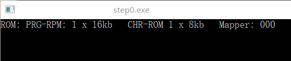

本博客github[备份地址](https://github.com/dustpg/BlogFM/issues/6)

### NesDev
本系列博客几乎全部资料来源是[nesdev.com](http://nesdev.com)

根据本人习惯, 项目命名为StepFC, 简写SFC(感觉...和超任重名了). 当然, 读作模拟器, 写作仿真器(emulator).

然后就是很重要的声明: **由于精力和水平, 不能保证文章所述均为正确的**

### 名词解释

本篇可能能遇到下列名词:

 - CPU: 中央处理器, 即2A03
 - PPU: 图形处理器, 用来控制/显示图形之类的
 - VRAM: 即Video-RAM, 俗称显存
 - PRG-ROM: 程序只读储存器: 存储程序代码的存储器. 放入CPU地址空间.
 - CHR-ROM: 角色只读储存器, 基本是用来显示图像, 放入PPU地址空间
 - VROM: 基本和CHR-ROM同义, 用于理解CHR-ROM
 - SRAM: 存档(SAVE)用RAM, 有些卡带额外带了用电池供电的RAM
 - WRAM: 工作(WORK)用RAM, 基本和SRAM一样, 不过不是用来存档, 就是拿来一般用的
 - Mapper: 由于地址空间最多64KB, 当游戏太大时, 会使用Mapper/MMC用来切换当前使用的'BANK'. 软件(模拟器)上的实现, Mapper会把类似的MMC放在一起实现
 - MMC: Memory-Management Controller 硬件(卡带)上的实现, 会有非常多的大类, 甚至还有变种. 在国内为了显示汉字还有魔改版
 - CHR-RAM: 基本同CHR-ROM, 只不过可以写
 - PRG-RAM: 基本同PRG-ROM, 只不过可以写


### STEP0: 读取ROM
既然是从零开始, 那就'零'开始吧. 一开始当然步子不能跨得太大, 不然.....

- 第零步: 读取简单的ROM.


### FC游戏ROM
说到ROM, 目前流行的ROM格式是.nes格式的, 我参考的是叫做[NES 2.0](http://wiki.nesdev.com/w/index.php/NES_2.0)的ROM格式:

```
文件头:
 0-3: string    "NES"<EOF>
   4: byte      以16384(0x4000)字节作为单位的PRG-ROM大小数量
   5: byte      以 8192(0x2000)字节作为单位的CHR-ROM大小数量
   6: bitfield  Flags 6
   7: bitfield  Flags 7
8-15: byte      保留用, 应该为0. 其实有些在用了, 目前不管

CHR-ROM - 角色只读存储器(用于图像显示, 暂且不谈)

Flags 6:
7       0
---------
NNNN FTBM

N: Mapper编号低4位
F: 4屏标志位. (如果该位被设置, 则忽略M标志)
T: Trainer标志位.  1表示 $7000-$71FF加载 Trainer
B: SRAM标志位 $6000-$7FFF拥有电池供电的SRAM.
M: 镜像标志位.  0 = 水平, 1 = 垂直.

Byte 7 (Flags 7):
7       0
---------
NNNN xxPV

N: Mapper编号高4位
P: Playchoice 10标志位. 被设置则表示为PC-10游戏
V: Vs. Unisystem标志位. 被设置则表示为Vs.  游戏
x: 未使用

```
F: 由于FC的显存只有2kb, 只能支持2屏幕. 如果卡带自带了额外的显存就可以利用4屏幕了.

M: 同上, 这个标记为也暗示游戏是横版还是纵版.

可以看出很多其实不用忙着特地支持, 但是Trainer实现又很简单但是不急着实现的为了避免忘记 —— 打上TODO标记甚至FIXME是一个不错的选择.

### ROM在哪里
由于你懂的原因, 本系列博客不会附送商业游戏ROM, 使用的全是爱好者自己写的, 测试用ROM

这里提供一个测试用的ROM, 这个ROM可以从一开始用到很后面:

 - 原地址: [nestest](http://nickmass.com/images/nestest.nes)
 - [以及文档](http://www.qmtpro.com/~nes/misc/nestest.txt)
 - 收录地址: [Emulator tests](http://wiki.nesdev.com/w/index.php/Emulator_tests)


现在我们利用文件头填写ROM信息吧:
```c
// ROM 信息
typedef struct {
    // PRG-ROM 程序只读储存器 数据指针
    uint8_t*    data_prgrom;
    // CHR-ROM 角色只读存储器 数据指针
    uint8_t*    data_chrrom;
    // 16KB为单位 程序只读储存器 数据长度
    uint32_t    count_prgrom16kb;
    //  8KB为单位 角色只读存储器 数据长度
    uint32_t    count_chrrom_8kb;
    // Mapper 编号
    uint8_t     mapper_number;
    // 是否Vertical Mirroring(否即为水平)
    uint8_t     vmirroring;
    // 是否FourScreen
    uint8_t     four_screen;
    // 是否有SRAM(电池供电的)
    uint8_t     save_ram;
    // 保留以对齐
    uint8_t     reserved[4];
} sfc_rom_info_t;
```

### 基础框架
这次说到这次使用C, 是指核心部分用C实现. 核心部分应该实现得尽可能简单, 所以需要使用接口进行扩展.

C++拥有虚函数可以方便地扩展, 这里只有老实地手动写接口, 即使用函数指针, 如果忘记的话请去复习吧.


sfc_ecode: 错误码

```c
/// <summary>
/// StepFC扩展接口
/// </summary>
typedef struct {
    // ROM 加载器读取信息
    sfc_ecode(*load_rom)(void*, sfc_rom_info_t*);
    // ROM 加载器卸载
    sfc_ecode(*free_rom)(void*, sfc_rom_info_t*);

} sfc_interface_t;
```


即ROM加载步骤为: ROM文件 -> ROM 加载器 -> ROM 信息


载入代码可以这么实现:
```c
/// <summary>
/// 加载默认测试ROM
/// </summary>
/// <param name="arg">The argument.</param>
/// <param name="info">The information.</param>
/// <returns></returns>
sfc_ecode sfc_load_default_rom(void* arg, sfc_rom_info_t* info) {
    assert(info->data_prgrom == NULL && "FREE FIRST");
    FILE* const file = fopen("nestest.nes", "rb");
    // 文本未找到
    if (!file) return SFC_ERROR_FILE_NOT_FOUND;
    sfc_ecode code = SFC_ERROR_ILLEGAL_FILE;
    // 读取文件头
    sfc_nes_header_t nes_header;
    if (fread(&nes_header, sizeof(nes_header), 1, file)) {
        // 开头4字节
        union { uint32_t u32; uint8_t id[4]; } this_union;
        this_union.id[0] = 'N';
        this_union.id[1] = 'E';
        this_union.id[2] = 'S';
        this_union.id[3] = '\x1A';
        // 比较这四字节
        if (this_union.u32 == nes_header.id) {
            const size_t size1 = 16 * 1024 * nes_header.count_prgrom16kb;
            const size_t size2 =  8 * 1024 * nes_header.count_chrrom_8kb;
            uint8_t* const ptr = (uint8_t*)malloc(size1 + size2);
            // 内存申请成功
            if (ptr) {
                code = SFC_ERROR_OK;
                // TODO: 实现Trainer
                // 跳过Trainer数据
                if (nes_header.control1 & SFC_NES_TRAINER) fseek(file, 512, SEEK_CUR);
                // 这都错了就不关我的事情了
                fread(ptr, size1 + size2, 1, file);

                // 填写info数据表格
                info->data_prgrom = ptr;
                info->data_chrrom = ptr + size1;
                info->count_prgrom16kb = nes_header.count_prgrom16kb;
                info->count_chrrom_8kb = nes_header.count_chrrom_8kb;
                info->mapper_number 
                    = (nes_header.control1 >> 4) 
                    | (nes_header.control2 & 0xF0)
                    ;
                info->vmirroring    = (nes_header.control1 & SFC_NES_VMIRROR) > 0;
                info->four_screen   = (nes_header.control1 & SFC_NES_4SCREEN) > 0;
                info->save_ram      = (nes_header.control1 & SFC_NES_SAVERAM) > 0;
                assert(!(nes_header.control1 & SFC_NES_TRAINER) && "unsupported");
                assert(!(nes_header.control2 & SFC_NES_VS_UNISYSTEM) && "unsupported");
                assert(!(nes_header.control2 & SFC_NES_Playchoice10) && "unsupported");
            }
            // 内存不足
            else code = SFC_ERROR_OUT_OF_MEMORY;
        }
        // 非法文件
    }
    fclose(file);
    return code;
}
```
当然实现有问题, 不过对于这个nestest.nes足够了

 - 没有对于非法ROM的检查, 这个由接口实现
 - 有些ROM是没有CHR-ROM的, 只有CHR-RAM, 这个后面再解决

### 运行起来


项目地址[Github-StepFC-Step0](https://github.com/dustpg/StepFC/tree/master/step0)


### 作业

 - 基础: 下载这个项目, 在main.c中实现自己的接口(load_rom/free_rom).
 - 扩展: 下载这个项目, 在main.c中实现自己的接口(load_rom/free_rom), 改成利用main函数参数argc/argv载入指定文件
 - 从零开始: 从零开始实现自己的模拟器吧
