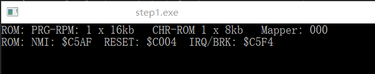

### STEP1: CPU地址空间: 基础读写 + Mapper000
本博客github[备份地址](https://github.com/dustpg/BlogFM/issues/7)

让我们再跨一步吧.

6502汇编使用数字前面美元符号(\$)作为16进制的表示(8086则是在后面加‘h’)

### CPU地址空间布局
先谈谈内存布局, 6502理论支持64KB的寻址空间, 但是小霸王服务器只有2kb的内存. 自然得说说内存布局


| 地址    | 大小  | 标记  |         描述          |
|---------|------|-------|------------------------|
| $0000   | $800  |       | RAM                   |
| $0800   | $800  | M     | RAM                   |
| $1000   | $800  | M     | RAM                   |
| $1800   | $800  | M     | RAM                   |
| $2000   | 8     |       | Registers             |
| $2008   | $1FF8 |  R    | Registers             |
| $4000   | $20   |       | Registers             |
| $4020   | $1FDF |       | Expansion ROM         |
| $6000   | $2000 |       | SRAM                  |
| $8000   | $4000 |       | PRG-ROM               |
| $C000   | $4000 |       | PRG-ROM               |

M: 主内存2KB镜像, 比如读取\$0800实际是读取$0000

R: PPU寄存器, 8字节步进镜像. 

Registers: 一堆寄存器, 现在不用管.

Expansion ROM: 扩展ROM, 现在不用管

SRAM,  PRG-ROM: 已经说过了

### CPU中断
很遗憾, 自己在大学虽然是计算机系的, 但是不是计算机科学之类的学科, 而是靠近多媒体方向(比如计算机图形学, 音频之类的). 这就导致导致计算机硬件知识几乎没有, 只能靠脑补了.

6502有三种中断(按优先度排序, 越后面越优先): 
 - IRQ/BRK
 - NMI
 - RESET

每一种中断都有一个向量. 向量是当中断触发时“转到”的指定位置的16位地址:
 - $FFFA-FFFB = NMI
 - $FFFC-FFFD = RESET
 - $FFFE-FFFF = IRQ/BRK

0. IRQ - Interrupt Request 中断请求
硬件中断请求被执(大致分为Mapper和APU两类)
1. BRK - Break 中断指令
当软件中断请求被执行(BRK指令)
2. NMI - Non-Maskable Interrupt 不可屏蔽中断
发生在每次垂直空白(VBlank)时, NMI在NTSC制式下刷新次数为 60次/秒, PAL为50次/秒
3. RESET在(重新)启动时被触发. ROM被读入内存, 6502跳转至指定的RESET向量

也就是说程序一开始执行```$FFFC-FFFD```指向的地址

'低地址'在'低地址', '高地址'在'高地址'. 即低8位在\$FFFC, 高8位在\$FFFD.

### Mapper000 - NROM
目前当然是实现Mapper000, 实际上也就是没有Mapper的意思:

 - 适用于16KB(NROM-128)或者32KB(NROM-256)的RPG-ROM
 - CPU ```$8000-$BFFF```: ROM开始的16kb
 - CPU ```$C000-$FFFF```: ROM最后的16kb

### Mapper接口
就目前而且, 只需要一个重置接口:
```c
/// <summary>
/// StepFC: Mapper接口
/// </summary>
typedef struct {
    // Mapper 重置
    sfc_ecode(*reset)(sfc_famicom_t*);

} sfc_mapper_t;
```

### BANK
BANK是每个Mapper载入的单位, 在某种意义上也可以称为window. 根据内存布局, 可以把根据地址划分为每8KB一个BANK, 一共8个区块:

 - ```0: [$0000, $2000)``` 系统主内存
 - ```1: [$2000, $4000)``` PPU 寄存器
 - ```2: [$4000, $6000)``` pAPU寄存器以及扩展区域
 - ```3: [$6000, $8000)``` 存档用SRAM区
 - 剩下的全是 程序代码区 RPG-ROM

也就是:
```c
uint8_t* prg_banks[0x10000 >> 13];
```

### Mapper000 - Reset
根据所述内容, Mapper000可以实现为:
```c
/// <summary>
/// 实用函数-StepFC: 载入8k PRG-ROM
/// </summary>
/// <param name="famicom">The famicom.</param>
/// <param name="des">The DES.</param>
/// <param name="src">The source.</param>
static inline void sfc_load_prgrom_8k(
    sfc_famicom_t* famicom, int des, int src) {
    famicom->prg_banks[4 + des] = famicom->rom_info.data_prgrom + 8 * 1024 * src;
}
/// <summary>
/// StepFC: MAPPER 000 - NROM 重置
/// </summary>
/// <param name="famicom">The famicom.</param>
/// <returns></returns>
static sfc_ecode sfc_mapper_00_reset(sfc_famicom_t* famicom) {
    assert(famicom->rom_info.count_prgrom16kb && "bad count");
    assert(famicom->rom_info.count_prgrom16kb <= 2 && "bad count");
    // 16KB -> 载入 $8000-$BFFF, $C000-$FFFF 为镜像
    const int id2 = famicom->rom_info.count_prgrom16kb & 2;
    // 32KB -> 载入 $8000-$FFFF
    sfc_load_prgrom_8k(famicom, 0, 0);
    sfc_load_prgrom_8k(famicom, 1, 1);
    sfc_load_prgrom_8k(famicom, 2, id2 + 0);
    sfc_load_prgrom_8k(famicom, 3, id2 + 1);
    return SFC_ERROR_OK;
}
```

这里使用到了C99的inline, 和C++的inline略有区别. 还有就是, 利用位操作减少分支判断也是编码技巧之一.

### 地址空间读写
根据BANK, 就可以非常简单地实现读:
```c
    switch (address >> 13)
    {
    case 0:
        // 高三位为0: [$0000, $2000): 系统主内存, 4次镜像
        return famicom->main_memory[address & (uint16_t)0x07ff];
    case 1:
        // 高三位为1, [$2000, $4000): PPU寄存器, 8字节步进镜像
        assert(!"NOT IMPL");
        return 0;
    case 2:
        // 高三位为2, [$4000, $6000): pAPU寄存器 扩展ROM区
        assert(!"NOT IMPL");
        return 0;
    case 3:
        // 高三位为3, [$6000, $8000): 存档 SRAM区
        return famicom->save_memory[address & (uint16_t)0x1fff];
    case 4: case 5: case 6: case 7:
        // 高一位为1, [$8000, $10000) 程序PRG-ROM区
        return famicom->prg_banks[address >> 13][address & (uint16_t)0x1fff];
    }
```

和写:

```c
    switch (address >> 13)
    {
    case 0:
        // 高三位为0: [$0000, $2000): 系统主内存, 4次镜像
        famicom->main_memory[address & (uint16_t)0x07ff] = data;
        return;
    case 1:
        // 高三位为1, [$2000, $4000): PPU寄存器, 8字节步进镜像
        assert(!"NOT IMPL");
        return;
    case 2:
        // 高三位为2, [$4000, $6000): pAPU寄存器 扩展ROM区
        assert(!"NOT IMPL");
        return;
    case 3:
        // 高三位为3, [$6000, $8000): 存档 SRAM区
        famicom->save_memory[address & (uint16_t)0x1fff] = data;
        return;
    case 4: case 5: case 6: case 7:
        // 高一位为1, [$8000, $10000) 程序PRG-ROM区
        assert(!"WARNING: PRG-ROM");
        famicom->prg_banks[address >> 13][address & (uint16_t)0x1fff] = data;
        return;
    }
```

还没实现的用断言即可. 写入也是同样的. 不过既然是PRG-ROM, 那么写入加个断言好了.

### 输出各个中断向量


可以看出RESET是跳转$C004.


项目地址[Github-StepFC-Step1](https://github.com/dustpg/StepFC/tree/master/step1)

### 作业
 - 基础: RESET跳转地址的那一个字节是啥? 即执行的第一个指令的操作码是?
 - 从零开始: 从零开始实现自己的模拟器吧

### REF

 - [CPU memory map](http://wiki.nesdev.com/w/index.php/CPU_memory_map)
 - [Mapper000 - NROM](http://wiki.nesdev.com/w/index.php/NROM)
 - [任天堂红白机 ( NES ) 文档](http://nesdev.com/nestech_cn.txt)