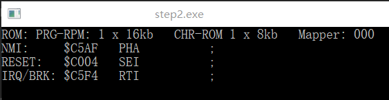

本文github[备份地址](https://github.com/dustpg/BlogFM/issues/8)

### STEP2: 6502汇编
写模拟器当然要了解使用到的汇编, 不管是调试模拟器还是模拟器调试都需要.

前面知道了6502汇编用\$表示十六进制, 那先讲讲6502机器码, 由一个操作码和0~2个地址码构成, 都是8位的:
```c
/// <summary>
/// StepFC: 6502机器码
/// </summary>
typedef union {
    // 用32位保存数据
    uint32_t    data;
    // 4个8位数据
    struct {
        // 操作码 
        uint8_t op;
        // 地址码1
        uint8_t a1;
        // 地址码2
        uint8_t a2;
        // 显示控制
        uint8_t ctrl;
    };

} sfc_6502_code_t;
```
其中, 值得注意的是C11才支持的匿名struct/union. 请检查自己编译器支持的情况.

理论上, 6502拥有256条操作码, 这里是所有的指令表: [非官方OpCode](http://wiki.nesdev.com/w/index.php/CPU_unofficial_opcodes#Games_using_unofficial_opcodes)

有一些被称为非法或者说未被文档记录的操作码, 但是文档提到
> An accurate NES emulator must implement all instructions, not just the official ones. A small number of games use them (see below).

我们必须实现所有操作码.

### 指令
举一个简单的指令```LDA```, 就是"load 'A'(累加器)"的意思

### 寻址方式
指令```LAD```对应多个机器码, 区别是寻址方式的不同, 现在先列举所有的寻址方式以及格式, 详细的解释在下一节.

0. **累加器A寻址** Accumulator
单字节指令, 格式:
```
INS A
```

1. **隐含寻址** Implied Addressing
单字节指令, 格式:
```
INS
```

2. **立即寻址** Immediate Addressing
双字节指令, 格式
```
INS #$AB
```

3. **绝对寻址** Absolute Addressing
三字节指令, 格式
```
INS #$ABCD
```

4. **绝对X变址** Absolute X Indexed Addressing
三字节指令, 格式
```
INS #$ABCD, X
```

5. **绝对Y变址** Absolute Y Indexed Addressing
三字节指令, 格式
```
INS #$ABCD, Y
```

6. **零页寻址** Zero-page Absolute Addressing
双字节指令, 格式
```
INS #$A
```

7. **零页X变址** Zero-page X Indexed Addressing
双字节指令, 格式
```
INS #$A, X
```

8. **零页X变址** Zero-page Y Indexed Addressing
双字节指令, 格式
```
INS #$A, Y
```

9. **间接寻址** Indirect Addressing
三字节指令, 格式
```
INS ($ABCD)
```

10. **间接X变址**: Pre-indexed Indirect Addressing
双字节指令, 格式
```
INS (#$A, X)
```

11. **间接Y变址**: Post-indexed Indirect Addressing
双字节指令, 格式
```
INS ($AB), Y
```

12. **相对寻址**: Relative Addressing
双字节指令, 格式
```
INS $AB   - 16进制
INS +-abc - 有符号十进制
INS xxxxx - 跳转的目标地址的标签, 由汇编器自动计算
INS $ABCD - 跳转的目标地址, 由汇编器自动计算
```

### 反汇编
由于我们只需要反汇编而不需要汇编, 所以输出格式看自己喜好.比如除了最后一个, 看自己喜好实现吧.

现在就是根据操作码查找寻址方式和指令就能反汇编了:

```c
/// <summary>
/// StepFC: 指定地方反汇编
/// </summary>
/// <param name="address">The address.</param>
/// <param name="famicom">The famicom.</param>
/// <param name="buf">The buf.</param>
void sfc_fc_disassembly(uint16_t address, const sfc_famicom_t* famicom, char buf[]) {
    // TODO: 根据操作码读取对应字节

    sfc_6502_code_t code;
    code.data = 0;
    // 暴力(NoMo)读取3字节
    code.op = sfc_read_cpu_address(address, famicom);
    code.a1 = sfc_read_cpu_address(address + 1, famicom);
    code.a2 = sfc_read_cpu_address(address + 2, famicom);
    // 反汇编
    sfc_6502_disassembly(code, buf);
}
```

目前暴力(?)读取3字节, 下次再实现读取指定字节数量.

建立一张表用于反汇编:

```cp
/// <summary>
/// 命令名称
/// </summary>
struct sfc_opname {
    // 3字名称
    char        name[3];
    // 寻址模式
    uint8_t     mode;
};

/// <summary>
/// 反汇编用数据
/// </summary>
static const struct sfc_opname s_opname_data[256] = {
    { 'B', 'R', 'K', SFC_AM_IMP },
    // 下略
};
```
就能反汇编了:
 
 - 00 - BRK
 - 等等等等
 - 这些全部要自己查表才行
 - 自己使用的微软编译器, 对C11支持不大行, 像```_Alignas```之类的明明C++那边实现了, C这边却没有
 - 对于查表用的数据可以 以CPU缓存行为单位对齐

### 反汇编
有了数据反汇编就太简单了, 核心部分应该是尽可能少使用外部函数. 这里可以用```snprintf```之类的格式化函数, 但是毕竟核心部分, 自己还是自己手写了像格式化位16进制字符串.

### 输出每个向量的第一个执行代码的汇编代码


这里, RESET执行的第一个指令是: ```SEI```, 即 'Set I flag'

项目地址[Github-StepFC-Step2](https://github.com/dustpg/StepFC/tree/master/step2)

### 作业
 - 基础: 利用反汇编函数输出所有256个机器码的汇编代码
 - 扩展: 删掉反汇编实现函数, 自己实现反汇编函数.
 - 从零开始: 从零开始实现自己的模拟器吧


### REF
 - [CPU unofficial opcodes](http://wiki.nesdev.com/w/index.php/CPU_unofficial_opcodes)
 - [6502 CPU](http://nesdev.com/6502_cpu.txt)