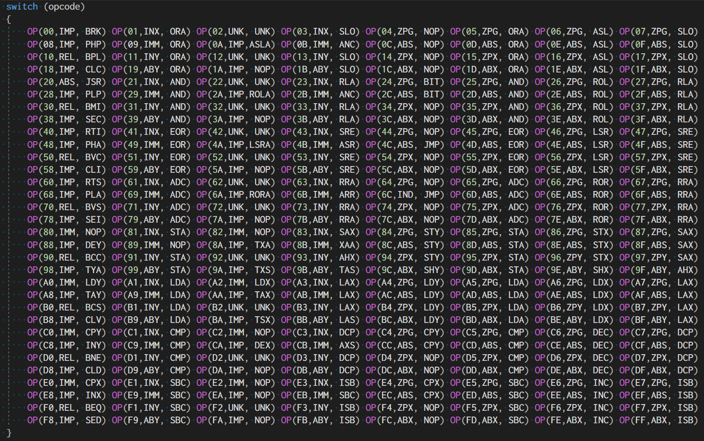
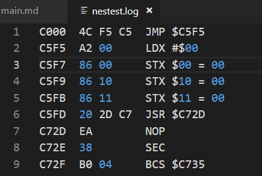
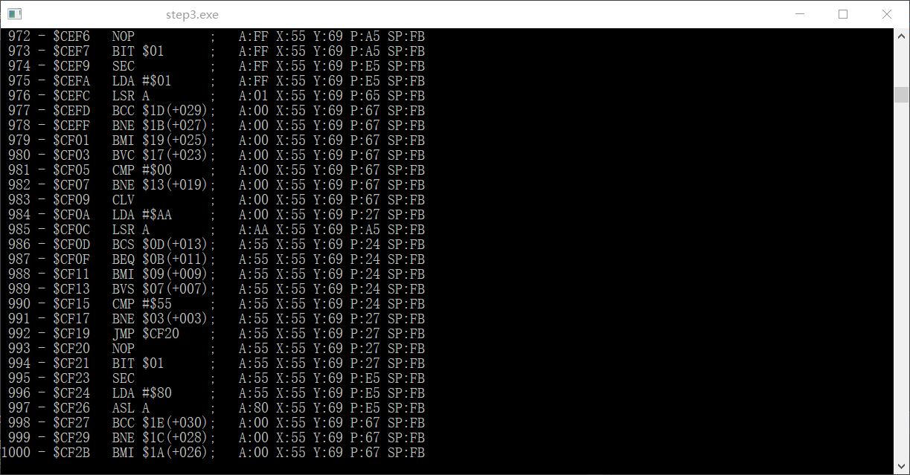

### STEP3: CPU 指令实现 - 具体实现
本文github[备份地址](https://github.com/dustpg/BlogFM/issues/13)

这节是指令实现的最后一节, 前面介绍了几乎所有的指令, 现在就做具体实现

说说之前有提到的"页面边界交叉", 或者简单理解为"跨页"

### 条件转移
条件转移语句很简单:

 - 没有跳转： 花费2周期
 - 跳转至本页面: 花费3周期
 - 跳转至其他页面: 花费4周期

### 页面边界交叉
之前提到了"+1s", 与其说是"+1s", 不如说是"-1s". 会发生在下列寻址方式:

 - 绝对X变址
 - 绝对Y变址
 - 间接Y变址

如果指令不进行写操作的话, 会进行优化: 本页面读取就会少一周期, 也就是"不如说的缘由". 同样也是扩展指令中"读改写"没有额外周期的说法 —— 因为已经自带了. 基础指令的写操作```STA```之类的, 没有额外的周期也是同样的原因.

说了这么多, 但是在STEP3中没有实现 —— STEP3中没有意义. 但是在需要同步的时候, 意义就非常大了, 必须要实现. 

### 具体实现
具体实现就一个大```case```然后从00写到FF? 图样! 把寻址和指令分开介绍的原因当然是:


 - I have an addressing mode
 - I have an instruction


 - ohn~


- OpCode


所以直接这么实现:


适当使用宏可以大幅度美化代码, OP宏实现如下:
```c
// 指令实现
#define OP(n, a, o) \
case 0x##n:\
{           \
    const uint16_t address = sfc_addressing_##a(famicom);\
    sfc_operation_##o(address, famicom);\
    break;\
}
```

### 累加器寻址
由于累加器寻址, 并没有"地址", 所以单独实现了: 可以看到截图中有些指令是4个字母的, 这些是累加器寻址的单独实现.

### nestest.nes
有请主角测试用ROM——"nestest.nes". 之前了解到这个ROM的RESET向量是$C004.

[Emulator tests](http://wiki.nesdev.com/w/index.php/Emulator_tests)中提到: 
>  Start execution at $C000 and compare execution with a log

也就是说, 我们把初始PC设为$C000, 就可以和现有的LOG就行比较:


比如执行JMP然后LDX......这就是一个非常棒的参考, 自己实现顺序也是这个:

 - 运行程序
 - 执行到一个没有实现的指令
 - 报错(断言)
 - 检测该指令并实现. 
 - 重复这系列步骤

如果从00开始实现指令, 就感觉背单词从abandon开始一样, 很没劲儿.

### 实用宏
可以利用宏大幅度简化代码:
```c
// 寄存器
#define SFC_REG (famicom->registers)
#define SFC_PC (SFC_REG.program_counter)
#define SFC_SP (SFC_REG.stack_pointer)
#define SFC_A (SFC_REG.accumulator)
#define SFC_X (SFC_REG.x_index)
#define SFC_Y (SFC_REG.y_index)
#define SFC_P (SFC_REG.status)

// if中判断用FLAG
#define SFC_CF (SFC_P & (uint8_t)SFC_FLAG_C)
#define SFC_ZF (SFC_P & (uint8_t)SFC_FLAG_Z)
#define SFC_IF (SFC_P & (uint8_t)SFC_FLAG_I)
#define SFC_DF (SFC_P & (uint8_t)SFC_FLAG_D)
#define SFC_BF (SFC_P & (uint8_t)SFC_FLAG_B)
#define SFC_VF (SFC_P & (uint8_t)SFC_FLAG_V)
#define SFC_SF (SFC_P & (uint8_t)SFC_FLAG_S)
// 将FLAG将变为1
#define SFC_CF_SE (SFC_P |= (uint8_t)SFC_FLAG_C)
#define SFC_ZF_SE (SFC_P |= (uint8_t)SFC_FLAG_Z)
#define SFC_IF_SE (SFC_P |= (uint8_t)SFC_FLAG_I)
#define SFC_DF_SE (SFC_P |= (uint8_t)SFC_FLAG_D)
#define SFC_BF_SE (SFC_P |= (uint8_t)SFC_FLAG_B)
#define SFC_RF_SE (SFC_P |= (uint8_t)SFC_FLAG_R)
#define SFC_VF_SE (SFC_P |= (uint8_t)SFC_FLAG_V)
#define SFC_SF_SE (SFC_P |= (uint8_t)SFC_FLAG_S)
// 将FLAG将变为0
#define SFC_CF_CL (SFC_P &= ~(uint8_t)SFC_FLAG_C)
#define SFC_ZF_CL (SFC_P &= ~(uint8_t)SFC_FLAG_Z)
#define SFC_IF_CL (SFC_P &= ~(uint8_t)SFC_FLAG_I)
#define SFC_DF_CL (SFC_P &= ~(uint8_t)SFC_FLAG_D)
#define SFC_BF_CL (SFC_P &= ~(uint8_t)SFC_FLAG_B)
#define SFC_VF_CL (SFC_P &= ~(uint8_t)SFC_FLAG_V)
#define SFC_SF_CL (SFC_P &= ~(uint8_t)SFC_FLAG_S)
// 将FLAG将变为0或者1
#define SFC_CF_IF(x) (x ? SFC_CF_SE : SFC_CF_CL);
#define SFC_ZF_IF(x) (x ? SFC_ZF_SE : SFC_ZF_CL);
#define SFC_OF_IF(x) (x ? SFC_IF_SE : SFC_IF_CL);
#define SFC_DF_IF(x) (x ? SFC_DF_SE : SFC_DF_CL);
#define SFC_BF_IF(x) (x ? SFC_BF_SE : SFC_BF_CL);
#define SFC_VF_IF(x) (x ? SFC_VF_SE : SFC_VF_CL);
#define SFC_SF_IF(x) (x ? SFC_SF_SE : SFC_SF_CL);

// 实用函数
#define SFC_READ(a) sfc_read_cpu_address(a, famicom)
#define SFC_PUSH(a) (famicom->main_memory + 0x100)[SFC_SP--] = a;
#define SFC_POP() (famicom->main_memory + 0x100)[++SFC_SP];
#define SFC_WRITE(a, v) sfc_write_cpu_address(a, v, famicom)
#define CHECK_ZSFLAG(x) { SFC_SF_IF(x & (uint8_t)0x80); SFC_ZF_IF(x == 0); }
```

之前虽然说是"伪C代码", 实际加一个宏就变成C了. 然后一步一步实现吧!

### 输出
根据LOG文件, 最后可以看到写入"$4015"了 也就是可以完成这部分了. 虽然还有很多指令没有实现, 甚至```BRK```和```CLI```也没实现!



项目地址[Github-StepFC-Step3](https://github.com/dustpg/StepFC/tree/master/step3)

### 作业
 - 基础: 之前提到可以用uint8_t[8]实现状态寄存器, 试试吧
 - 扩展: 删掉实现代码, 自己实现所有指令
 - 从零开始: 从零开始实现自己的模拟器吧

### REF
 - [Emulator tests](http://wiki.nesdev.com/w/index.php/Emulator_tests)
