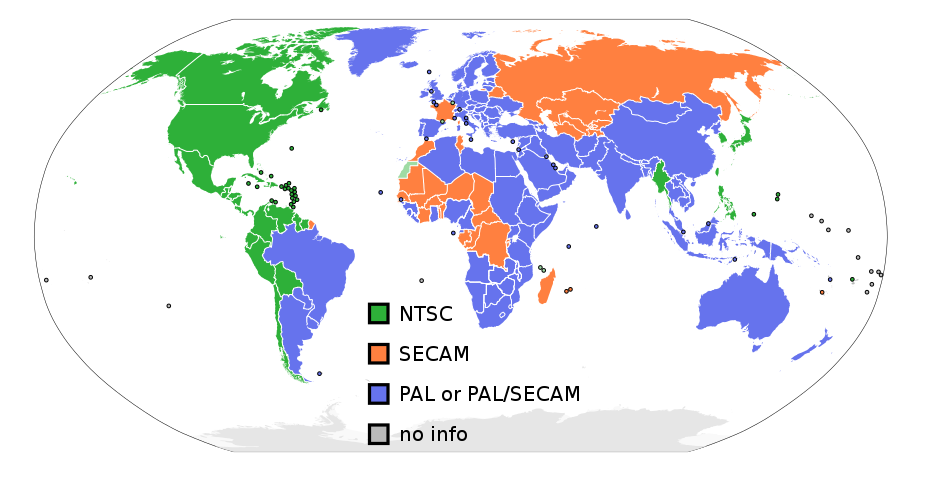

### 屏幕相关

这一节将介绍屏幕相关知识

### CRT显示器
CRT叫做"阴极射线显像管"(Cathode Ray Tube), 也就是所谓的"大屁股".

以前的老电视都是这种形式, 现在自己老家应该还有用了几十年的老电视. 记得是在初中物理还是是什么地方应该介绍过原理, 这个受限于电力系统的频率, 我国是50HZ, 使用的PAL-D,K制式:


这里有一个视频叫:

 - [【中字】慢镜头下的电视工作原理科普（CRT/LED/OLED)](https://www.bilibili.com/video/av21969824) 
 - [油管地址](https://www.youtube.com/watch?v=3BJU2drrtCM)

可以通过高速摄像机直观地理解.

现在视频网站可能有720p, 1080p的视频. p就是表示逐行(progressive)扫描, 对应的就是i, 隔行(interlaced)扫描. 我记得PS3上有1080i的选项但是ps4没有看到(或者没注意到), 可能是时代不同了.

一般没有必要模拟隔行扫描(视频中的显示器貌似就是逐行扫描的CRT), 除非有强迫症. 但是扫描线的概念还是要有的:

 1. HBlank
      - 扫描线扫描完一行要返回下一行(隔行的话就是下面第二行)开头, 直接返回会覆盖掉之前辛苦的扫描, 所以电子枪会暂时关掉, 然后掉头. 
      - 这段工作会消耗大概整个扫描行1/6的时间.这段空白时间称为水平空白间隙(Horizontal blanking interval), 或者统称水平空白(HBlank). 这个"空白"是指消除电子枪的显示, 也被翻译作"消隐".
 2. VBlank
      - 这个概念同样适用于垂直方向, 当整个画面(称为'场'Field, 逐行扫描则可以称为'帧'Frame)显示完了, 电子枪会回到屏幕的左上角. 就有了垂直空白间隙(Vertical Blank Interval), 常称VBlank这个东西. 
      - 这段时间相当长, 可能有1毫秒. 拿NTSC举例, NTSC分辨率是720x480, 但是拥有525条扫描线, 有483条可见的扫描线. 剩下的不可见扫描线就是用来处理VBlank以及掉头. 为什么是1毫秒? 可以计算一下!
      - 现在虽然不怎么使用CRT显示器了, 但是这个概念还是一直保留.
 
### 计算题
NTSC 一秒显示60场, 每场平均262.5扫描线(隔行扫描). 也就是扫描线频率15.75KHz, 折合63.5微秒(μs), 262.5-241.5 = 21条扫描线. 也就是说VBlank花了1.33毫秒(ms), 标准制式是这样的.

### FC的情况
根据NesDev提供的文档[Nintendo Entertainment System documentation](http://nesdev.com/ndox200.zip)
```
      +--------+ 0 ----+
      |        |       |
      |        |       |
      | Screen |       +-- (0-239) 256x240 on-screen results
      |        |       |
      |        |       |
      +--------+ 240 --+
      |   ??   |       +-- (240-242) Unknown
      +--------+ 243 --+
      |        |       |
      | VBlank |       +-- (243-262) VBlank
      |        |       |
      +--------+ 262 --+
```
FC是在243扫描线开始的时候触发VBlank, 240-242是在Unknown状态.


根据NesDev本身自己wiki的情况: [PPU Rendering](http://wiki.nesdev.com/w/index.php/PPU_rendering):

 - Pre-render scanline (-1, 261)
 - Visible scanlines (0-239)
 - Post-render scanline (240)
 - Vertical blanking lines (241-260)

细节上有些区别, 不过都是240行可见扫描线以及20行的VBlank线. 以wiki为主吧.