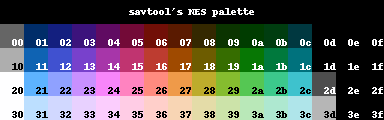
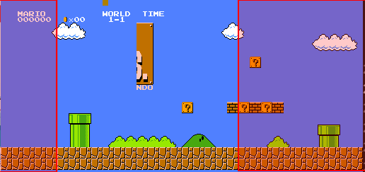
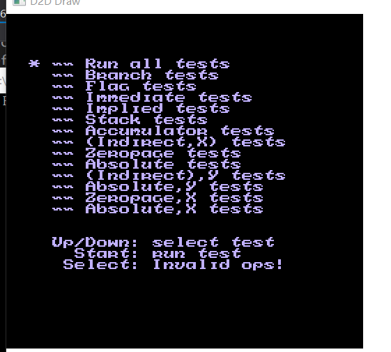

### STEP4: 背景渲染

本文github[备份地址](https://github.com/dustpg/BlogFM/issues/15)

那么进入第四步, 背景的渲染. 终于进入关于图像渲染的步骤了, 这开始后就加快节奏了, 图形API的部分会略过, 因为可能读者拥有自己习惯的图形API, 这里采用的是D2D 1.1, 至少需要Win7的平台更新或者Win8.

### 黑匣子

如果没有自己熟悉的图形API的话, 这里介绍一下"黑匣子"函数, 就像```printf```那样, 不需要了解实现细节, 只需要知道它是干什么的就行. 这里, 自己将这些称为黑匣子函数:

 - 头文件 "common/d2d_interface.h"
 - 源文件 "common/d2d_draw.cpp"
 - 是的, 这个用C++实现的
 - ```void main_cpp()``` 入口函数, 这个函数内部会一直循环直到窗口被关闭
 - ```void main_render(void* rgba)``` 以RGBA字节序填充一个256x240像素的缓存, 实际上为了避免越界, 是256x256+256的缓冲空间. 由于RGBA序列刚好和```uint32_t```一样大, 所以这个缓存的类型是```uint32_t```. 结果会显示在窗口的左边
 - ```int sub_render(void* rgba)``` 同上, 不过在返回非零值才会显示. 会显示在稍微右边点
 - 不需要副渲染可以定义一次```SFC_NO_SUBRENDER```
 - ```void user_input(int index, unsigned char data)``` 用户输入, 很简单的接口
 - 不需要用户输入就定义一次```SFC_NO_INPUT```
 - ```void qsave()``` ```void qload()```为了更为方便地调试, 即时存档/读档的接口
 - 不需要S/L就定义一次```SFC_NO_SL```
 - 这些可能随时修改, 不过如果大幅度修改可能会新开头文件

### PPU 地址空间
进入正题, 关于PPU的地址空间. PPU拥有16kb的地址空间, 完全独立于CPU. 再高的地址会被镜像.

| 地址 | 大小  | 描述  |
|------|-------|-------|
\$0000-\$0FFF|\$1000| 图样(非彼图样)表0|
\$1000-\$1FFF|\$1000| 图样(非彼图样)表1|
$2000-$23FF | $0400 | 名称表 0
$2400-$27FF | $0400 | 名称表 1
$2800-$2BFF | $0400 | 名称表 2
$2C00-$2FFF | $0400 | 名称表 3
$3000-$3EFF | $0F00 | $2000-$2EFF 镜像
$3F00-$3F1F | $0020 | 调色板内存索引
$3F20-$3FFF | $00E0 | $3F00-$3F1F 镜像

- 图样表: pattern tables
- 名称表: Nametables
- 属性表: Attribute tables
- 调色板:	Palette

### 调色板
FC理论能显示64种颜色(使用某种技巧的话):


自己使用的RGBA序调色板:
```c
/// <summary>
/// 调色板数据
/// </summary>
const union sfc_palette_data {
    struct { uint8_t r, g, b, a; };
    uint32_t    data;
} sfc_stdpalette[64] = {
    { 0x7F, 0x7F, 0x7F, 0xFF }, { 0x20, 0x00, 0xB0, 0xFF }, { 0x28, 0x00, 0xB8, 0xFF }, { 0x60, 0x10, 0xA0, 0xFF },
    { 0x98, 0x20, 0x78, 0xFF }, { 0xB0, 0x10, 0x30, 0xFF }, { 0xA0, 0x30, 0x00, 0xFF }, { 0x78, 0x40, 0x00, 0xFF },
    { 0x48, 0x58, 0x00, 0xFF }, { 0x38, 0x68, 0x00, 0xFF }, { 0x38, 0x6C, 0x00, 0xFF }, { 0x30, 0x60, 0x40, 0xFF },
    { 0x30, 0x50, 0x80, 0xFF }, { 0x00, 0x00, 0x00, 0xFF }, { 0x00, 0x00, 0x00, 0xFF }, { 0x00, 0x00, 0x00, 0xFF },

    { 0xBC, 0xBC, 0xBC, 0xFF }, { 0x40, 0x60, 0xF8, 0xFF }, { 0x40, 0x40, 0xFF, 0xFF }, { 0x90, 0x40, 0xF0, 0xFF },
    { 0xD8, 0x40, 0xC0, 0xFF }, { 0xD8, 0x40, 0x60, 0xFF }, { 0xE0, 0x50, 0x00, 0xFF }, { 0xC0, 0x70, 0x00, 0xFF },
    { 0x88, 0x88, 0x00, 0xFF }, { 0x50, 0xA0, 0x00, 0xFF }, { 0x48, 0xA8, 0x10, 0xFF }, { 0x48, 0xA0, 0x68, 0xFF },
    { 0x40, 0x90, 0xC0, 0xFF }, { 0x00, 0x00, 0x00, 0xFF }, { 0x00, 0x00, 0x00, 0xFF }, { 0x00, 0x00, 0x00, 0xFF },

    { 0xFF, 0xFF, 0xFF, 0xFF }, { 0x60, 0xA0, 0xFF, 0xFF }, { 0x50, 0x80, 0xFF, 0xFF }, { 0xA0, 0x70, 0xFF, 0xFF },
    { 0xF0, 0x60, 0xFF, 0xFF }, { 0xFF, 0x60, 0xB0, 0xFF }, { 0xFF, 0x78, 0x30, 0xFF }, { 0xFF, 0xA0, 0x00, 0xFF },
    { 0xE8, 0xD0, 0x20, 0xFF }, { 0x98, 0xE8, 0x00, 0xFF }, { 0x70, 0xF0, 0x40, 0xFF }, { 0x70, 0xE0, 0x90, 0xFF },
    { 0x60, 0xD0, 0xE0, 0xFF }, { 0x60, 0x60, 0x60, 0xFF }, { 0x00, 0x00, 0x00, 0xFF }, { 0x00, 0x00, 0x00, 0xFF },

    { 0xFF, 0xFF, 0xFF, 0xFF }, { 0x90, 0xD0, 0xFF, 0xFF }, { 0xA0, 0xB8, 0xFF, 0xFF }, { 0xC0, 0xB0, 0xFF, 0xFF },
    { 0xE0, 0xB0, 0xFF, 0xFF }, { 0xFF, 0xB8, 0xE8, 0xFF }, { 0xFF, 0xC8, 0xB8, 0xFF }, { 0xFF, 0xD8, 0xA0, 0xFF },
    { 0xFF, 0xF0, 0x90, 0xFF }, { 0xC8, 0xF0, 0x80, 0xFF }, { 0xA0, 0xF0, 0xA0, 0xFF }, { 0xA0, 0xFF, 0xC8, 0xFF },
    { 0xA0, 0xFF, 0xF0, 0xFF }, { 0xA0, 0xA0, 0xA0, 0xFF }, { 0x00, 0x00, 0x00, 0xFF }, { 0x00, 0x00, 0x00, 0xFF }
};
```


调色板索引是32字节的一段数据
 - 前面16字节是背景用
 - 后面16字节是精灵用

16个也就是需要4位, 换句话说一个像素仅仅需要4位来描述, 就目前而言:

4位数据 -> 调色板索引 -> 输出颜色

但是, 实际上当最低俩位是0的时候:
 - 背景: 使用全局背景色(\$3F00)
 - 精灵: 透明显示

也就是说虽然有16个, 但是有1/4的用不到: 

 - 背景能用16 x 0.75 + 1 = 13个
 - 精灵则是16 x 0.75 = 12个

### 镜像
 - $3F10/$3F14/$3F18/$3F1C
 - 对应$3F00/$3F04/$3F08/$3F0C
 - 如果你没有实现的话, '超级马里奥' 背景色是黑的.... 自己找了一上午的原因, 原来是在这, 坑爹啊

### 名称表
名称表就是用来排列显示背景的. 背景每个图块是8x8像素. 而FC总共是256x240即有32x30个背景图块.每个图块用1字节表示所以一个背景差不多就需要1kb(32x30=960b). 为了实现1像素滚动, 两个背景连在一起然后用一个偏移量表示就行了:

就像马里奥这样, 红框就是当前屏幕显示(不是中央, 而是两侧两部分合起来).

虽然PPU支持4个名称表，不过FC只支持2个(FC自带的2kb显存), 另外两个被做了镜像. 当然, 如果卡带自带了显存那么就可以支持4个名称表了, 也就是ROM中提到的4屏模式.

.....

好像缺了点什么.每个表还有64字节没用? 那个时候的汇编程序猿怎么可能浪费RAM的字节, 被用在了**属性表**上.


### 属性表
64字节被瓜分成8x8, 也就是把背景分成8x8的区域:
```
      2xx0    2xx1    2xx2    2xx3    2xx4    2xx5    2xx6    2xx7
     ,-------+-------+-------+-------+-------+-------+-------+-------.
     |   .   |   .   |   .   |   .   |   .   |   .   |   .   |   .   |
2xC0:| - + - | - + - | - + - | - + - | - + - | - + - | - + - | - + - |
     |   .   |   .   |   .   |   .   |   .   |   .   |   .   |   .   |
     +-------+-------+-------+-------+-------+-------+-------+-------+
     |   .   |   .   |   .   |   .   |   .   |   .   |   .   |   .   |
2xC8:| - + - | - + - | - + - | - + - | - + - | - + - | - + - | - + - |
     |   .   |   .   |   .   |   .   |   .   |   .   |   .   |   .   |
     +-------+-------+-------+-------+-------+-------+-------+-------+
     |   .   |   .   |   .   |   .   |   .   |   .   |   .   |   .   |
2xD0:| - + - | - + - | - + - | - + - | - + - | - + - | - + - | - + - |
     |   .   |   .   |   .   |   .   |   .   |   .   |   .   |   .   |
     +-------+-------+-------+-------+-------+-------+-------+-------+
     |   .   |   .   |   .   |   .   |   .   |   .   |   .   |   .   |
2xD8:| - + - | - + - | - + - | - + - | - + - | - + - | - + - | - + - |
     |   .   |   .   |   .   |   .   |   .   |   .   |   .   |   .   |
     +-------+-------+-------+-------+-------+-------+-------+-------+
     |   .   |   .   |   .   |   .   |   .   |   .   |   .   |   .   |
2xE0:| - + - | - + - | - + - | - + - | - + - | - + - | - + - | - + - |
     |   .   |   .   |   .   |   .   |   .   |   .   |   .   |   .   |
     +-------+-------+-------+-------+-------+-------+-------+-------+
     |   .   |   .   |   .   |   .   |   .   |   .   |   .   |   .   |
2xE8:| - + - | - + - | - + - | - + - | - + - | - + - | - + - | - + - |
     |   .   |   .   |   .   |   .   |   .   |   .   |   .   |   .   |
     +-------+-------+-------+-------+-------+-------+-------+-------+
     |   .   |   .   |   .   |   .   |   .   |   .   |   .   |   .   |
2xF0:| - + - | - + - | - + - | - + - | - + - | - + - | - + - | - + - |
     |   .   |   .   |   .   |   .   |   .   |   .   |   .   |   .   |
     +-------+-------+-------+-------+-------+-------+-------+-------+
2xF8:|   .   |   .   |   .   |   .   |   .   |   .   |   .   |   .   |
     `-------+-------+-------+-------+-------+-------+-------+-------'
```
属性表自然是描述熟悉属性的, 描述该区域(32x32像素, 也就是4x4个图块)所使用的调色板.

其中又被瓜分成'田'字, 即16x16像素(2x2图块), 每部分分得2位(太抠门了)
```
,---+---+---+---.
|   |   |   |   |
+ D1-D0 + D3-D2 +
|   |   |   |   |
+---+---+---+---+
|   |   |   |   |
+ D5-D4 + D7-D6 +
|   |   |   |   |
`---+---+---+---'
```
换句话说, 16x16像素区域公用了一个2位的属性, 导致这16x16中, 只能显示最多4种颜色. 

于是调色板中4位其中2位就在这里了.剩下的两位自然就是在图样(非彼图样)表里面了:

### 图样表
图样表一般来映射自ROM中的CHR-ROM或者卡带上的CHR-RAM.

每个'图样'使用16字节, 描述了一个8x8的图块. 
```
       VRAM    Contents of                     Colour 
       Addr   Pattern Table                    Result
      ------ ---------------                  --------
      $0000: %00010000 = $10 --+              ...1.... Periods are used to
        ..   %00000000 = $00   |              ..2.2... represent colour 0.
        ..   %01000100 = $44   |              .3...3.. Numbers represent
        ..   %00000000 = $00   +-- Bit 0      2.....2. the actual palette
        ..   %11111110 = $FE   |              1111111. colour #.
        ..   %00000000 = $00   |              2.....2.
        ..   %10000010 = $82   |              3.....3.
      $0007: %00000000 = $00 --+              ........

      $0008: %00000000 = $00 --+
        ..   %00101000 = $28   |
        ..   %01000100 = $44   |
        ..   %10000010 = $82   +-- Bit 1
        ..   %00000000 = $00   |
        ..   %10000010 = $82   |
        ..   %10000010 = $82   |
      $000F: %00000000 = $00 --+
```
前面8字节(平面0)表示2位中的低位, 后面8字节(平面1)表示两位中的高位. 这两位合在一起是索引需要的4位中的低两位.

图样分为两个平面(plane), 多个平面组合起来才是最终的数据, 这个概念在多媒体中很常见.

名称表是一个字节, 也就是16*256 = 4kb, 刚好填充一个图样表. 那么如何确定是使用两个中的哪个? 答案是利用PPU寄存器状态位控制. 当然, 渲染精灵的话, 如果是8x16的精灵, 两个图样表都要用上了.


### PPU寄存器
还记得大明湖畔, 呃不, 8字节步进镜像的PPU寄存器吗?


|端口地址 | 读写/位 | 功能描述 | 解释 
|--------|---------|---------|-----
|$2000 | 写| PPU控制寄存器 | PPUCTRL
| - | D1 D0 | 确定当前使用的名称表 | 配合微调滚动使用 
| - | D2 | PPU读写显存增量 | 0(+1 列模式) 1(+32 行模式)
| - | D3 | 精灵用图样表地址 | 0($0000) 1($1000)
| - | D4 | 背景用图样表地址 | 0($0000) 1($1000)
| - | D5 | 精灵尺寸(高度) | 0(8x8) 1(8x16)
| - | D6 | PPU 主/从模式 | FC没有用到
| - | D7 | NMI生成使能标志位 | 1(在VBlank时触发NMI)
|$2001 | 写| PPU掩码寄存器 | PPUMASK
| - | D0 | 显示模式 | 0(彩色) 1(灰阶) 
| - | D1 | 背景掩码 | 0(不显示最左边那列, 8像素)的背景
| - | D2 | 精灵掩码 | 0(不显示最左边那列, 8像素)的精灵
| - | D3 | 背景显示使能标志位 | 1(显示背景)
| - | D4 | 精灵显示使能标志位 | 1(显示精灵)
| NTSC | D5 D6 D7 | 颜色强调使能标志位 | 5-7分别是强调RGB
| PAL  | D5 D6 D7 | 颜色强调使能标志位 | 5-7分别是强调GRB
|$2002 | 读 | PPU状态寄存器 | PPUSTATUS
| - | D5 | 精灵溢出标志位 | 0(当前扫描线精灵个数小于8)
| - | D6 | 精灵命中测试标志位 | 1(#0精灵命中) VBlank之后置0
| - | D7 | VBlank标志位 | VBlank开始时置1, 结束或者读取该字节($2002)后置0
|$2003 | 写 | 精灵RAM指针 | 设置精灵RAM的8位指针
|$2004 | 读写 | 精灵RAM数据 | 读写精灵RAM数据, 访问后指针+1
|$2005 | 写x2 | 屏幕滚动偏移 | 第一个写的值: 垂直滚动 第第一个写的值: 水平滚动
|$2006 | 写x2 | 显存指针 | 第一个写指针的高6位 第二个写低8位
|$2007 | 读写 | 访问显存数据 | 指针会在读写后+1或者+32
|$4014 | 写 | DMA访问精灵RAM | 通过写一个值$xx, 将CPU内存地址为$xx00-$xxFF的数据复制到精灵内存


目前需要的:

 1. $2000: D4 背景使用的图样表地址
 2. $2000: D7 VBlank期间是否产生NMI. 
    - 也就是说虽然叫做NMI, 但是在FC上还是可屏蔽的. 
    - 如果需要做比较长的工作, 比如游戏开始(该位初始化为0也暗示了)需要比较长的处理, 就置0, 完了就置1
 3. $2002: D7 VBlank标记
    - 简单地说就是VBlank开始置1, 结束置0
    - 但是读取该数据后, VBlank标记也要置0


以及VRAM读写相关的寄存器

### BANK
PPU地址空间也同CPU地址空间使用BANK处理, 之前在Mapper000中应该提到了. CPU的BANK目前是8KB, PPU则更为细腻一点: 1KB. 这1KB导致了一些BUG到最后才发现.

### PPU缺陷
个人认为是因为PPU来不及在一个CPU周期内, 返回数据, 才不得已这么实现. PPU地址空间读取, 实际上返回的是内部的一个缓冲值, 也就是说第一次读取的[\$0000, \$3F00]显存值是无效:
```
    LDA #$20
    STA $2006
    LDA #$00
    STA $2006        ; VRAM address now set at $2000
    LDA $2007        ; A=??     VRAM Buffer=$AA
    LDA $2007        ; A=$AA    VRAM Buffer=$BB
    LDA $2007        ; A=$BB    VRAM Buffer=$CC
    LDA #$20
    STA $2006
    LDA #$00
    STA $2006        ; VRAM address now set at $2000
    LDA $2007        ; A=$CC    VRAM Buffer=$AA
    LDA $2007        ; A=$AA    VRAM Buffer=$BB
```
不过对于后面的调色板, 这个缺陷不存在(但是会更新缓冲值). 

这里需要注意的是, 这里调色板更新缓冲值的**实现是错误的**, 但是没有关系, 除了测试ROM没人会利用调色板修改的缓冲值. 这个实现会在后面修改.
```c
  // 调试板前数据
  if (real_address < (uint16_t)0x3F00) {
      const uint16_t index = real_address >> 10;
      const uint16_t offset = real_address & (uint16_t)0x3FF;
      assert(ppu->banks[index]);
      const uint8_t data = ppu->pseudo;
      ppu->pseudo = ppu->banks[index][offset];
      return data;
  }
  // 调色板索引
  else return ppu->pseudo = ppu->spindexes[real_address & (uint16_t)0x1f];
```

写入就很简单了, 注意一下镜像数据:
```c
    const uint16_t real_address = address & (uint16_t)0x3FFF;
    // 使用BANK写入
    if (real_address < (uint16_t)0x3F00) {
        assert(real_address >= 0x2000);
        const uint16_t index = real_address >> 10;
        const uint16_t offset = real_address & (uint16_t)0x3FF;
        assert(ppu->banks[index]);
        ppu->banks[index][offset] = data;
    }
    // 调色板索引
    else {
        // 独立地址
        if (real_address & (uint16_t)0x03) {
            ppu->spindexes[real_address & (uint16_t)0x1f] = data;
        }
        // 镜像$3F00/$3F04/$3F08/$3F0C
        else {
            const uint16_t offset = real_address & (uint16_t)0x0f;
            ppu->spindexes[offset] = data;
            ppu->spindexes[offset | (uint16_t)0x10] = data;
        }
    }
```

### PPU地址空间读写
有了读写函数, 实现起来就很简单了:
```c
    case 6:
        // 0x2006: Address ($2006) >> write x2
        // PPU 地址寄存器 - 双写
        // 写入高字节
        if (ppu->writex2 & 1) {
            ppu->vramaddr = (ppu->vramaddr & (uint16_t)0xFF00) | (uint16_t)data;
        }
        // 写入低字节
        else {
            ppu->vramaddr = (ppu->vramaddr & (uint16_t)0x00FF) | ((uint16_t)data << 8);
        }
        ++ppu->writex2;
        break;
    case 7:
        // 0x2007: Data ($2007) <> read/write
        // PPU VRAM数据端
        sfc_write_ppu_address(ppu->vramaddr, data, ppu);
        ppu->vramaddr += (uint16_t)((ppu->ctrl & SFC_PPU2000_VINC32) ? 32 : 1);
        break;
```
读取也是类似的, 其他寄存器按照表格, 有些不着急实现.


### 绘制背景

现在我们就可以绘制背景了.

 1. ROM运行起来会自己填充名称表和属性表
 2. 根据Mapper将图样表载入对应地址(测试ROM就8KB CHR-ROM而已)
 3. 根据\$2000:D4 位挑选图样表
 4. 合并图样表的两位与属性表的两位查找对应的背景调色板颜色
 5. 输出背景


从图样表中了解到, 一个字节对应8个像素, 所以最好的实现方式是一次性渲染8个或者8个整数倍像素. 逻辑和效率兼备.

这里就不走寻常路, 是以像素为单位渲染, 目的是为了方便以后像素着色器的编写:
```c
/// <summary>
/// 获取坐标像素
/// </summary>
/// <param name="x">The x.</param>
/// <param name="y">The y.</param>
/// <param name="nt">The nt.</param>
/// <param name="bg">The bg.</param>
/// <returns></returns>
uint32_t get_pixel(unsigned x, unsigned y, const uint8_t* nt, const uint8_t* bg) {
    // 获取所在名称表
    const unsigned id = (x >> 3) + (y >> 3) * 32;
    const uint32_t name = nt[id];
    // 查找对应图样表
    const uint8_t* nowp0 = bg + name * 16;
    const uint8_t* nowp1 = nowp0 + 8;
    // Y坐标为平面内偏移
    const int offset = y & 0x7;
    const uint8_t p0 = nowp0[offset];
    const uint8_t p1 = nowp1[offset];
    // X坐标为字节内偏移
    const uint8_t shift = (~x) & 0x7;
    const uint8_t mask = 1 << shift;
    // 计算低二位
    const uint8_t low = ((p0 & mask) >> shift) | ((p1 & mask) >> shift << 1);
    // 计算所在属性表
    const unsigned aid = (x >> 5) + (y >> 5) * 8;
    const uint8_t attr = nt[aid + (32*30)];
    // 获取属性表内位偏移
    const uint8_t aoffset = ((x & 0x10) >> 3) | ((y & 0x10) >> 2);
    // 计算高两位
    const uint8_t high = (attr & (3 << aoffset)) >> aoffset << 2;
    // 合并作为颜色
    const uint8_t index = high | low;

    return palette_data[index];
}
```

C没有类型安全一说, 有时很方便, 有时很X疼. 直接```extern```就能重解释, 连警告都没有 —— 爽.

### 同步
由于现在没有任何同步手段, 但是一般来说游戏会等待VBlank, 所以我们目前渲染逻辑如下:

  - 执行足够多的指令(比如定一个小目标: 执行™一万次)
  - 触发VBlank(NMI)中断(需要检查$2000:D7)
  - 渲染图像
  - 回到第一步

### 窒息的操作
实际编码中, 不小心让NMI跳向RESET向量(Ctrl+C, V大法好), 图像老是有问题...一步一步反汇编发现是NMI实现错了, 差点弃坑.

编程中小问题总是会引发大麻烦.

### 输出测试ROM左上背景屏幕


这就是这ROM左上角屏幕的显示了, 正好是显示内容.

项目地址[Github-StepFC-Step4](https://github.com/dustpg/StepFC/tree/master/step4)

### 作业
 - 基础: 这次是输出左上角的屏幕, 试着输出其他位置的屏幕
 - 扩展: 重写渲染逻辑, 以8像素为单位渲染背景
 - 从零开始: 从零开始写自己的模拟器吧

### REF
 - [Background evaluation](http://wiki.nesdev.com/w/index.php/PPU_programmer_reference#Background_evaluation)
 - [PPU programmer reference](http://wiki.nesdev.com/w/index.php/PPU_programmer_reference)