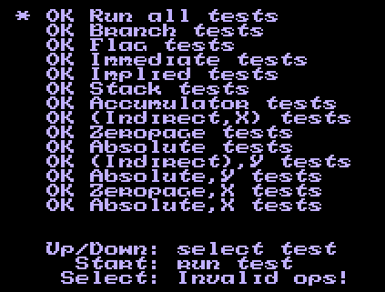

### STEP5: 手柄输入

为了让这个测试ROM能够通过, 我们加入手柄输入试试吧.

一般来说最少得有1个手柄, 不然只能看着马大叔被板栗弄死.

最高可支持4个手柄输入, 比如这个款游戏:
[油管 - 4 Player Madness - RC PRO-AM 2 (NES)](https://www.youtube.com/watch?v=-MnQhH7Q2Jg)

但是是通过特殊装置接驳上去的.

### 标准输入
先支持普通双手柄吧, 最后完善测试再说其他情况.

[Controller port registers](https://wiki.nesdev.com/w/index.php/Controller_port_registers)

根据文档, NES(欧美版) 和 Famicom(日版) 存在区别:

地址|比特位|功能
----|-----|----
N: $4016 (写) | ----, ---A | 为全手柄写入选通(strobe)
N: $4016 (写) | ----, -CBA | 为扩展端口写入数据
N: $4016 (读) | ---4, 3--0 | 从手柄端口#1读到的数据 
N: $4016 (读) | ---4, 3210 | 从扩展端口读到的数据 
N: $4017 (读) | ---4, 3--0 | 从手柄端口#2读到的数据 
N: $4017 (读) | ---4, 3210 | 从扩展端口读到的数据 
F: $4016 (写) | ----, ---A | 为全手柄写入选通(strobe)
F: $4016 (写) | ----, -CBA | 为扩展端口写入数据
F: $4016 (读) | ----, -M-0 | 从手柄端口#1读到的数据,  以及手柄端口2读取到的麦克风(M)数据
F: $4016 (读) | ----, --1- | 从扩展端口读到的数据 
F: $4017 (读) | ----, ---0 | 从手柄端口#2读到的数据 
F: $4017 (读) | ---4, 3210 | 从扩展端口读到的数据 


同4人手柄, 扩展端口就直接...所以实现基本输入就行, 反正绝大数游戏都是支持的 —— 也就是最低位.


strobe(选通)乍一看! 还以为是string.h的一个函数... 对于这里输入来说, 是一种重置手段:

 0. 为0时表示按钮状态会被像字节流一样被连续读取.
 1. 唯一表示重置按钮读取序列状态, 会被一直'重置'直到被设为0

也就是说读取按钮状态应该这样:

 - WRITE $4016, 1
 - WRITE $4016, 0
 - READ $4016
 - 重复8次(拥有8个按钮)

 按钮序列如下:

  - A
  - B
  - Select
  - Start
  - Up
  - Down
  - Left
  - Right

读取大概就是这样:
```c
case 0x16:
    // 手柄端口#1
    data = (famicom->button_states+0)[famicom->button_index_1 & famicom->button_index_mask];
    ++famicom->button_index_1;
    break;
case 0x17:
    // 手柄端口#2
    data = (famicom->button_states+8)[famicom->button_index_2 & famicom->button_index_mask];
    ++famicom->button_index_2;
    break;
```
写入大概这样:
```c
case 0x16:
    // 手柄端口
    famicom->button_index_mask = (data & 1) ? 0x0 : 0x7;
    if (data & 1) {
        famicom->button_index_1 = 0;
        famicom->button_index_2 = 0;
    }
    break;
```

### 黑匣子
之前提到用户输入的黑匣子函数, 现在详细说说.
```c
void user_input(int index, unsigned char data);
```
用户输入时调用, index是0-15, 前面8个是手柄1, 后面8个是手柄2. 不过, 我记得二号手柄没有select/start键?
键盘映射如下:
```c
static const unsigned sc_key_map[16] = {
    // A, B, Select, Start, Up, Down, Left, Right
    'J', 'K', 'U', 'I', 'W', 'S', 'A', 'D',
    // A, B, Select, Start, Up, Down, Left, Right
    VK_NUMPAD2, VK_NUMPAD3, VK_NUMPAD5, VK_NUMPAD6, 
    VK_UP, VK_DOWN, VK_LEFT, VK_RIGHT,
};
```

### 输出效果


按下'I'键(Start)就能测试了. 历时这么久, 终于把基础指令测试通过了! 即便没有实现BRK和CLI!

同时, 也宣告着这个ROM的使命完成了. 感谢ROM作者kevtris.

这一节很简单! 主要当然只是实现了基本的输入而已. 项目地址[Github-StepFC-Step5](https://github.com/dustpg/StepFC/tree/master/step5)


### 作业
 - 基础: 重新实现一次吧
 - 扩展: 如果熟悉Windows编程的话, 尝试实现连发键
 - 从零开始: 从零开始实现自己的模拟器吧

### REF
 - [Input devices](https://wiki.nesdev.com/w/index.php/Input_devices)
 - [Standard controller](https://wiki.nesdev.com/w/index.php/Standard_controller)