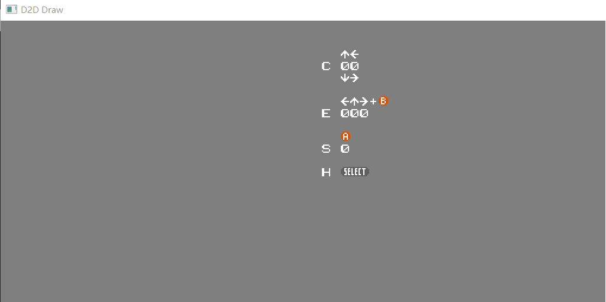

### STEP6: 精灵渲染

这一步就进入关于精灵的渲染, 精灵(Sprite)是2D游戏中一个通用概念, 一般来说是指一个单独的图块, 控制播放动画什么的. 很多2D游戏引擎甚至2D图形API都会提供叫做"精灵"的接口.
 
### 精灵显示

精灵拥有独立的256字节用内存, 这256字节不在PPU的地址空间内.

整个精灵RAM可以通过$4014的DMA(直接储存器访问)方式来写，写一个8位的数到$4014就将这个8位数所指定的内存页面整个拷贝到精灵RAM上。

|端口地址 | 读写/位 | 功能描述 | 解释 
|--------|---------|---------|-----
|$2003 | 写 | 精灵RAM指针 | 设置精灵RAM的8位指针
|$2004 | 读写 | 精灵RAM数据 | 读写精灵RAM数据, 访问后指针+1
|$4014 | 写 | DMA访问精灵RAM | 通过写一个值$xx, 将CPU内存地址为$xx00-$xxFF的数据复制到精灵内存


每个精灵共4字节的属性, 共计64个:

字节 | 位 | 描述
----|----|-----
0 | YYYY YYYY | 精灵Y坐标-1
- | - | 以显示的角度来看则+1s. 换句话说, 不能显示在第一行
1 | IIII IIII | Tile索引号(类似于名称表)
2 | v--- ---- | v 1-垂直翻转
- | -h-- ---- | h 1-水平翻转
- | --p- ---- | p 优先级(0-在背景前 1-在背景后)
- | ---- --pp | pp 调色板高两位(类似于属性表)
3 | XXXXXXXX | 精灵X坐标

要点:

 1. 是否为8x16?
 1. 8x16的话, 偶数```IIII IIII```使用图样表是$0000，而奇数则为$1000, 然后读取32字节
 3. 加载的图样表地址?
 4. 0号优先度最高(最后被画)，63号优先度最低(最先被画)
 5. 一条扫描线最多渲染8个精灵, 超过8个会设置精灵溢出标志位($2002:D5)
 6. 可以通过$2004或者$4014设置精灵RAM. 后者类似```memcpy```, 比手动实现的快
 7. 由于+1s, 所以(y)$EF-$FF的显示不了, 设置为这个值就相当于隐藏


对于第二点的额外说明:

 - $00: $0000-$001F 
 - $01: $1000-$101F 
 - $02: $0020-$003F 
 - $03: $1020-$103F 
 - $04: $0040-$005F 
 - ...
 - $FE: $0FE0-$0FFF 
 - $FF: $1FE0-$1FFF

### 渲染实现
同背景一样的渲染逻辑, 不过这次就以8个像素为单位渲染:
```c
// 0 - D7
const uint8_t low0 = ((p0 & (uint8_t)0x80) >> 7) | ((p1 & (uint8_t)0x80) >> 6);
if (low0) output[0] = palette_data[high | low0];
// 下略
```

当然可以通过写入临时的```palette_data```避免分支
```c
// 7 - D7
const uint8_t low0 = ((p0 & (uint8_t)0x80) >> 7) | ((p1 & (uint8_t)0x80) >> 6);
palette_data[high] = output[0];
output[0] = palette_data[high | low0];
// 下略
```

效率的话, 经过测试可以大致提高100%

### 黑匣子
利用黑匣子函数的副渲染, 渲染在主渲染(背景)的右侧

### 新的ROM
这一次使用的ROM叫做"color_test", 作者rainwarrior.

### 输出显示
有了背景渲染的经验, 这次同样很简单, 但是细节部分就比较困难了, 比如8x16, 两个方向的翻转. 这次DEMO工程里面就没有实现8x16和垂直翻转, 只实现了水平翻转.



项目地址[Github-StepFC-Step6](https://github.com/dustpg/StepFC/tree/master/step6

### 作业
 - 基础: 尝试实现DEMO里面没有实现的垂直翻转
 - 扩展: 尝试实现DEMO里面没有实现的8x16模式
 - 从零开始: 从零开始实现自己的模拟器吧

### REF
 - [Emulator tests](https://wiki.nesdev.com/w/index.php/Emulator_tests)
 - [PPU sprite evaluation](http://wiki.nesdev.com/w/index.php/PPU_sprite_evaluation)