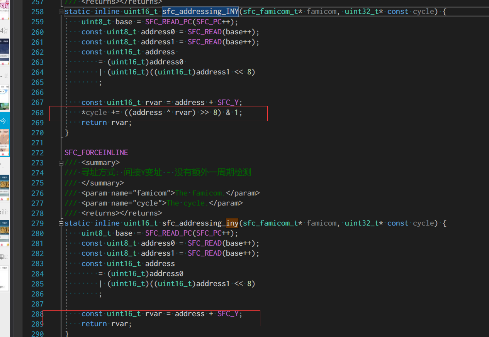
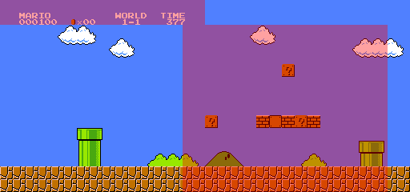
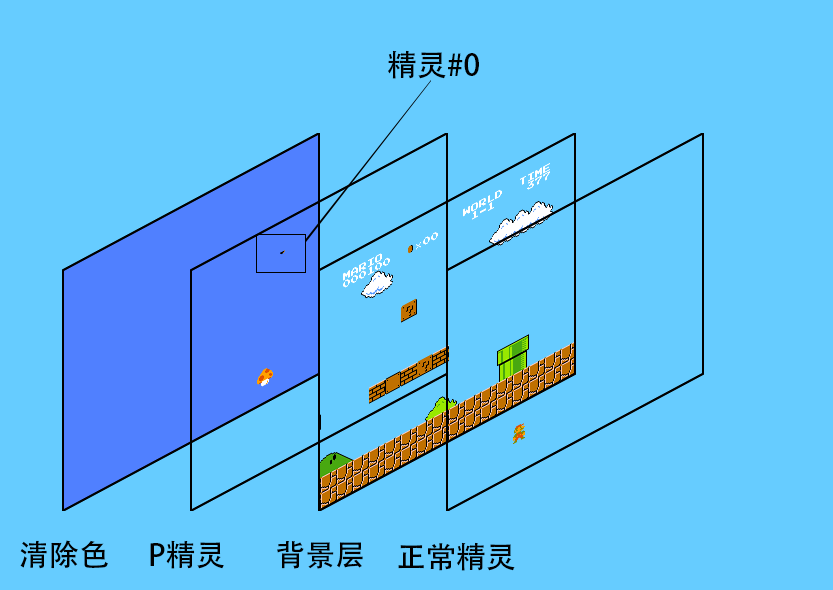
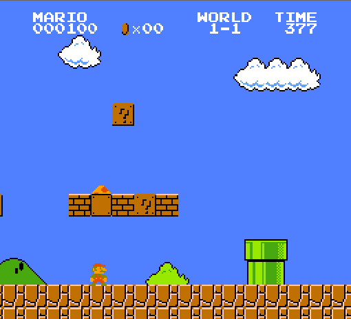
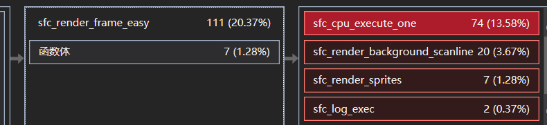

### 中精度同步

本文github[备份地址](https://github.com/dustpg/BlogFM/issues/18)

之前用的是非常暴力(?)的同步方法, 同步精度大致在帧, 自己称之为"低精度同步". 现在就要使用更加精确的同步了, 同步精度大致在扫描行, 自己称为"中精度同步". 还有最高的基于各个部件周期, 精度大致为次像素, 称为"高精度同步". 不过高精度同步会消耗较大的计算资源, 不在本博客范围内, 有兴趣的读者可以自行实现. 

### CPU周期

之前提到了每个指令需要消耗多少多少周期, 现在就需要用了. 固定周期的直接加就行:
```c
// 指令实现
#define OP(n, a, o) \
case 0x##n:\
{           \
    cycle_add += (uint32_t)SFC_BAISC_CYCLE_##n;\
    // 后略
}
```
至于浮动的, 条件转移: 
```c
/// <summary>
/// StepFC: 执行分支跳转
/// </summary>
/// <param name="address">The address.</param>
/// <param name="famicom">The famicom.</param>
/// <param name="cycle">The cycle.</param>
static inline void sfc_branch(uint16_t address, sfc_famicom_t* famicom, uint32_t* const cycle) {
    const uint16_t saved = SFC_PC;
    SFC_PC = address;
    ++(*cycle);
    *cycle += (address ^ saved) >> 8 & 1;
}
```
让条件转移语句判断后调用即可.

对于像"绝对X变址", "绝对Y变址", "间接Y变址"这三个有些没有额外的一周期这里用大小写区分:



(绝对X/Y变址也是同样的)

截图中可以看到有```SFC_READ_PC```和```SFC_READ```, 为什么这么区分, 原因在后面

还有像精灵DMA会消耗相当的周期:
> Not counting the OAMDMA write tick, the above procedure takes 513 CPU cycles (+1 on odd CPU cycles): first one (or two) idle cycles, and then 256 pairs of alternating read/write cycles. (For comparison, an unrolled LDA/STA loop would usually take four times as long.)

### CHR-RAM
之前提到有些ROM没有CHA-ROM, 只有CHR-ROM, 解决方法很简单:
```c
const size_t size1 = 16 * 1024 * nes_header.count_prgrom16kb;
// 允许没有CHR-ROM(使用CHR-RAM代替)
const size_t size2 = 8 * 1024 * (nes_header.count_chrrom_8kb | 1);
uint8_t* const ptr = (uint8_t*)malloc(size1 + size2);
```
在CHR-ROM的长度为0时多分配8KB即可, 这里偷懒直接'或'了一下. 

主要是因为C没有```std::max```, 又太懒╮（￣▽￣）╭

不过注意的是这部分是会被程序修改的...反正是```malloc```的无所谓了.

### 分割

在实现之前, 先看一下之前使用的一张图片:


之前提到了红框是当前的屏幕偏移量, 那有没有什么奇怪的地方?

 - [PPU scrolling](http://wiki.nesdev.com/w/index.php/PPU_scrolling)

就是左上角的分数显示! 因为直接显示这样分数会错位的. 这就是FC程序的小技巧, 屏幕刷新时写入VRAM指针. 大致时机可以分成两部分:

  1. 屏幕刷新
  2. 垂直空白

其中VBlank期间访问VRAM是合法, 而刷新时访问是不合法的. 但是可以利用写入\$2006(VRAM指针)这个制作出一些‘滚动’效果(或者\$2005, 但是PPU内部实现表明其实是一回事), 而真正的访问VRAM - \$2007(VRAM数据) 就太非法了, 模拟难度较高——需要高精度同步. 

一般利用这个实现之前提到的滚动方式, 被称为'分割滚动'(split-scrolling)

### 精灵命中与溢出
有这么两个标志位, 会在渲染中途才会被设置, VBlank结束后会清空. 这两个标志位一般来作为'分割滚动'的动作的转折点.(不过实际上溢出很少有游戏会使用).
所以一些游戏(比如[超级马里奥](https://retrocomputing.stackexchange.com/questions/1898/how-can-i-create-a-split-scroll-effect-in-an-nes-game)):

 1. 一直检测是不是命中了
 2. 命中了? 将水平滚动恢复正常, 让下面的游戏背景可以滚起来. 
 3. VBlank期间再设置水平滚动为0让背景不滚


超马1的那个金币下边就是精灵0, 等到触发#0命中, 然后程序猿掐到大概状态栏显示完了(还有一行), 就恢复滚动.

除了这两个还有通过硬件的IRQ(比如超级马里奥3利用Mapper触发IRQ, 状态栏在下面; 甚至还有的ROM是通过APU的IRQ), 后面再说

### 精灵0命中
简单地说就是精灵#0, 如果某像素不是透明的, 然后背景也不是全局背景色(即低2位都有效时)会触发, 详细的说明(细节)还是请到引用连接查看. 目前的实现, 很多细节是通过不了全部测试的.

不过一般游戏, 要么就是用来分割屏幕, 要么就不用, 实际上就懒得完全实现.

### 精灵溢出
简单地说一条扫描线需要渲染超过8个精灵时, 触发溢出. 详细的说明(细节)还是请到引用连接查看. 目前的实现, 很多细节是通过不了全部测试的

不过一般游戏, 基本就不用(就几个游戏在用), 实际上就懒得完全实现.

### 相关内部寄存器
 - v: 当前VRAM (15位)指针
 - t: 临时VRAM (15位)指针, 可以认为是屏幕左上角的图块
 - x: 水平方向滚动微调 (3位)
 - w: 标记双写寄存器的写入次数 (1位)

VRAM指针(\$2006)在渲染时可被描述为:

位 | 描述
---|-----
0-4 | 水平偏移量, 以图块作为单位(8像素)
5-9 | 垂直偏移量, 以图块作为单位(8像素)
A-B | 名称表的索引($2000, $2400, $2800, $2C00)
C-E | 额外的(微调)垂直偏移量 像素(0-7)
F | 忽略


[PPU scrolling](http://wiki.nesdev.com/w/index.php/PPU_scrolling)中提到的这几个内部寄存器, 应该是PPU本身的内部实现, 但是我们不用太拘束, 只要理解每个位表示什么就行:

 1. (渲染时)\$2006的A-B位其实就是对应了\$2000(控制)的低2位. 
 2. (渲染时)\$2006的0-4位对应\$2005第一次写入的高5位, x寄存器对应\$2005第一次写入的低三位
 3. 垂直偏移量同理
 4. 只要程序猿不搞大新闻, 比如先写一次\$2005再写\$2006这种操作, 目前的实现还行, 以后可能会向官方内部的实现靠拢
 5. [垂直滚动的修改仅对下帧有效](http://wiki.nesdev.com/w/index.php/PPU_scrolling#During_dots_280_to_304_of_the_pre-render_scanline_.28end_of_vblank.29)(会在VBlank结束时复制部分位)
 6. (剧透: 后面因为有BUG, 还是按照vtxw实现了, 官方实现太香了)

### 修改点
 0. 反汇编时按指令长度读取(最开始提出, 终于在这填上了)
 1. 通过剖析, 发现READ操作消耗了近乎三分之一的CPU时间, 现在将读取指令区的操作单独实现了一份(目前是所有的寻址以及读取OpCode, 还有一个是立即寻址的操作, 有点难优化, 需要改一下OP宏的逻辑. 不过效率得到了明显的提升. )
 2. 指令模拟代码换成了强行内联, C99添加的inline效果不够给力, 只好用强行内联(__forceinline/\_\_attribute\_\_((always_inline))) 效率也得到了明显提升
 3. Address should not increment on $2004 read, ROM 测试提出的, 不加就不加咯.
 4. DMA copy should start at value in $2003 and wrap, ROM 测试提出的, DMA复制需要换'行'处理
 5. Palette read should also read "underneath" VRAM into read buffer, ROM 测试提出的, 读取调色板会将处于下方调色板'下方'的VRAM读入伪缓存


### 同步
我们先实现一个简单的模式来模拟一帧(场), 也就是"中精度同步". 并且**基于'同时只能显示25色'的假设**(虽然可以在渲染时修改调色板以达到超过25色的可能, 也就是说这种情况是不支持的), 也就是, 和之前的实现差不多.

根据说明, 我们可以这么实现:

 0. 开始前处理精灵溢出, 计算精灵会溢出的行数
 1. 0-239 行 可见扫描线 x240
    - 根据当前偏移渲染该行背景
    - 处理精灵#0的命中测试
    - 检测精灵溢出行
    - 让CPU执行一段时间
    - 240行结束后一次性渲染所有精灵
 2. 240 渲染后 x1
    - 让CPU执行一段时间
 2. 241-260行 垂直空白行 x20
    - 开始后: 设置VBlank标志
    - 开始后: 看情况执行NMI
    - 开始后: 执行CPU执行一段时间
    - 结束后, 清除status所有状态
 3. 261-262 空行 x2 (或者1.5)
    - 执行CPU一段时间

 '执行CPU一段时间'是多久呢, 根据文档[Clock rate](https://wiki.nesdev.com/w/index.php/Clock_rate), NTSC的Master Clock是'21.477272 MHz', 除以60, 再除以 262.5大概是1364周期.
 CPU频率是Master的12分之一, 113.5. 为了避免小数, 我们用 Master Clock作为基准就行.


 
现在刷新的频率是和模拟器环境, 也就显示器, 的刷新频率是一致的. 好在自己电脑就是60Hz无所谓, 如果是144Hz显示器的话速度就会很快. 这个由于自己显示器就是60Hz所以一直没在意, 一直没改, 后面再说吧.

### 合在一起
现在就是把背景和精灵合在一起了, 如果我们把全局背景色理解为清除色的话, 就很简单地理解了:



合成:




看起来很简单, 但是花的时间非常多, 大概花了一个星期. 完成倒是很早就完成了, 完成后就是去通过ROM测试, 发现通过不了就再修改, 反反复复, 直到测试通过到一定程度(没有完全通过), 非常花时间.

当然, 实现了精灵的8x16, 两个方向翻转, 但是在处理P精灵时存在小BUG, 这个因为打算后面用顶点去渲染, 有Z坐标的话就很方便了.

### 细节
有些细节依然没有实现:

- 什么, NTSC不能显示最上最下8像素啦
- 什么, \$2001除了D3, D4显示背景/精灵的使能位都没有实现啦
- 什么, 右边边界的精灵由于越界会写入一下行左边啦. 
- 溢出判断仅仅通过了第一个测试, 精力0命中测试仅仅通过了4个测试(但是自己觉得足够用了)
- 太多了, 需要后期打磨


### SSE指令
实现了之后, 自己用SSE处理了背景渲染的部分, 因为背景相对来说是对齐的, 就像数组那样, CPU使用明显降了不少. 

不过精灵部分没有用SSE实现, 因为没有对齐. 通过对雪碧拉罐(spritecan)的ROM测试:


再使用CPU剖析:


可以看出雪碧(sprite), 哦不, 精灵(sprite)的渲染占了整个核心的6%(1.28 / 20.37), 换句话说就算精灵渲染优化到0(效率提升无限倍), 也只有6%的核心提升, 全局甚至只有1%. 所以懒得优化了.


是的, 这次的测试ROM是spritecans, 这个ROM使用的是8x16精灵模式.

项目地址[Github-StepFC-Step7](https://github.com/dustpg/StepFC/tree/master/step7)


### F-1 Race
被誉为天才程序猿的岩田聪在FC上开发了一款伪3D赛车游戏 - F-1 Race. 目前模拟效果如下:


可以看出这个游戏是算准了CPU周期然后执行水平偏移实现的伪3D(大神就是能在处理游戏逻辑的同时掐准CPU周期写入偏移量). 也可以看出目前的同步率不够高(基于行, 一旦错过则该行错位), 看看以后能不能解决(比如一旦写入偏移则通知渲染层).

顺带一提这个游戏是分奇数帧和偶数帧的, 处理不当会导致画面闪烁.

> 岩田聪在奇数帧中更新转速(RPM), 偶数帧中更新距离(DIS)

### 作业
 - 基础: 使用vtxw寄存器实现相关处理
 - 扩展: 重写EZ模式渲染的所有代码
 - 从零开始: 从零开始实现自己的模拟器吧
 

### REF
 - [PPU rendering](http://wiki.nesdev.com/w/index.php/PPU_rendering)
 - [PPU scrolling](http://wiki.nesdev.com/w/index.php/PPU_scrolling)
 - [Sprite zero hits](https://wiki.nesdev.com/w/index.php?title=PPU_OAM&redirect=no#Sprite_zero_hits)
 - [红白机64合1大回顾（30）：F1 Race 大赛车](https://zhuanlan.zhihu.com/p/22754471)