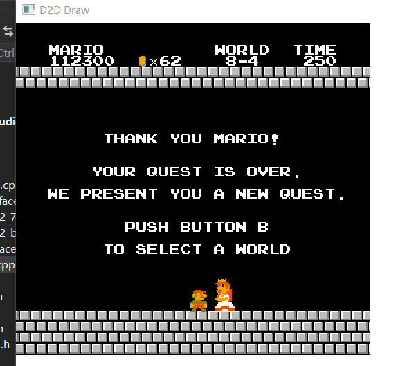

### STEP8: 基本音频播放

本文github[备份地址](https://github.com/dustpg/BlogFM/issues/19)

上节简单介绍了基本概念, 下面, 介绍相关[寄存器](https://wiki.nesdev.com/w/index.php/APU_registers)


### 分频器(Divider)
这里特指时钟分频器(或者叫做'分时器'?), 分频器会利用一个值(P)输出时钟, 内部持有一个计数器, 计数器到0就输出然后重置为P值, 比如P为5:
 - 2 -> 1
 - 1 -> 0
 - 0 -> 5 =>输出
 - 5 -> 4
 - 4 -> 3
 - 3 -> 2
 - 2 -> 1
 - 1 -> 0
 - 0 -> 5 =>输出
 - 5 -> 4
 - 4 -> 3
 - 3 -> 2
 
可以看出这个分频器的周期是P+1.

可以强制让分频器重载P值, 不过就不会输出时钟了. P值修改时不会影响分频器当前的计数.


### 帧计数器(Frame Counter) / 帧序列器(Frame Sequencer)
地址|位|功能
----|--|---
$4017|M--- ----|模式(0:4步 1:5步)
$4017|-I-- ----|IRQ禁止标志位


地址$4017, 问: 读取的话是用来干什么的?

写入的话就是用控制帧计数器([APU Frame Counter](https://wiki.nesdev.com/w/index.php/APU_Frame_Counter))的, 这个就是用来驱动方波、三角波以及噪声声道的包络、扫描和长度单元.

内部包含一个分频器和序列器.

帧计数器的分频器会以四倍于帧率的频率进行"计数"(NTSC下就是240Hz, 实际上会'稍微略'低于240). 4步模式4步就是刚好一帧, 5步模式5步就是一又四分之一帧了. 之后就根据序列器中的内容进行触发.

写入会使分频器与序列器复位

模式|序列|实际频率|说明
----|---|--------|---
模式0|---f| 60Hz | 设置中断标志
模式0|-l-l| 120Hz | 为长度计数器与扫描单元提供时钟信号
模式0|eeee| 240Hz | 为包络以及三角波的线性计数器提供时钟信号
模式1|-----|  0Hz | 不会设置中断标志
模式1|l-l--| 96Hz | 为长度计数器与扫描单提供时钟信号
模式1|eeee-| 192Hz | 为包络以及三角波的线性计数器提供时钟信号

这个帧计数器的频率和垂直空白不是完全同步的, 是独立运行的, 只能说几乎是4倍. 接下来的内容, **如果没有特殊说明, 则假定在模式0(四步模式)下**.


IRQ:

> When $4017 sets the IRQ flag, it will keep telling the CPU to cause an IRQ, until the CPU reads from $4015 (or writes $40 or $C0 to $4017) to tell it to stop requesting an IRQ. $4017 doesn't have any other way of knowing that the CPU handled the IRQ; it doesn't know that the CPU has entered the IRQ handler.

文档说是由于电平敏感, 任何时间中断标志被设置并且并且CPU的I标志为0则立即触发IRQ. 这里每次写入$4017就会重置状态, 感觉时机很难把握, IRQ先放一放. 

(中精度模拟下)简单实现为一帧内每隔大概65~66扫描行触发一次.

### 包络发生器(Envelope Generator)
包络([APU Envelope](https://wiki.nesdev.com/w/index.php/APU_Envelope))发生器生成一个固定的音量或者一个锯齿包络(还可以选择是否循环)来控制音量, 内部包括一个时钟分频器和一个计数器.

上面提到了, 分频器的周期是P+1, 即每次获得P+1次时钟信号则输出一次时钟信号.

1. 当接收到帧计数器发出的时钟信号时
    - 之前写入了第四个寄存器?
    - 是: 计数器设为15, 重置分频器
    - 否: 为分频器提供一次时钟信号
2. 当分频器输出了时钟信号时
    - 计数器>0
    - 是: 计数器-1
    - 否且设置了循环: 计数器=15
3. 如果设置了固定音量
    - 是: 直接输出音量为P
    - 否: 输出音量为计数器的数据


例如:

 - 如果P=0, 即分频器的周期为1, 能够将音量在4帧内将声音从15降至0, 2帧内将音量从7降至0.
 - 如果P=15, 即分频器的周期为16, 能够在16*4, 即一又十五分之一秒内将声音从15降至0.
 - 可以看出这个包络可以让声音'渐出'
 - 实际上很多游戏的音乐使用的固定音量(如果是完整的ADSR包络, 估计就会用的很多了)

 
### 长度计数器(Length Counter)
长度可以理解为时长. 这东西用来自动控制持续的时间, 计数器可以被暂停. 暂停标志位是在D5位(方波、噪声), 或者D7位(三角波), 设置为0表示暂停. 暂停会让计数器...emmm...暂停. 

内部计数器到0的话就会静音; 被提供时钟信号时, 计数器会-1, 除非:

 - 已经0了
 - 暂停中

长度计数器([APU Length Counter](https://wiki.nesdev.com/w/index.php/APU_Length_Counter))是一个5bit的数据, 也就是说最高能到31, 前面提到120Hz的长度计数器触发频率, 换句话说最多15.5帧...太短了!

所以实际上5bit是一个索引值:
```

    iiii i---       length index
    
    bits  bit 3
    7-4   0   1
        -------
    0   $0A $FE
    1   $14 $02
    2   $28 $04
    3   $50 $06
    4   $A0 $08
    5   $3C $0A
    6   $0E $0C
    7   $1A $0E
    8   $0C $10
    9   $18 $12
    A   $30 $14
    B   $60 $16
    C   $C0 $18
    D   $48 $1A
    E   $10 $1C
    F   $20 $1E
```
长度计数器可以看出比较粗糙, 比如这种表都是偶数.


### 状态寄存器(Status Register)
$4015是APU相关寄存器唯一一个可读的寄存器.

**读**
位|作用
--|---
i--- ----| DMC的IRQ标志
-f-- ----| 帧中断标志, 如果为1, 会确认IRQ, 返回1置为0
---d ----| DMC还有剩余样本(剩余字节>0)
---- n---| 噪声长度计数器>0
---- -t--| 三角波长度计数器>0
---- --2-| 方波2长度计数器>0
---- ---1| 方波1长度计数器>0

**写**
位|作用
--|---
---d ----| DMC声道使能位
---- n---| 噪声声道使能位
---- -t--| 三角波声道使能位
---- --2-| 方波2声道使能位
---- ---1| 方波1声道使能位

写入0对应的声道就会静音, 同时长度计数器**归零**. 一定注意要归零, 自己之前忘记归零导致玩马里奥第二关才发现有音效问题, 找了很久才发现是这个原因


### 方波#1#2 寄存器
地址|位|功能
----|--|---
$4000/$4004|DD-- ----|占空比 
$4000/$4004|--L- ----| 循环包络 / 暂停长度计数器
$4000/$4004|---C ----| 固定音量标志位(1: 固定音量 0:使用包络的音量)
$4000/$4004|---- VVVV| 固定音量模式下的音量 或者作为包络的分频器输入P
$4001/$4005|E--- ----| 扫描单元: 使能位
$4001/$4005|-PPP ----| 扫描单元: 周期P
$4001/$4005|---- N---| 扫描单元: 负向扫描
$4001/$4005|---- -SSS| 扫描单元: 位移次数
$4002/$4006|TTTT TTTT| 声道周期低8位
$4003/$4007|---- -TTT| 声道周期高三位
$4003/$4007|LLLL L---| 长度计数器加载索引值

为了方便, 下面节省$4004-$4007的说明

#### 频率
 - 方波声道的频率是CPU时钟的全境掉线, 不, 分频(division)
 - 计算方法是 ```f = CPU / (16 * (t + 1))```
 - t是$4002-$4003的11位声道周期计时器
 - t<8则静音, 即阈值是CPU频率的128分之一
 - 1.789773MHz NTSC, 1.662607MHz PAL
 - 大概是13kHz, 换句话说, 输出采样频率最好是至少26kHz, 这里就直接用万能的44.1kHz

#### 占空比
 - 占空比由$4000的高两位控制
 - [0] 0 1 0 0 0 0 0 0 [12.5%]
 - [1] 0 1 1 0 0 0 0 0 [25%]
 - [2] 0 1 1 1 1 0 0 0 [50%]
 - [3] 1 0 0 1 1 1 1 1 [25% 反相]

#### 音量
 - 可以是固定音量, 由$4000:D4(C)位确定
 - 固定音量下, 具体音量就是$4000:D0-D3(V)
 - 不是固定音量, 换句话说就是采用包络进行音量控制, 即$4000:D4(C)位为0
 - $4000:D0-D3(V)这时候就是包络的周期
 - 如果包络的循环模式$4000:D5(L)没有打开, 则启动长度计数器, 计数器到0则会静音

### 扫描单元(Sweep Unit)
扫描单元([APU Sweep](https://wiki.nesdev.com/w/index.php/APU_Sweep))位提供了周期性调整方波周期的手段, 包含一个分频器和一个移位器.

```
EPPP NSSS  使能标志, 分频器周期(需要+1), 负向标志位, 位移数量
```

同样, 扫描单元的分频器也是P+1, 不同的是一个3bit的了. 还有就是扫描单元是以120Hz的频率触发, 所以扫描的频率是15Hz-120Hz(0.5帧-4帧)

移位器连续地对频率进行扫描:

 - 将当前周期(11bit)右移s位, 作为结果值1
 - 将当前周期加上(N为1则减去)结果值1, 作为结果值2
 - 输出结果值2
 

方波1和2区别:

 - 在N=1时, 方波#1是加上结果的反码, 也就是需要额外-1
 - 在N=1时, 方波#2是加上结果的补码, 直接减就行
 - 这是BUG还是特性?

例子:

 - P = 0, N = 0, S = 0, 即每0.5帧将输出周期加倍, 即输出频率降低到一半, 低八度
 - 钢琴中央A音高对应频率为440Hz, 低八度A音则为220Hz
 - P = 1, N = 1, S = 1, 即每帧将输出周期降至原来的一半, 即输出频率加倍, 高八度
 - 高八度A音对应频率为880Hz

静音:

 - 可以看出这个可以'加倍', 所以一旦超过11bit的范围($800), 应该被静音
 - 同样会减少, 之前提到: 少于8静音.
 - 因为是连续扫描的, 所以在不干涉的情况下, 最后总会高于$7FF或者低于8. 这个时候不会对频率更新(比如降到7然后就不会更低了)
 - 假设一开始就是7, 然后准备增加, 因为已经低于8了, 实际不会增加. 
 - 这个测试ROM[sweep_cutoff]有测试, 不过自己并没有实现


### 方波的周期与频率
之前说到方波频率的计算公式```f = CPU / (16 * (t + 1))```, 为什么呢?

1. APU的频率是CPU频率的一半, 也就是说2个CPU周期等于1个APU周期
2. 之前说到了方波的占空比, 是一个8个数, 组成的数列
3. 比如[0 1 1 1 1 0 0 0]
    - 第一个APU周期方波输出0
    - 第二: 1
    - ...
    - 第八: 0
4. 这样上限频率是CPU/16
5. 之前说到了11bit的周期, 就像其他周期一样, N表示每N+1触发一次
6. 每N+1次APU周期 -> 推进这8个数列的索引
7. 每个APU周期 -> 输出这8个数列的当前索引表示的数据
8. 这样就输出了方波

### 具体实现
前面提到了, 目前使用状态机实现, 目前的实现是60Hz(同刷新率). 如果一帧内修改了超过1下, 只会以某一时刻为准, 不过60Hz对于音乐是够用了, 至于音效么, 只能说总比没有的好(比如马里奥跳跃的音效, 目前听起来就有点呆板了). 以后可能会用更好的办法(一旦修改数据就通知渲染层(广义)).

 - 我是谁?
 - 方波
 - 频率?
 - 由当前周期通过公式计算, 当前周期可能会通过扫描单元进行修改
 - 周期太低(低于8)或者太高(超过11bit)都会导致静音
 - 音量?
 - 由包络单元输出, 当前音量可能是固定的也可能是通过包络衰减, 甚至还有循环
 - 0就是静音 15是最大
 - 占空比?
 - 就是那4个
 - 输出?
 - 置空状态寄存器对应的使能位能让声道静音
 - 长度计数器归零也会导致静音


### 三角波 寄存器

寄存器地址|位|说明
---------|--|---
$4008|C--- ----|暂停长度计数器/线性计数器控制
$4008|-RRR RRRR|线性计数器重载值
$4009|---- ----|居然没用
$400A|TTTT TTTT|周期低8位
$400B|---- -TTT|周期高3位
$400B|LLLL L---|长度计数器载入索引


### 线性计数器
之前有一个长度计数器, 用于控制播放的时间, 由于120Hz和都是偶数, 所以精度是在一帧. 三角波增加了一个线性计数器能够更为精确地控制(那么代价是什么?).

$4008包括了一个控制标志位以及一个7位的重载值: ```crrr rrrr ```, 当然这个C位也被用于长度计数器. 

之前可以看长度计数器是一回合2次(又由于是偶数, 所以...), 线性计数器则是4次:

  - 如果之前写入了$400B, 则标记暂停
  - 帧计数器提供了信号: 如果标记了暂停
    - 是: 将计数器设置为7bit重载值R
    - 否: 计数器非零则减1
  - 帧计数器提供了信号: 如控制标志C为0, 则清除暂停标志


7bit, 240Hz可以看出还是挺细腻的.

### 三角波
同之前的方波, 三角波也有一个数列(32):
> F E D C B A 9 8 7 6 5 4 3 2 1 0 0 1 2 3 4 5 6 7 8 9 A B C D E F

所以理论上最高频率是CPU/64? 实际上与方波不同的是, 三角波采用的是CPU的频率(搞事!), 也就是最高CPU/32. 计算公式: ```f = CPU/(32*(t + 1))```

等等, CPU/32太高了吧? 硬件上的确没有限制, 实现上我们可以让t小于一个阈值让它实现上'静音'(反正听不到), 这个阈值当然就是当前输出采样率的一半或者说人耳上限20kHz再换算到t. 2?

模拟器可以这么实现, 但是如果是游戏开发就不能这么干, 单独的确是静音, (实机或者高精度模拟器)混起来就可能产生爆裂声 - 除非就想这么干.

### 具体实现

没有包络控制音量, 没有扫描器控制频率, 对于模拟器实现来说——爽. 同样由于这些问题, 三角波要么循环要么就短时间放一下.

> NES的三角波没有音量设定, 但是有一种特殊的调节其音量的方法(DAC法)

 - 我是谁?
 - 三角波
 - 频率?
 - 通过周期换算, 如果频率过高可以实现为静音
 - 音量?
 - 没有直接控制
 - 输出?
 - 置空状态寄存器对应的使能位能让声道静音
 - 长度计数器归零也会导致静音
 - 线性计数器归零也会导致静音


### 噪声 寄存器
```
$400C   --le nnnn   loop env/disable length, env disable, vol/env period
$400E   s--- pppp   short mode, period index
$400F   llll l---   length index
```

### 线性反馈移位寄存器
$400E S--- ---- S: 短模式

噪声声道有一个15bit的LFSR, 每次输出最低的bit位.算法如下:

 1. 将D0位与D1做异或运算
 2. 如果是短模式则是D0位和D6位做异或运算
 3. LFSR右移一位, 并将之前运算结果作为最高位(D14)

如果是长模式(S=0), 这个LFSR的周期是32767(如果初始0则一直为0), 短模式的周期是93(还有可能是31?)

为了避免一直为0, 初始化应该为1.

### 周期索引
$400E ---- pppp 周期索引值
周期是一个4bit的值, 理所当然是一个索引值:
```
Rate  $0 $1  $2  $3  $4  $5   $6   $7   $8   $9   $A   $B   $C    $D    $E    $F
      --------------------------------------------------------------------------
NTSC   4, 8, 16, 32, 64, 96, 128, 160, 202, 254, 380, 508, 762, 1016, 2034, 4068
PAL    4, 8, 14, 30, 60, 88, 118, 148, 188, 236, 354, 472, 708,  944, 1890, 3778
```
制式的差异主要体现在CPU频率上:

 - PAL-CPU/NTSC-CPU = 0.929

理论频率计算公式应该是```CPU / P```, 或者```APU / P```. 不用加1, 是因为直接给出了周期. 不过因为是噪音, 不是真正的频率, 这个频率只是LFSR的更新频率.

至于是```CPU / P```还是```APU / P```, 感觉上有歧义:
 - [APU REF](http://nesdev.com/apu_ref.txt)
    > All channels use a timer which is a divider driven by the ~1.79 MHz clock.
    > 
    > The noise channel and DMC use lookup tables to set the timer's period. For the square and triangle channels, the third and fourth registers form an 11-bit value and the divider's period is set to this value *plus one*.
    - 这篇文档提到全部计时器是以CPU1.79MHz驱动
    > Timer with
divide-by-two on the output
    - 但是方波计时器会除以2
 - [NESDEV APU](https://wiki.nesdev.com/w/index.php/APU)
    - 这个当然是主要参考的
    > A timer is used in each of the five channels to control the sound frequency. It contains a divider which is clocked by the CPU clock. The triangle channel's timer is clocked on every CPU cycle, but the pulse, noise, and DMC timers are clocked only on every second CPU cycle and thus produce only even periods.
    - 这个文档就说只有三角波是特例, 是以CPU周期为单位, 其他都是每两个CPU周期计算一次


然后自己用马里奥反复对比了其他的模拟器, 发现计算公式感觉上应该是```CPU/P```(当然没有比较源代码, 毕竟世界上最痛苦的事情莫过于看别人写的代码), 有一个比较低的$0C音, 区别较大. 这个也需要求证. **不排除自己的实现有问题**.

也就是说噪音生成的逻辑:

 - 每P次APU(CPU?)周期更新一次LFSR
 - 每次采样时: 检测LFSR最低位
   - 1: 输出音量
   - 0: 输出0

### 包络归来
噪声声道也用到了包络, 方波已经说到了就不再累述

### 具体实现
EZ模式实现就比较困难了, 因为实际上有一个LFSR状态机. 但是回归本质, 这是一种白噪声的实现手段, 实际上只有$400E中的5bit控制音色, 即实际上只有32种音色, 16种频率乘上2种模式. 反正是噪音(EZ模式嘛, 听个响, 要啥自行车).

再简化, 频率可以通过音频API调整, 也就是说只需要实现两个模式即可. 不过, 即使是白噪声, 短时间播放一段时间还是有差别的, 记录当前播放状态反而实现了一个伪状态机, 换句话说, 也就是每次播放不要从头播放, 从上次的地方继续.

实现:

 1. 通过LFSR生成两段(两种模式)音频序列
 2. 根据模式切换这个两段序列
 3. 根据周期索引切换播放速度(调整频率)
    - 可以看出NTSC和PAL的LFSR修改频率, 理论上应该一致, 可以独立于CPU频率实现(方便但是会丢失精度, 理论一致但是实际上有误差)
    

 - 我是谁?
 - 噪音
 - 频率?
 - 没有, 滚
 - 音量?
 - 由包络单元输出, 当前音量可能是固定的也可能是通过包络衰减, 甚至还有循环
 - 0就是静音 15是最大
 - 输出?
 - 置空状态寄存器对应的使能位能让声道静音
 - 长度计数器归零也会导致静音

 ### DMC 声道
 DMC可以用来播放ΔPCM, 不过用的游戏很少, 原因当然是对于当时用kb作为单位的游戏来说太奢侈了. 2A03的DMC声道的采样深度是7bit的, 我们现在使用CD音质是16bit的, 差了不是一星半点. 甚至DEMO中自己是图方便, 直接用的32bit浮点. 

 寄存器地址|位|说明
 ---------|--|---
 $4010|I--- ----|IRQ 使能位
 $4010|-L-- ----|循环标志位
 $4010|---- PPPP|周期索引
 $4011|-DDD DDDD|DAC绑定计数器
 $4012|AAAA AAAA|样本地址
 $4013|LLLL LLLL|样本长度


不论是否被禁止(状态寄存器对应使能位), DMC都会向DAC输出数据, 一开始是0, 或者向$4011写入的7bit数据. 状态寄存器的使能位是用来控制样本播放的.

之前提到了三角波可以通过DAC方法调整音量, 想到了什么?

### 周期/频率
4bit想想还是索引:
```
Rate   $0   $1   $2   $3   $4   $5   $6   $7   $8   $9   $A   $B   $C   $D   $E   $F
      ------------------------------------------------------------------------------
NTSC  428, 380, 340, 320, 286, 254, 226, 214, 190, 160, 142, 128, 106,  84,  72,  54
PAL   398, 354, 316, 298, 276, 236, 210, 198, 176, 148, 132, 118,  98,  78,  66,  50
```
这个就没有歧义了, 两边都说明是以CPU周期为单位的, APU需要除以2. 同之前的制式区别, 当然也可以换算使用独立于CPU的频率(方便但是会丢失精度, 理论一致但是实际上有误差)

可以看出即使用最高频率播放, 也只有33kHz

### 样本
样本地址是一个8bit的数据, 实际地址是通过转换的:
 - 地址: ``` [$4012] * $40 + $C000 ```
 - 位操作: ```%11AAAAAA.AA000000```

样本长度是一个8bit的数据, 实际长度是通过转换的:
 - 长度: ``` [$4013] * $10 + 1 ```
 - 位操作: ```LLLL.LLLL0001```


### ΔPCM输出

2A03的ΔPCM大致解码流程: 

  - 一个字节为一次循环, 从D0到D7
  - 如果是1则Δ为+2, 否则Δ就是-2.
  - 初始状态为0或者$4011的写入值. 
  - 是一个7bit的数据, 超过会被钳制. 
  - 甚至能中途能够修改$4011(搞事).
  - 可以看出虽然输出7bit但是Δ是±2, 所以实际上*最多*能解码出6bit
  - 由于声音是由'震动'产生的, 所以初始值理论上无所谓, 这里完全是为7bit范围服务的
  - 1bit的ΔPCM相当粗糙, 导致DMC播放效果很差.

三个部分组成: DMA读取器->样本缓存->输出单元

 - 样本缓存
   - 8bit样本以及一个'空'状态
   - 由DMA读取器填充
   - 仅能被输出单元清空
 - DMA读取器
   - 样本缓存为'空'状态以及还有剩余样本可读则读取下一个样本, 地址+1, 剩余数量-1
   - 地址超过$FFFF则换至$8000
   - 读完了, 不过设置为循环, 则从头再来
   - 读完了, 不过设置为中断, 则标记中断
   > Based on the following tests, DMC DMA adds 4 cycles normally, 3 if it lands on a CPU write, 2 if it lands on the $4014 write or during OAM DMA, 1 if on the next-to-next-to-last DMA cycle, 3 if on the last DMA cycle. 
   - 访问CPU地址空间会让CPU暂停大约4周期
 - 输出单元
   - 内部输出循环开始后:
   - 内部计数器载入8
   - 样本缓存为空, 则标记静音状态
   - 否则清除静音状态, 将样本缓存的数据移动到一个移位器, 并将样本缓存置空
   - 当收到时钟信号:
     1. 静音状态为0? 那么移位器的D0位:
       - 0: 7bit输出减去2
       - 1: 7bit输出加上
       - 7bit输出($4011可以设置, 可以理解为同一个东西)默认是0
       - 钳制在[0, 127]区间内
       - 即: 0-2 -> 0, 127+2 -> 127
     2. 移位器右移一位
     3. 内部计数器递减, 到0后结束本次输出循环


2A03的ΔPCM是1bit的Δ, 0就-2, 1就+2. 每8次(一个字节)一个循环, 8次是一个单位, 不能从中间打断.

解码练习: 有爱好者将ΔPCM数据[RIP出来](http://famitracker.com/forum/posts.php?id=294)了, 可以用来测试解码器

 - PS: 从这里可以看出恶魔城传说/恶魔城3中, 那段仅仅+1s恶魔笑声花了3kb

编码练习: 有兴趣的话可以将一段高品质的音频序列编码至2A03的ΔPCM序列

### PCM输出
由于$4011的特点, 2A03可以以PCM方式工作, 这样会消耗大量的空间(ΔPCM x 8), 以及CPU时间. 音质甚至可以达到7bit/44kHz, 不过这个时候你就别想玩游戏了, CPU全部用来输出PCM了.

MMC5甚至带了一个类似的寄存器不过是8bit的了, 是鼓励用PCM吗?

### 具体实现
解码输出可以算是很简单, 但是对于EZ模式几乎是一个不可能的任务:

  - 允许直接写$4011, 可以让ΔPCM以[PCM方式工作](https://forums.nesdev.com/viewtopic.php?f=6&t=16117)([搞事](https://www.youtube.com/watch?v=v0dBXuZtbos)啊)
  - 读取CPU地址空间会消耗CPU周期, 会失去同步

至于7bit的PCM, 很难实现也很容易实现:

  - 利用当前设置几乎不可能实现
  - 我们增加一个接口, 在PCM模式下(如何判断?), 这个接口就是用来记录当前CPU周期数与$4011的新值
  - 让接口可以用来生产自己需要的音频序列, 实现上因为是7bit的, 我们可以简单地重解释(或乘以2)为8bitPCM直接输出, 不用转换成32bit浮点
  - 如何判断当前是否是PCM模式?
  - 嗯......?
  
至于ΔPCM, 难点是同步

 - 存在多余的4周期(甚至还有其他情况!)
 - 想想, 一行才100来个周期
 - 在33kHz下, 也就是54周期输出一次
 - 也就是一条扫描线输出两次
 - 最高频率每4行会读取一次
 - EZ模式下, 把这些周期塞在哪里?
 - (一帧最多才浪费60+周期, 无视掉?)
 - 有些搞事的会利用DMC中断来设置'分割滚动'效果
 - 还有的会利用DMC中断实现锯齿波(仅仅需要17字节+中断函数, 很不错的6bit锯齿波)
 - 如何同步?
 - 嗯......?


综上所述, 模拟DMC声道在状态机模式是比较困难的事情了(如果模拟精度精确到周期, 那就相当方便了, 真正的'仿真'), 我们先放置一下, 暂不实现.


### 混频器
托音频API的福, 自己没有实现混频器, 但是自带混频器算法如下:
```
    output = square_out + tnd_out
    
    
                          95.88
    square_out = -----------------------
                        8128
                 ----------------- + 100
                 square1 + square2


                          159.79
    tnd_out = ------------------------------
                          1
              ------------------------ + 100
              triangle   noise    dmc
              -------- + ----- + -----
                8227     12241   22638
```
当然除了2A03自带这些声道, 日版游戏还有卡带自带的额外声道, 原理上其实就是修改输出到DAC的值.

之前提到三角波可以利用DAC法修改音量, 想要模拟到这个程度必须自己混.

### 黑匣子
这次黑匣子作为状态机. 这次的文件有4个, 主要是MinGW-w64, 自己在N年前就给这个项目提出缺少XAudio2的头文件, 现在还是没有, 只好DIY以支持GCC(实际是g++)编译器(忘记说了, 项目中有CodeLite项目文件, 没有Visual Studio的可以用这个IDE, 配合GCC/MinGW-w64使用).

```c
int xa2_init();
void xa2_clean();

void xa2_play_square1(float frequency, uint16_t duty, uint16_t volume);
void xa2_play_square2(float frequency, uint16_t duty, uint16_t volume);
void xa2_play_triangle(float frequency);
void xa2_play_noise(uint16_t data, uint16_t volume);
```

感觉都不用解释. 这次测试ROM同上次的拉罐, 是的这个拉罐ROM实际是带来BGM的!

项目地址[Github-StepFC-Step8](https://github.com/dustpg/StepFC/tree/master/step8)

### 完整的马里奥
终于可以完整地游玩马里奥了, 就着这个劲儿准备把马里奥通关了!


然后自己加入了非常暴力膜幻的即时存档功能. 

### 作业
 - 基础: 文中提到了ΔPCM解码练习, 试试吧
 - 扩展: 文中提到了ΔPCM编码练习, 试试吧
 - 从零开始: 从零开始实现自己的模拟器吧

### REF
 - [APU REF](http://nesdev.com/apu_ref.txt)
 - [APU registers](https://wiki.nesdev.com/w/index.php/APU_registers)
 - [反则音源PCM DEMO](https://www.bilibili.com/video/av1173993/?p=7)
 - [FC音源普及篇](https://www.bilibili.com/video/av1211223/?p=3)