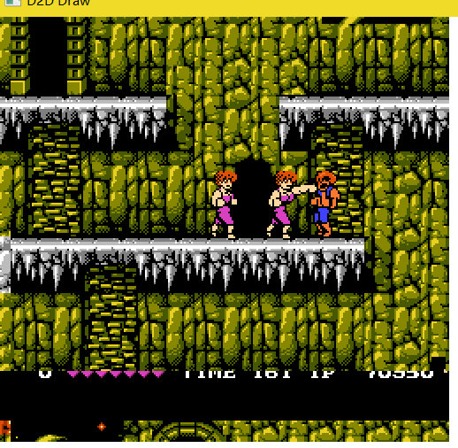
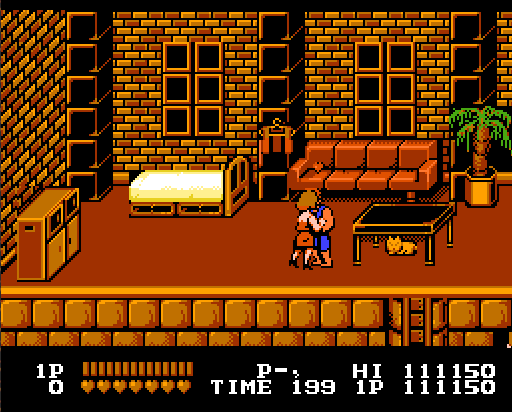

### STEP⑨: 实现部分Mapper

上一节很遗憾地没有实现DMC声道, 原因有一个: 使用Mapper0的游戏会用ΔPCM吗? 毕竟又没办法提前知道ROM到底用没用DMC

现在先实现:

 - MMC1 (1)
 - UxROM (2)
 - CNROM (3)
 - MMC3 (4)

### Mapper001: [MMC1](https://wiki.nesdev.com/w/index.php/MMC1) - SxROM

MMCx是任天堂自己开发的MMC, 任天堂自己开发的MMC是海外版(即NES)能够使用的MMC, 日本本土可以使用厂商自己生产的.

根据数据库, MMC1(在自己看来)比较有名的游戏, 比如:
 - [恶魔城II 诅咒的封印](http://bootgod.dyndns.org:7777/profile.php?id=61)
 - [双截龙](http://bootgod.dyndns.org:7777/profile.php?id=22)
 - [马里奥医生](http://bootgod.dyndns.org:7777/profile.php?id=174)
 - 算了, 看到D就好了

其中当然是双截龙比较适合测试Mapper, 流程还行. 我才不知道什么修改\$0505 \$0506可以修改时间呢.


### Banks
 - CPU $6000-$7FFF: 8 KB PRG RAM bank, fixed on all boards but SOROM and SXROM
 - CPU $8000-$BFFF: 16 KB PRG ROM bank, either switchable or fixed to the first bank
 - CPU $C000-$FFFF: 16 KB PRG ROM bank, either fixed to the last bank or switchable
 - PPU $0000-$0FFF: 4 KB switchable CHR bank
 - PPU $1000-$1FFF: 4 KB switchable CHR bank

 - 居然搭载了额外的PRG-RAM
 - MMC1的PRG-ROM Bank单位是16KB
 - $8000-$BFFF初始化为第一个Bank
 - $0000-$0FFF初始化为最后一个Bank
 - MMC1的CHR-ROM Bank单位是4KB

### 寄存器
 - $8000-$FFFF连接了一个公共的5bit移位寄存器
 - 将最高位D7为1的值写入$8000-$FFFF会重置移位寄存器, 以及写入Control寄存器, 见后面
 - 而写入D7为0的值会将D0的数据依次写(移)入移位寄存器
 - 第五次写入后, 会根据第五次写入的地址把5bit数据写入内部的寄存器
 - $8000-$9FFF Control 
 - $A000-$BFFF CHR bank 0
 - $C000-$DFFF CHR bank 1
 - $E000-$FFFF PRG bank


切换bank:
```
; Sets the switchable PRG ROM bank to the value of A.
;
              ;  A          MMC1_SR  MMC1_PB
setPRGBank:   ;  000edcba    10000             Start with an empty shift register (SR).  The 1 is used
  sta $E000   ;  000edcba -> a1000             to detect when the SR has become full.
  lsr a       ; >0000edcb    a1000
  sta $E000   ;  0000edcb -> ba100
  lsr a       ; >00000edc    ba100
  sta $E000   ;  00000edc -> cba10
  lsr a       ; >000000ed    cba10
  sta $E000   ;  000000ed -> dcba1             Once a 1 is shifted into the last position, the SR is full.
  lsr a       ; >0000000e    dcba1             
  sta $E000   ;  0000000e    dcba1 -> edcba    A write with the SR full copies D0 and the SR to a bank register
              ;              10000             ($E000-$FFFF means PRG bank number) and then clears the SR.
  rts
```

### Load register ($8000-$FFFF)
```
7  bit  0
---- ----
Rxxx xxxD
|       |
|       +- Data bit to be shifted into shift register, LSB first
+--------- 1: Reset shift register and write Control with (Control OR $0C),
              locking PRG ROM at $C000-$FFFF to the last bank.
```
D7位写入1会让写入Control寄存器自己, 为之前的值'与'上\$C, 让PRG-ROM切换模式至模式3(固定最后的bank至高地址, 切换16KB BANK至低地址)


### Control ($8000-$9FFF)
```
4bit0
-----
CPPMM
|||||
|||++- Mirroring (0: one-screen, lower bank; 1: one-screen, upper bank;
|||               2: vertical; 3: horizontal)
|++--- PRG ROM bank mode (0, 1: switch 32 KB at $8000, ignoring low bit of bank number;
|                         2: fix first bank at $8000 and switch 16 KB bank at $C000;
|                         3: fix last bank at $C000 and switch 16 KB bank at $8000)
+----- CHR ROM bank mode (0: switch 8 KB at a time; 1: switch two separate 4 KB banks)
```

等等, ROM头说有4屏模式, 你这用一屏也太抠门了吧

### CHR bank 0 ($A000-$BFFF)
```
4bit0
-----
CCCCC
|||||
+++++- Select 4 KB or 8 KB CHR bank at PPU $0000 (low bit ignored in 8 KB mode)
```
最高支持128KB的CHR-ROM, 5bit刚好32个4KB的bank. 8KB模式则只有16个.

4KB模式分成CHR bank 0和CHR bank 1. 8KB则会填充0和1.

### CHR bank 1 ($C000-$DFFF)
```
4bit0
-----
CCCCC
|||||
+++++- Select 4 KB CHR bank at PPU $1000 (ignored in 8 KB mode)
```

8KB无视掉

### PRG bank ($E000-$FFFF)
```
4bit0
-----
RPPPP
|||||
|++++- Select 16 KB PRG ROM bank (low bit ignored in 32 KB mode)
+----- PRG RAM chip enable (0: enabled; 1: disabled; ignored on MMC1A)
```

16KB为BANK, 可以支持16个, 也就是最多256KB的PRG-ROM? 

### 变种
 变种就不谈了, 懒的实现...

### 双截龙模拟中出现的问题
 - 有时会读取无效的地址($4XXX)
 - 下面的分数版显示有时会错位也就是'分割滚动'没有完全实现
 - 
 - 上面这个问题实际是自己没有吃透滚动的的原理
 - 自己干脆按照PPU本身原理(就是vtxw寄存器, 香就一个字)
 - 然后就没有这个问题了
 - 
 - 游戏愉快!

### REF
 - [MMC1](https://wiki.nesdev.com/w/index.php/MMC1)