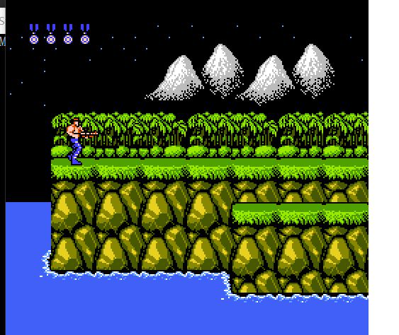
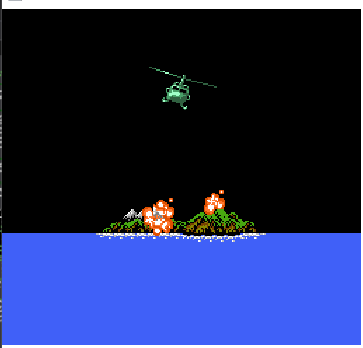

### Mapper002: [UxROM](https://wiki.nesdev.com/w/index.php/UxROM)

UxROM这就比较厉害了, 能够用到最高用到4MB的RPG-ROM.

但是没有CHR-ROM, 需要自己写入CHR-RAM.

根据数据库,UxROM(在我看来)比较有名的游戏, 比如:
 - [恶魔城](http://bootgod.dyndns.org:7777/profile.php?id=57)
 - (不被小岛承认的)[合金装备](http://bootgod.dyndns.org:7777/profile.php?id=79)
 - [洛克人](http://bootgod.dyndns.org:7777/profile.php?id=608)
 - 以及这次测试的主角, 美版[魂斗罗](http://bootgod.dyndns.org:7777/profile.php?id=52)
 - 不找了

 ### Banks
 - CPU $8000-$BFFF: 16 KB switchable PRG ROM bank
 - CPU $C000-$FFFF: 16 KB PRG ROM bank, fixed to the last bank

 这个设计就很暴力了, 我喜欢

### Bank select ($8000-$FFFF)
```
7  bit  0
---- ----
xxxx pPPP
     ||||
     ++++- Select 16 KB PRG ROM bank for CPU $8000-$BFFF
          (UNROM uses bits 2-0; UOROM uses bits 3-0)
```
完全可以实现为使用全部的8bit.

要使用全部8bit, 即4MB, 需要 NES 2.0的文件头, 为此我特地更新了文件头让其支持4MB. 之前有一个搞事的就是用的4MB的Mapper002(自制的所以没有物理板子)

有些会有总线冲突, 需要使用副-Mapper来解决, 这里就不讨论了

这个Mapper简单暴力. 避免溢出, 可以这样: ```value % count_prgrom16kb```

### 魂斗罗模拟出现的问题
 - 魂斗罗使用的精灵是8x16模式
 - 魂斗罗使用了DMC声道增强音效
 - 下次测试DMC就靠你了
 - BGM还行, SE表现力实在太差.
 - 主要就是声音播放有点问题
 - 上上下下左右左右BA!
 - 
 - 我就不信三十条命打不通关
 - ~~我才不会告诉你即时存档需要保存CHR-RAM呢~~
 - 
 - 游戏愉快!