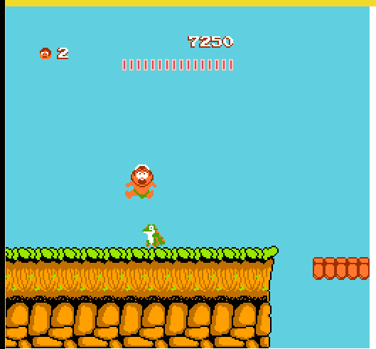

### STEP⑨: 实现部分Mapper

### Mapper003: [CNROM](https://wiki.nesdev.com/w/index.php/UxROM)

可以看出这个浓眉大眼的Mapper居然和Mapper000一样支持16KB或者32KB的RPG-ROM, 太丢脸了, 褪裙吧.

好在CHR-ROM支持得比较多.

根据数据库,CNROM(在自己看来)比较有名的游戏, 比如:
 - [勇者斗恶龙](http://bootgod.dyndns.org:7777/profile.php?id=1509)
 - [高桥名人的冒险岛](http://bootgod.dyndns.org:7777/profile.php?id=59)
 - (高桥名人成名的)[星际力量](http://bootgod.dyndns.org:7777/profile.php?id=344)
 - 相比前两个就少了一点

看来这次是一秒16发男(高桥名人)的主场. 冒险岛初代自然可以用来测试.

### Banks
 - PRG-ROM和Mapper000一样
 - CHR bank单位是8kb
 - CHR-ROM一次性切换

### Bank select ($8000-$FFFF)
```
7  bit  0
---- ----
cccc ccCC
|||| ||||
++++-++++- Select 8 KB CHR ROM bank for PPU $0000-$1FFF
```
和上一个一样的逻辑, 最多支持256*8, 2MB的CHR-ROM. 为了避免溢出, 可以进行一次膜运算: ```value % count_chrrom_8kb```

### 高桥名人的冒险岛
 - 流程有点长
 - 
 - 被击败的笔者
 - 小时候就没通关了
 - 这个是每次场景切换时切换BANK, 很科学
 - 切换的D4D5位为1, 所以不膜的话会溢出
 - 游戏愉快!


### REF
 - [CNROM](https://wiki.nesdev.com/w/index.php/UxROM)