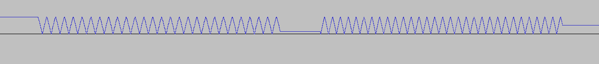
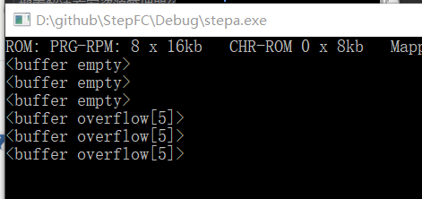
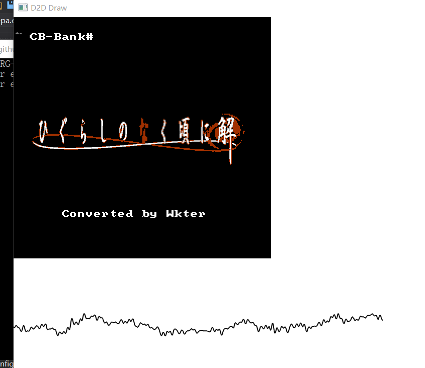
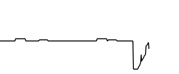

### 更好的音频播放

本文github[备份地址](https://github.com/dustpg/BlogFM/issues/25)

我们之前实现的是在音频API基础上实现的状态机, 精确度大致在60Hz. 由于内部的帧计数器是240Hz的, 所以精度远远不够. 

现在就由60Hz一口气提升到44.1kHz吧, 精度即在样本, 这是听觉上的上限, 但是距离最高的1.79MHz还差了几十倍!

而且当然要实现DMC声道, 很多游戏利用DMC发出鼓声来带节奏!

注意, 本节并未处理PAL的场合, 这个, 以后再说!


### 44.1kHz
采用这个频率不光是主流方案, 还有就是44100除以60和50都可以除尽, 即每帧的样本数量是固定的. 这次核心部分依然不会计算生成样本, 是由接口完成的样本生成, 好处是可以自由地选择采样率, 不用向核心提供参数.

48kHz也是不错的选择.


### 事件
这次由核心部分提供事件, 然后由接口生成数据:

```c
// 音频事件
void(*audio_changed)(void*, uint32_t, int);
```

- 第一个参数自然是接口参数, 不过由于懒, 直接用全局数据
- 第二个参数是该帧事件发生时CPU周期数, 用于确定事件发生的时机
- 第三个就是事件类型了: 写入公共的寄存器事件0, 方波1,2以此类推, 6是帧计数器事件(240Hz的那个)

参数2范围: ```44100 * 1789773 / 60 = 1315564005```在32bit范围内, 也就是说即使是一帧最后一个CPU周期(大致为三万)也能通过32bit整数确定到是最后一个样本

所以, 实际上**还是一个状态机**, 不过精度高了.

核心 ->  接口事件 -> 生成样本到音频API

### StepA: 基础混频

第A步, 基础混频. 之前了解到混频算法:
```
output = pulse_out + tnd_out

                            95.88
pulse_out = ------------------------------------
             (8128 / (pulse1 + pulse2)) + 100

                                       159.79
tnd_out = -------------------------------------------------------------
                                    1
           ----------------------------------------------------- + 100
            (triangle / 8227) + (noise / 12241) + (dmc / 22638)
```
文档还提到了可以使用查表或者线性逼近的方法混频.

这里因为使用的是桌面平台, 浮点计算能力不错, 加上为用户提供每个声道独立的音量调整还算比较重要, 这里就选择原生的算法.

如果目标平台的浮点计算能力弱的话, 可以考虑用查表的方式.

本篇中很多细节不再描述, 详细地可以参考前面的文章.

### 事件
超级马里奥跳跃的音效, 之前说到很呆板, 其实很大问题是因为状态机实现有问题, 导致切换状态很容易出现'爆音', 下面是马里奥跳跃时方波#1的状态切换.

**注意的是**, 好像事件记录有问题, 被延迟了一步, 比如第二次的状态实际在第一次, 不过用来测试足够了.

格式: ```<帧ID> 事件触发点 : 周期(已经+1) - 音量 - 占空比```

```
< 508> 0.942 :  255 - 15 - 2
< 509> 0.252 :  255 - 14 - 2
< 509> 0.503 :  256 - 14 - 2
< 510> 0.251 :  256 - 13 - 2
< 510> 0.503 :  256 - 12 - 2
< 510> 0.942 :  257 - 12 - 2
< 510> 0.944 :  257 - 11 - 2
< 514> 0.252 :  257 - 15 - 1
< 515> 0.944 :  261 - 15 - 1
< 517> 0.942 :  261 -  9 - 1
< 519> 0.251 :  244 -  9 - 1
< 520> 0.949 :  228 -  8 - 1
< 521> 0.503 :  213 -  8 - 1
< 522> 0.503 :  213 -  7 - 1
< 523> 0.754 :  199 -  7 - 1
< 523> 0.942 :  199 -  6 - 1
< 525> 0.503 :  186 -  6 - 1
< 525> 0.754 :  174 -  6 - 1
< 526> 0.942 :  174 -  5 - 1
< 527> 0.942 :  163 -  5 - 1
< 528> 0.754 :  163 -  4 - 1
< 529> 0.995 :  152 -  4 - 1
< 531> 0.754 :  142 -  3 - 1
< 531> 0.995 :  133 -  3 - 1
< 532> 0.995 :  133 -  2 - 1
< 534> 0.251 :  124 -  2 - 1
< 534> 0.942 :  124 -  1 - 1
< 536> 0.252 :  116 -  1 - 1
< 536> 0.503 :  108 -  1 - 1
< 537> 0.942 :  108 -  0 - 1
< 539> 0.251 :  101 -  0 - 1
< 540> 0.942 :   94 -  0 - 1
< 542> 0.503 :   88 -  0 - 1
< 543> 0.942 :   82 -  0 - 1
< 545> 0.503 :   76 -  0 - 1
< 546> 0.942 :   71 -  0 - 1
< 546> 0.945 :   66 -  0 - 1
```

我们目前的逻辑: 有一串事件ABCD....当事件进行到F时, 处理E到F之间的样本, [E, F)区间采用E事件状态. 即: **永远处理上一个状态**:
```c
static void this_audio_event(void* arg, uint32_t cycle, int type) {

    const uint32_t old_index = g_states.last_cycle * SAMPLES_PER_SEC / NTSC_CPU_RATE;
    const uint32_t now_index = cycle * SAMPLES_PER_SEC / NTSC_CPU_RATE;
    // 将目前的状态覆盖 区间[old_index, now_index)
    make_samples(old_index, now_index);
    g_states.last_cycle = cycle;
    // 后略
}
```

然后用内建支持正则表达式的脚本语言(比如ruby)处理一下, 将数据转换生成C格式数组, 接下来大致就是方波#1的处理:

```c
static const float sq_seq[] = {
    0, 1, 0, 0, 0, 0, 0, 0,
    0, 1, 1, 0, 0, 0, 0, 0,
    0, 1, 1, 1, 1, 0, 0, 0,
    1, 0, 0, 1, 1, 1, 1, 1,
};

const struct tmp_data {
    uint32_t    id;
    float       pos;
    uint16_t    p;
    uint8_t     v;
    uint8_t     d;
} DATA[] = {
    { 0, 0.000f,  255,  0, 2 },
    // 后略
};

void make_mario_jump() {
    float buffer[SAMPLES_PER_FRAME * 38];
    FILE* const file = fopen("record.flt", "wb");
    if (!file) return;
    memset(buffer, 0, sizeof(buffer));

    float apu_cycle = 0.f;
    const float cycle_per_sample = (float)NTSC_CPU_RATE / (float)SAMPLES_PER_SEC / 2.f;

    const struct tmp_data* data = DATA;
    uint8_t index = 0;
    for (int i = 0; i != sizeof(buffer) / sizeof(buffer[0]); ++i) {
        const float pos = (float)i / (float)SAMPLES_PER_FRAME;
        const float next = (float)(data[1].id) + data[1].pos;
        if (pos >= next) ++data;

        apu_cycle += cycle_per_sample;
        const float p = (float)data->p;
        if (apu_cycle >= p) {
            apu_cycle -= p;
            index++;
            index = index & 7;
        }
        
        float square1 = 0.f;
        if (data->v) {
            const float sq1 = sq_seq[index | (data->d << 3)];
            square1 = data->v * sq1;
        }
        const float sample = 95.88f / ((8128.f / (square1)) + 100.f);
        buffer[i] = sample;
    }

    fwrite(buffer, 1, sizeof(buffer), file);
    fclose(file);
}
```

因为目前使用的采样率是44.1kHz, 用CPU的1.789MHz除是除不尽的, 所以这里采用了浮点```apu_cycle```.

```c
apu_cycle += cycle_per_sample;
const float p = (float)data->p;
if (apu_cycle >= p) {
    apu_cycle -= p;
    index++;
    index = index & 7;
}
```
这里是推进方波的8步索引, 注意的是, 如果周期足够小, 可能会在一次样本中推进多次. 稍微正确一点的是:
```c
apu_cycle += cycle_per_sample;
const float p = (float)data->p;
const int count = (int)(apu_cycle / p);
apu_cycle -= (float)count * p;
index += (uint8_t)count;
index = index & 7;
```

接下来就是样本的生成了, 输出当前音量即可:
```c
float square1 = 0.f;
if (data->v) {
    const float sq1 = sq_seq[index | (data->d << 3)];
    square1 = data->v * sq1;
}
const float sample = 95.88f / ((8128.f / (square1)) + 100.f);
buffer[i] = sample;
```


这样马里奥跳跃的音效就生成了, 我们可以利用类似```audacity```的软件导入裸数据:


就可以听到马里奥跳跃的声音了. 方波#2也是类似的. 在实现细节上值得注意的是:

 - 写入$4003会重置方波#1的8步序列索引
 - 写入$4007会重置方波#2的8步序列索引


### 三角波澜T-Wave
这个逻辑同样适合三角波, 值得注意的是, 我们之前实现最初状态机提到过因为三角波特性导致必须播放完一个三角波避免出现'爆音'. 这里解释本身为什么不会出现:

- 线性计数器或者长度计数器为0的话, 三角波的32步序列索引不会再变
- 之前提到会产生'爆音'是因为状态机播放的波形出现跳跃. 但是本身线性计数器或者长度计数器为0的话会暂停三角波的的索引, 以此达到静音的目的, 从而不会'爆'

```
BEFORE:

*     *                     *     *
 *   *  *     *           *  *   *
  * *    *  *                 * *
---*------*----***********-----*---
               ^         ^
               |         |
                 两次跳跃


                 没有跳跃
AFTER:        |           |
*     *       v           v *     *
 *   *  *     *************  *   *
  * *    *  *                 * *
---*------*--------------------*----
```

即: 


- 线性计数器或者长度计数器为0的话, 依然会继续输出, 除非禁用状态寄存器的三角波, 输出0, 本身可能会产生'爆音', nesdev提到:

> To silence the wave, write %10000000 to $4008 and then $4017. Writing a raw period of 0 also silences the wave, but produces a pop, so it's not the preferred method.

.

还有就是是以CPU频率驱动的, 这个问题不大, 毕竟音调会变得奇怪.

### 噪声
这一次可以通过频率比较准确的模拟LFSR状态了, 只有一点比较反常识:

> When bit 0 of the shift register is set, the DAC receives 0

即, LFSR最低位是1, DAC会接收到0. 最低位是0, DAC会接收音量.

之前状态机实现得无所谓, 反正声道是独立的, 现在由于自己混音就得注意点.

### DMC
重头戏来了, 这次实现的重点, DMC声道. 由于目前是事件驱动的状态机, DMC状态改变时, 这时候DMC样本非常有可能已经播放完毕了. 我们目前是延迟一个事件处理, **永远处理上一个事件**. 也就是说DMC播放完毕处理IRQ是不可能的了.

DMC声道目前来说有三种用法:

 - ΔPCM播放
 - PCM播放
 - 配合IRQ搞事

目前前两个都能处理, 最后一个就无能为力了, 好在最后一个很少见. **以后再说**.


注意点: $4015的D4位实际上相当于DMC的播放/停止按钮

```
$4015 write	---D NT21	Enable DMC (D), noise (N), triangle (T), and pulse channels (2/1)
If the DMC bit is clear, the DMC bytes remaining will be set to 0 and the DMC will silence when it empties.
If the DMC bit is set, the DMC sample will be restarted only if its bytes remaining is 0. If there are bits remaining in the 1-byte sample buffer, these will finish playing before the next sample is fetched.
```


DMC声道最高频率是大致是33kHz, 就目前的采样率(44.1kHz)而言, 每次采样最多遇到一次DMC修改, 所以可以不用检测修改次数. 


### 即时播放
现在就需要将音频即时播放, 那就处理一下实时播放的策略吧.

之前提到为了避免'饥饿'状态, 一般模拟器会缓存几帧数据再播放. 当然, 除了饥饿, 还有'吃撑'的情况. 

个人觉得一个阈值太粗糙, 用两个阈值吧, 上下阈值, 针对不同情况进行处理.

### 饥饿状态
由于各种原因, 最大的原因可能是计时器的精度, 可能会导致音频播放剩余缓冲区过少(甚至到0), 我们可以这么处理:

1. 跳过视频帧(音频优先)
2. 插入空白音频帧(视频优先)
3. 结合上面两种情况, 比如一开始几秒是视频优先, 后面就是音频优先

列出来主要是可以让用户自行选择, 这里的实现:

 - 图方便, 直接插入空白音频帧.
 - "认为过少", 是到0了, 即没有剩余的缓冲区, 当前播放的是最后一个.

### 吃撑状态
由于各种原因, 最大的原因可能是计时器的精度, 可能会导致音频播放剩余缓冲过多. 过多的话, 一, 是可能当前环境不够支持过多的缓冲区, 二, 是会导致音频延迟, 到一定程度就会浑~ 身~ 难~ 受~.

1. 等待一两帧视频(音频优先)
2. 跳过音频帧(视频优先)
3. 结合上面两种情况

列出来主要是可以让用户自行选择, 这里的实现:

 - 这里图方便直接睡过去```Sleep(30)```. 毕竟**吃饱了就睡是常识**!
 - 这样的话, 如果目前显示器明显超过60Hz, 会感觉比较难受. 还是那句话, **以后再说**.
 - "认为过多", 是到超过4, 即5.

.

自己播放时, 几分钟就会触发一次'吃撑':



自己仅仅是等待垂直同步, 也就说可能自己的显示器可能实际是60.01Hz的

(居然发现是PRG-RPM! 请叫我错别字大王)

### 新的音频/图像接口
之前的```xa2_interface.h```就升级(或者说降级?)了: ```xa2_interface1.h```

```c

int xa2_init(uint32_t sample_persec) ;
void xa2_clean() ;

void xa2_submit_buffer(const float*, uint32_t len) ;
void xa2_flush_buffer() ;
unsigned xa2_buffer_left() ;
```

很简单:

 - ```xa2_buffer_left```用来检测剩余缓存区数量.
 - ```xa2_flush_buffer``` 理论上是开始或者结束需要调用
 - ```xa2_submit_buffer``` 提交当前缓冲区, 由于XAudio2, 这部分缓存必须保证播放时, 引用有效
 - 也处理了设备丢失的问题(自己用的是蓝牙耳机)

同样也升级了图像接口, ```d2d_interface1.h```, 修改点很少:

 - 交换了AB键, 玩双截龙2时, 突然意识到, A键在右边!
 - ```d2d_submit_wave``` 就是把样本再发给图像接口一端, 可以显示当前帧的波形图像

当然, 这些都是小接口, 未作优化.


### DMC 跳跃

之前4MB的PCM播放的ROM(搞事者转录的*寒蝉鸣泣之时-解*)也可以正确播放了.



.

不过播放ΔPCM还是可能会出现跳跃:



这是一段鼓声, 不知道是不是BUG. 但是几乎听不出来是'爆音', 或者说, 以为'爆音'就是这段鼓声的特点.


项目地址[Github-StepFC-StepA](https://github.com/dustpg/StepFC/tree/master/stepa)

### 作业
 - 基础: 自己考虑还有什么方法处理饥饿和吃撑的情况?
 - 扩展: 自己实现生成WAVE数据的逻辑!
 - 从零开始: 从零开始自己的模拟器吧!

### REF
 - [APU Mixer](https://wiki.nesdev.com/w/index.php/APU_Mixer)