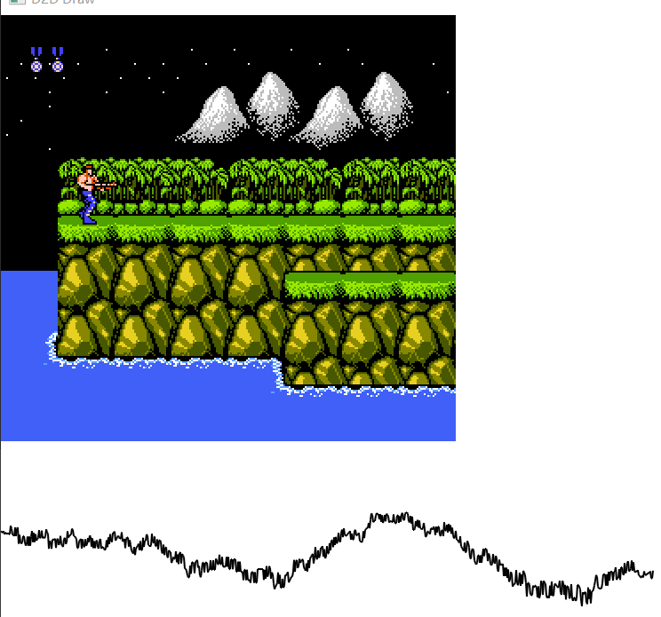

### StepB: 规范存储

本文github[备份地址](https://github.com/dustpg/BlogFM/issues/26)

自己在前面即时存档中, 非常暴力地几乎把所有东西都存进去了, 这一节自然得规范一下!

### SRAM
有一些ROM使用SRAM进行存档, 这是非常基本的存档方式, 首先自然是实现这个, 不过你得找一个支持SRAM的游戏(好在MM就是)!


#### 保存

这个也没什么可说了, 如果检测到ROM会使用SRAM, 那么在程序退出或者说切换游戏ROM时, 进行保存. 我们可以针对ROM计算出HASH值, 比如CRC32(自己使用的crc32b, 是搜索到第一个public domain代码). 然后保存文件名就是CRC32值即可.

当然, 只需要计算PRG-ROM的CRC32即可, 不然稍微修改文件头就不一样了. 

#### 读取
然后在游戏加载时读取即可. 查找之前对应的文件即可. 


#### 数据布局
很简单的文件头+具体数据即可
```
16字节文件头
                -StepFC-
                SRAMWRAM
8KB实际数据
                01010101
                ........
```

文件头基本就是用来检测是不是合法的文件而已, 甚至可以连文件头都不需要.

#### 接口
当然, 核心不处理文件读写, 全靠接口:
```
// 保存SRAM
void(*save_sram)(void*, const sfc_rom_info_t*, const uint8_t*);
// 读取SRAM
void(*load_sram)(void*, const sfc_rom_info_t*, uint8_t*);
```

很简单就实现了!

### 即时存档/读档
这就是主要内容了, 之前是将所有内容一股脑地存进去了, 现在就得规范一下, 这个东西越后面完成越简单, 因为核心部分不会再修改了.

换句话说, 很有可能随着模拟器的编写, 这部分可能会发生**翻天覆地**的变化.

同样核心部分不处理文件读写, 但是又实在需要写入流, 自然就交给接口完成啦!
```c
// 状态保存 写入流
void(*sl_write_stream)(void*, const uint8_t*, uint32_t len);
// 状态读取 读取流
void(*sl_read_stream)(void*, uint8_t*, uint32_t len);
```
当然是流数据即可, 可以用类似```std::vector<uint8_t>```保存(甚至可以通过网络数据流!), 不用非得是文件流. 这就是接口的好处.

逻辑是: 

 - 外部代码准备数据
 - 调用```sfc_famicom_save/load_state```
 - 外部代码对于数据的处理

```c
// 保存状态
void sfc_famicom_save_state(sfc_famicom_t*);
// 读取状态
sfc_ecode sfc_famicom_load_state(sfc_famicom_t*);
```

### 需要存什么?
那么到底需要存什么东西? 简单地说就是"状态", 现在很多状态可以直接保存结构体数据就行, 但是, 但是很有可能修改数据布局, 导致这个版本的读取不了上一个版本的. 

我们又不可能预知未来, 修改是必然的, 所以可以考虑使用版本号区分, 正式释出的时候可以兼容上一个(文件)版本的文件就非常完美了. 最完美的是兼容所有历史(文件)版本, 这个包袱有点重可以不实现.

### 大小端
又到异端审判的时间到了:

 - (吃鸡蛋)是大端派还是小端派?
 - 答曰: 混合序(middle-endian).
 - 烧了

大小端问题在文件储存上问题比较突出, 以什么字节序保存也是一个令人头疼的问题, x86采用的小端模式自己感觉还算科学, 比如```char16_t```如果是保存的是ascii码的话, ```char16_t*```强转```char*```就行, 步进变成2而已. 什么C++模板走开点, 重解释才是王道! 无奈网络传输一般用大端传输(大概是数字文字表示是左边更大)

这里就直接采用不考虑大小端的情况, 直接保存, 以后再考虑大小端.


### RAM
RAM自然是保存的重点对象, 下面列出需要保存的RAM数据:

 - CPU主RAM, 2KB的那个
 - CPU的SRAM/WRAM, 8KB的那个
 - PPU的VRAM, 2KB的
 - PPU的EX-VRAM, 如果是4屏幕模式的话, 卡带上自带了2KB的VRAM
 - PRG-RAM CHR-RAM

关于SRAM的说明, ROM会有SRAM的标志位(电池供电), 但是没有WRAM的标志位(FC供电). 比如超级马里奥3使用了WRAM, 但是ROM里面是没有SRAM标记的.

当然, WRAM可能不止8KB, 内部甚至允许切换, 所以SRAM/WRAM分开处理比较好.

再比如, 之前Mapper1是支持切换WRAM的, 不过因为是变种就**没有实现**, 这是以后的事情.

不过嘛, 无脑保存就行, 反正不缺8KB的磁盘空间, 甚至可以压缩.

### PRG-RAM CHR-RAM
目前完成的4个Mapper寄存器都是基于对高位地址写入完成的, 也就是说这些Mapper在高地址是没有PRG-RAM的, 最多是WRAM视为PRG-RAM. 但是以后, 可能有(其实Mapper005-MMC5就支持)高地址的PRG-RAM. 准备好接口就行.

CHR-RAM这个就太常见了, 甚至Mapper0都有CHR-RAM的情况.

所以, PRG-RAM以及CHR-RAM应该是**Mapper来处理**的, 应该提供相应接口给Mapper:
```c
// 写入RAM到流
void(*write_ram_to_stream)(sfc_famicom_t*);
// 从流读取RAM
void(*read_ream_from_stream)(sfc_famicom_t*);
```

例如大部分Mapper其实没有特殊的CHR-RAM处理, 可以公用一个接口, 例如写就可以这么干:
```c
    // PRG-RAM 不考虑

    // 没有CHR-ROM则表明全是CHR-RAM
    if (!famicom->rom_info.count_chrrom_8kb) {
        famicom->interfaces.sl_write_stream(
            famicom->argument,
            famicom->rom_info.data_chrrom,
            8 * 1024
        );
    }
```
读也是类似的.

再例如Mapper 074, 国产膜改版的MMC3. CHR BANK的$08, $09号是CHR-RAM. Mapper读写只需要保存这部分即可.

### 文件头
大致布局, 当然最好是保证每块内容16字节对齐.:
```
判断用文件头
基础用文件头
RAM区
文件尾基础信息
文件尾详细信息
```

详细内容布局:
```c
// 判断用文件头 16字节. 汉字是用UTF-16小端编码
                "-StepFC-SL大法好"


// 基础数据文件头 用于保存小几率修改的数据, 目前布局如下:

/// <summary>
/// 状态基本数据用文件头
/// </summary>
typedef struct {
    // 大小端检查用, 可以检测该位转换到其他平台
    uint32_t        endian_01020304;
    // 本结构体大小
    uint32_t        size_of_this;
    // 主 版本号
    uint8_t         major_version;
    // 副 版本号
    uint8_t         minor_version;
    // RAM 用掩码
    uint8_t         ram_mask;
    // 未使用
    uint8_t         unused;
    // 当前帧ID
    uint32_t        frame_counter;
    // CPU 周期数 低4字节
    uint32_t        cpu_cycle_lo;
    // CPU 周期数 高4字节
    uint32_t        cpu_cycle_hi;
    // APU 周期数 低4字节
    uint32_t        apu_cycle_lo;
    // APU 周期数 高4字节
    uint32_t        apu_cycle_hi;
    // PPU 周期数 低4字节
    uint32_t        ppu_cycle_lo;
    // PPU 周期数 高4字节
    uint32_t        ppu_cycle_hi;
    // 16字节对齐/ 保留用
    uint8_t         reserved1[8];
    // CPU BANK 高位偏移
    uint32_t        cpu_hi_banks_offset[4];
    // PPU BANK 低位偏移
    uint32_t        ppu_lo_banks_offset[8];
    // PPU BANK 高位偏移
    uint32_t        ppu_hi_banks_offset[8];

} sfc_state_header_basic_t;

// RAM MASK位如下
enum SFC_RAM_MASK {
    // 主RAM
    SL_CPU_MAIN_RAM_2KB = 1 << 0,
    // SRAM
    SL_CPU_SRAM_8KB = 1 << 1,
    // 主VRAM
    SL_PPU_VRAM_2KB = 1 << 2,
    // 额外VRAM
    SL_PPU_EXVRAM_2KB = 1 << 3,
};
// 从低到高表示随后的数据块
//                 D0为1时:    Main-RAM 2KB 
//                 D1为1时:    SRAM 8KB
//                 D2为1时:    VRAM 2KB
//                 D3为1时:    EX-VRAM 2KB

// 这4个RAM块结束后是Mapper的RAM块
//                 Mapper RAM块 大小布局由Mapper确定


// 最后是文件尾, 保存一些大概率修改的数据

// 文件尾段大小, 保存数据的大小, 版本不匹配时利用这个可以尝试强制读取.

/// <summary>
/// 文件尾 用于存放易变数据
/// </summary>
typedef struct {
    // CPU 数据段大小
    uint32_t        cpu_seg_len;
    // PPU 数据段大小
    uint32_t        ppu_seg_len;
    // APU 数据段大小
    uint32_t        apu_seg_len;
    // Mapper 数据段大小
    uint32_t        mapper_seg_len;
    // 输入设备 数据段大小
    uint32_t        input_seg_len;
    // 保留16字节对齐
    uint32_t        reserved1[3];

} sfc_state_tail_len_t;


// 文件尾 数据区, 这部分就是例如寄存器状态什么的, 布局容易修改的


/// <summary>
/// 文件尾 用于存放易变数据
/// </summary>
typedef struct {
    // CPU 寄存器
    sfc_cpu_register_t          cpu_data;
    // PPU 数据
    sfc_ppu_data_t              ppu_data;
    // APU 数据
    sfc_apu_register_t          apu_data;
    // Mapper 数据
    sfc_mapper_buffer_t         mapper_data;
    // 输入设备数据
    sfc_sl_input_data_t         input_data;

} sfc_state_tail_data_t;

```

存档就填写, 读档就读取, 将布局规划一下就简单了.

目前没有处理特殊WRAM的情况(交给Mapper后期完善), 不过测试了几个ROM都没问题, 说明这个情况比较罕见.



魂斗罗没有CHR-ROM, 需要保存8KB的CHR-RAM. 不过, 魂斗罗的鼓声实在是一大亮点!


项目地址[Github-StepFC-StepB](https://github.com/dustpg/StepFC/tree/master/stepb)

### 作业
 - 基础: 定义自己的文件格式和布局!
 - 从零开始: 从零开始自己的模拟器吧!

### REF
 - [MMC5](https://wiki.nesdev.com/w/index.php/MMC5)
 - [MMC6](https://wiki.nesdev.com/w/index.php/MMC6)
 - [Mapper 074](https://wiki.nesdev.com/w/index.php/INES_Mapper_074)