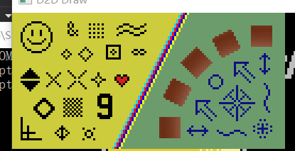
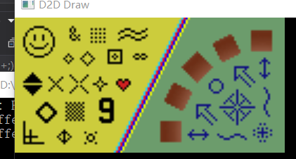
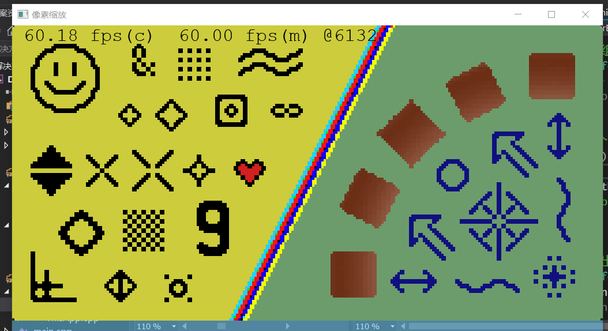
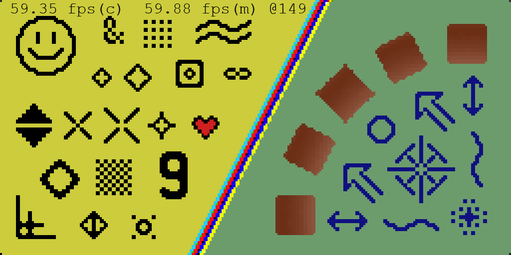
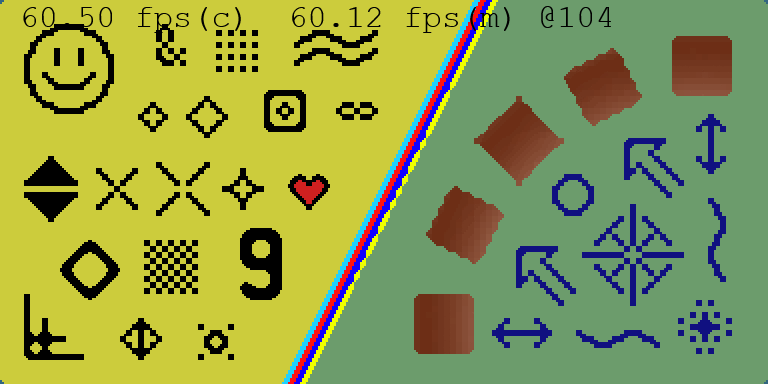

### 滤镜
由于原生分辨率只有256x240, 对于现在来说太小了, 我们可以把它放大一点, 使用的算法称为缩放算法(scaling algorithms), 处理后效果就称为滤镜(filter).

这里采用被维基标注为public domain测试用卡片:


例如```D3D11_FILTER```有这么一个枚举```D3D11_FILTER_MIN_MAG_POINT_MIP_LINEAR```, 其中```POINT```和```LINEAR```就是代表了两种最基础的过滤方式: 点过滤和线性过滤.

一般缩放算法采用插值, 这两个过滤方式对应的就是最邻插值和线性插值了.

### 最邻插值
也是之前采用的插值算法, 下面是放大3倍后效果



效果中规中矩, 也没有什么特别之处, 优点就是实现简单, 图像API本身就会提供


### 线性插值
这个方法实现也比较简单, 但是放大三倍后



就糊了. 

当然, 还有很多插值方法. 比如D2D就还提供了什么各向异性过滤等高质量的插值算法, 我们所谓的"像素风格"图像是不适合用常规插值算法的, 因为这些算法是针对平滑像素.

### 像素风格缩放算法
维基列了相当多的算法, 这里就挑选几个看看.

通过粗略查看, 我们可以知道很多都是将原生数据放大至整数倍, 由于我们显示的话可能会显示成任意分辨率, 所以逻辑是:

原生->像素风格缩放算法->插值到任意分辨率


中间有两次缩放, 我们可以为用户提供选项, 最后一步可以考虑用线性插值或者最邻插值, 当然也是可以选的


后面还有4倍的一些算法, 4x4就是16倍, 用CPU处理自然略慢, 就用着色器处理吧, 这里就用比较熟悉的HLSL实现.


### Scale2x
[www.scale2x.it](http://www.scale2x.it)

看名字就知道这个算法是将分辨率提高至2倍

```
 A          提高至两倍      
CPB          P:12
 D             34
                
            1=P; 2=P; 3=P; 4=P;
            IF C==A AND C!=D AND A!=B => 1=A
            IF A==B AND A!=C AND B!=D => 2=B
            IF D==C AND D!=B AND C!=A => 3=C
            IF B==D AND B!=A AND D!=C => 4=D
```

可以看出这个算法并没有生成新的颜色, 例如P生成的左上角点, 可以认为是夹在AC中央, 看情况变成AC.

效果:



(进行scale2x后再进行了4倍最邻插值)


(与8倍最邻插值比较, 可以看到4个角落并没有处理)

可以看出对于转角处有所处理, 稍微平滑了一点, 由于没有增加新的颜色, 所以处理后还是像素风满满, 不认真观察的话, 就会以为本身就是这样. 效果最差的应该是左下角的, 像坐标轴的那个, 也被强制平滑了.

像素着色器的实现
```hlsl
float4 scale2x(uint2 pos) {
    const uint2 real_pos = pos / 2;
    const float4 a = InputTexture[real_pos - uint2(0, 1)];
    const float4 b = InputTexture[real_pos + uint2(1, 0)];
    const float4 c = InputTexture[real_pos - uint2(1, 0)];
    const float4 d = InputTexture[real_pos + uint2(0, 1)];
    const float4 p = InputTexture[real_pos];

    float4 color;
    switch ((pos.x & 1) | ((pos.y & 1) << 1))
    {
    case 0:
        // IF C==A AND C!=D AND A!=B => 1=A
        color = (c == a && c != d && a != b) ? a : p;
        break;
    case 1:
        // IF A==B AND A!=C AND B!=D => 2=B
        color = (a == b && a != c && b != d) ? b : p;
        break;
    case 2:
        // IF D==C AND D!=B AND C!=A => 3=C
        color = (d == c && d != b && c != a) ? c : p;
        break;
    case 3:
        // IF B==D AND B!=A AND D!=C => 4=D
        color = (b == d && b != a && d != c) ? d : p ;
        break;
    }
    return color;
}
```

着色器, 特别是像素着色器应该尽可能地去掉分支, 这个实现包含了大量的分支. 可以考虑使用DX11带来的计算着色器(D2D也能用), 以减少部分分支. (然后传入索引减少75%CPU-GPU传输时间, 随便还能优化分支判断.) 后面的先不说, 计算着色器可以一次输出多次像素, 实现为:


```hlsl
void scale2x(uint2 pos) {
    const uint2 pos0 = pos.xy * 2;
    const uint2 pos1 = pos0 + uint2(1, 0);
    const uint2 pos2 = pos0 + uint2(0, 1);
    const uint2 pos3 = pos0 + uint2(1, 1);

    // ABC
    // DEF
    // GHI

    const float4 E = InputTexture[pos];
    const float4 B = InputTexture[pos - uint2(0, 1)];
    const float4 D = InputTexture[pos - uint2(1, 0)];
    const float4 F = InputTexture[pos + uint2(1, 0)];
    const float4 H = InputTexture[pos + uint2(0, 1)];

    const float4 CC = float4(1, 1, 1, 1) - (B - H) * (D - F);
    

    float4 E0, E1, E2, E3;
    if (CC.x + CC.y + CC.z != 3.0) {
        E0 = D == B ? D : E;
        E1 = B == F ? F : E;
        E2 = D == H ? D : E;
        E3 = H == F ? F : E;
    }
    else {
        E0 = E;
        E1 = E;
        E2 = E;
        E3 = E;
    }

    OutputTexture[pos0] = E0;
    OutputTexture[pos1] = E1;
    OutputTexture[pos2] = E2;
    OutputTexture[pos3] = E3;
}
```
线程量用的是SM5.0支持的[32, 32, 1], 这次总体效率提升大致在, emmmm, -50%左右. 是的, 效率降低了, 也不知道是不是D2D自带框架有问题. 当然测试发现, CS更适合重计算(128x64比较小), 不然大头花在其他地方了.

[When is a compute shader more efficient than a pixel shader for image filtering?](https://computergraphics.stackexchange.com/questions/54/when-is-a-compute-shader-more-efficient-than-a-pixel-shader-for-image-filtering)

### Scale3x
这就是Scale2x的三倍版本, 也有Scale4x不过其实就是连续两次Scale2x. 
```
ABC           E0 E1 E2
DEF       E:  E3 E4 E5
GHI           E6 E7 E8

E0 = D == B && B != F && D != H ? D : E;
E1 = (D == B && B != F && D != H && E != C) || (B == F && B != D && F != H && E != A) ? B : E;
E2 = B == F && B != D && F != H ? F : E;
E3 = (D == B && B != F && D != H && E != G) || (D == H && D != B && H != F && E != A) ? D : E;
E4 = E
E5 = (B == F && B != D && F != H && E != I) || (H == F && D != H && B != F && E != C) ? F : E;
E6 = D == H && D != B && H != F ? D : E;
E7 = (D == H && D != B && H != F && E != I) || (H == F && D != H && B != F && E != G) ? H : E;
E8 = H == F && D != H && B != F ? F : E;
```

同样, 直接"拿来"未做针对着色器的优化. 效果如下...同样还是像素着色器效率更好, 不过差距小了一点, 256x240的话, 效率就差不多了.


(scale3x后2倍最邻插值)


(与6倍最邻插值比较)


可也看出"圆"处理得比2x好, 其他的很一般了. 特别是中间的那个分割线, 还以为自己实现有问题, 找了很久, 然后用作者自己写的程序跑了一下还是一样的, 2X也有这种情况但是不明显, 估计放大倍数越大越明显.

### ScaleNx
可以看出ScaleNx优点是: 容易实现, 不会引入新的颜色. 不会引入新的颜色这一点算是有得有失吧, 处理后还是像素风. 比如有一个很不错的算法只能放大到4倍, 现在要放大至8倍, 可以先用Scale2x处理再用那个算法.

还有有人(Sp00kyFox)根据ScaleNx改进(效果上)算法, 称为ScaleNxSFX, 增加了对于旁边点的判断范围, 以及基于Scale3x深度改进(It was originally intended as an improvement upon Scale3x but became a new filter in its own right)而形成的, 还有ScaleFX-rAA和ScaleFX-Hybrid两个额外处理. 这个算法比较新, 到最近(本文初稿于2018-09-24)作者似乎还在更新, 所以效果[应该不错](https://forums.libretro.com/t/scalenx-artifact-removal-and-algorithm-improvement/1686/132), 没准还有新的算法会在这个主题出现. 

以及guest(r)基于Scale2x派生的Scale2xPlus, 这家伙在07年派生出这个算法, 但是居然也出现在了那个主题讨论中.

### REF
 - [Pixel Scalers](http://www.datagenetics.com/blog/december32013/index.html)
 - [Pixel-art scaling algorithms](https://en.wikipedia.org/wiki/Pixel-art_scaling_algorithms)