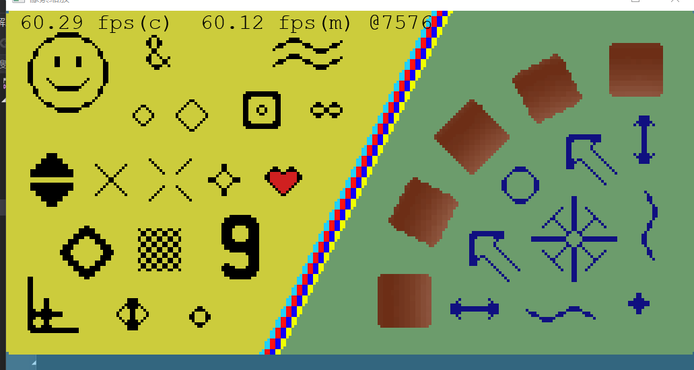
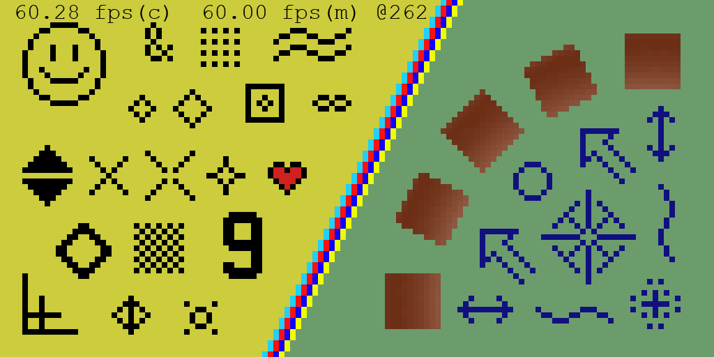
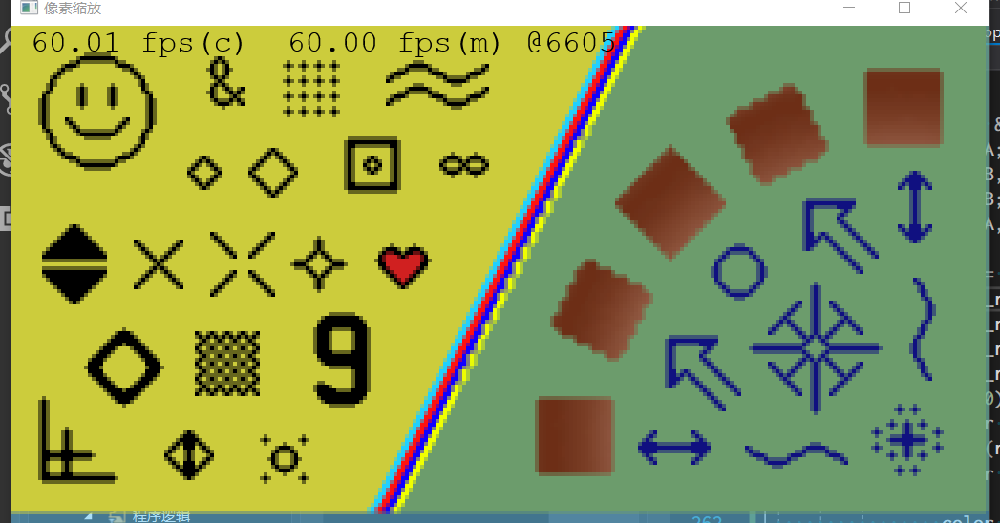
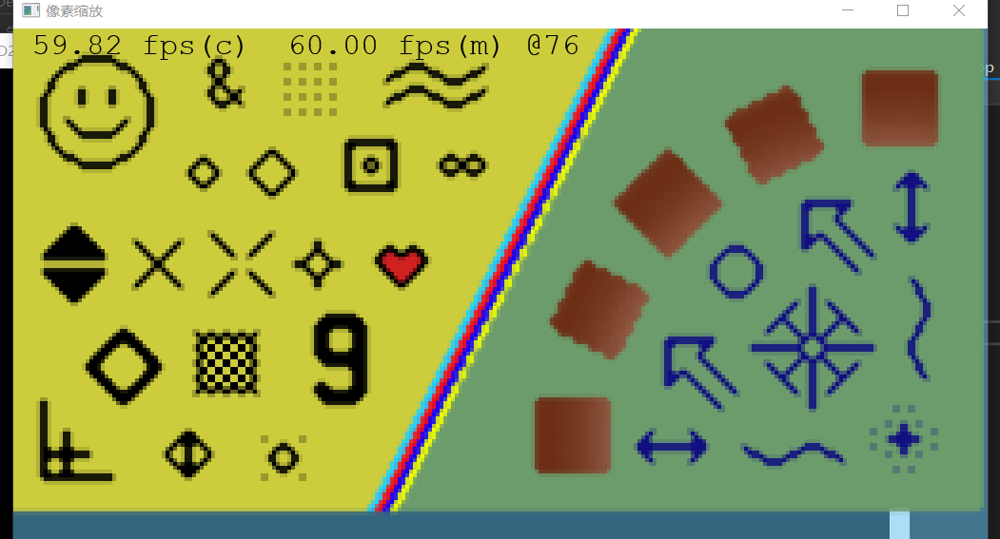
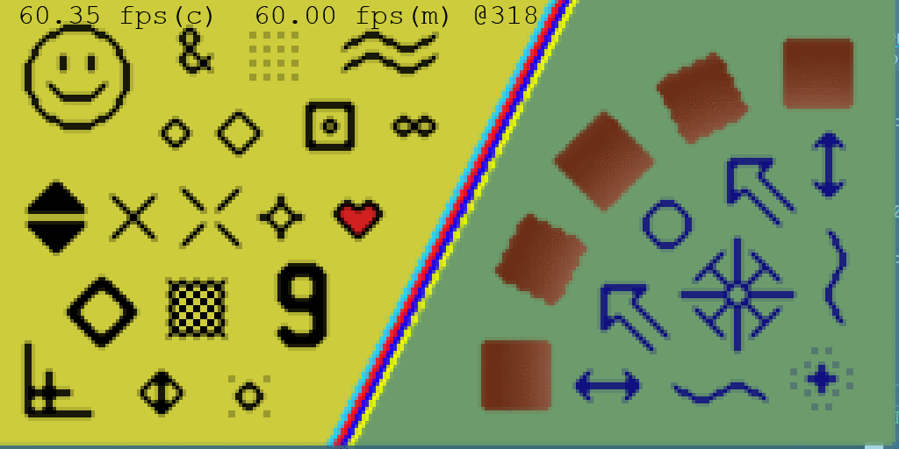
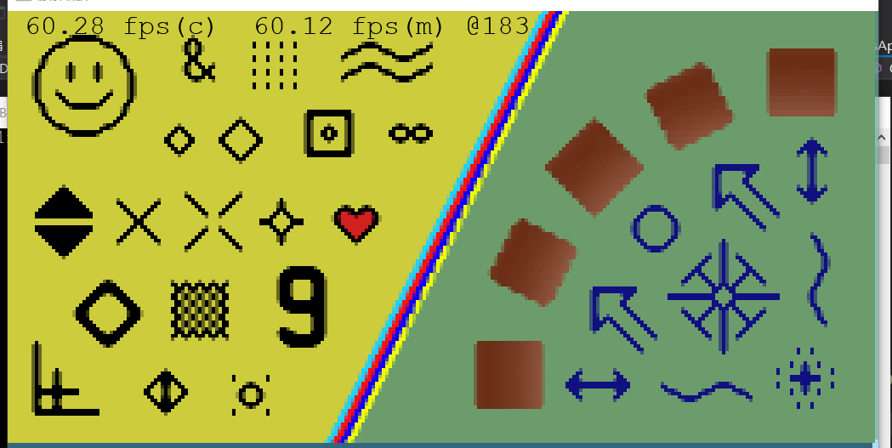

### Eagle

本文github[备份地址](https://github.com/dustpg/BlogFM/issues/29)

下面继续讨论一些关于像素风格缩放算法.

Eagle本身是一个比较初级的想法[Eagle (idea)](https://everything2.com/index.pl?node_id=1859453), 称不上真正的算法, 但是有些后续的算法就是基于Eagle的. Eagle是放大至2倍, 这里称之为eagle2x.

Eagle想得很简单, 放大两倍后, 那个像素旁边原本3个像素颜色一样的话就设定为该颜色, 否则就是最邻的.
```
first:        |Then
. . . --\ CC  |S T U  --\ 1 2
. C . --/ CC  |V C W  --/ 3 4
. . .         |X Y Z
              | IF V==S==T => 1=S
              | IF T==U==W => 2=U
              | IF V==X==Y => 3=X
              | IF W==Z==Y => 4=Z
```
同样可以根据同样的思想派生出eagle3x, 像素着色器可以简单实现为:
```hlsl
float4 eagle2x(uint2 pos) {
    const uint2 real_pos = pos / 2;
    float4 A, B, C;
    switch ((pos.x & 1) | ((pos.y & 1) << 1))
    {
    case 0:
        // AB
        // C
        A = InputTexture[real_pos - uint2(1, 1)];
        B = InputTexture[real_pos - uint2(0, 1)];
        C = InputTexture[real_pos - uint2(1, 0)];
        break;
    case 1:
        //  AB
        //   C
        A = InputTexture[real_pos - uint2(0, 1)];
        B = InputTexture[real_pos + int2(1, -1)];
        C = InputTexture[real_pos + uint2(1, 0)];
        break;
    case 2:
        // A
        // BC
        A = InputTexture[real_pos - uint2(1, 0)];
        B = InputTexture[real_pos + int2(-1, 1)];
        C = InputTexture[real_pos + uint2(0, 1)];
        break;
    case 3:
        //  A
        // BC
        A = InputTexture[real_pos + uint2(1, 0)];
        B = InputTexture[real_pos + uint2(0, 1)];
        C = InputTexture[real_pos + uint2(1, 1)];
        break;
    }
    return (eq(A, B) && eq(A, C)) ? A : InputTexture[real_pos];
}
```

来看看效果:


(eagle2x后4倍最邻插值)


(与8倍最邻插值比较)

可以看出处理后很多东西变得粗细不一, 不适合缩放曲线条, 甚至可以看到一些单独的点被去掉了, 这个算法(想法)只能测试用, 没法实际使用. 

### 2×SaI
全称```2× Scale and Interpolation engine```, 作者```Derek Liauw Kie Fa(Kreed)```看到Eagle后想到的. 这里称为sai2x. 作者以GPL形式发布, (作者的)是一个完整的实现, 并不能算是算法, 维基提到可以以完全重写的方式避免被GPL病毒传染.

通过阅读源代码, emmm, 上古代码, 还是16bit的颜色, 对于显卡用的float4感觉差了一个世纪.

sai2x有一个重要步骤: 插值, 会生成新的颜色. 作者实现的插值感觉很不错, 值得学习, 不过这里由于是```float4```直接取平均值.

```
I|E F|J
G|A B|K   A -\  A0 A1
H|C D|L     -/  A2 A3
M|N O|P

    A0 = A

    IF  A == D AND B != C, THEN
        IF (A == E AND B == L) OR (A == C AND A == F AND B != E AND B == J), THEN
            A1 = A
        ELSE
            A1 = INTERPOLATE(A, B)
        ENDIF
        IF (A == G AND C == O) OR (A == B AND A == H AND G != C AND C == M), THEN
            A2 = A
        ELSE
            A2 = INTERPOLATE(A, C)
        ENDIF
        A3 = A
    ELSIF B == C AND A != D, THEN
        IF (B == F AND A == H) OR (B == E AND B == D AND A != F AND A == I), THEN
            A1 = B
        ELSE
            A1 = INTERPOLATE(A, B)
        ENDIF
        IF (C == H AND A == F) OR (C == G AND C == D AND A != H AND A == I), THEN
            A2 = C
        ELSE
            A2 = INTERPOLATE(A, C)
        ENDIF
        A3 = B
    ELSIF A == D AND B == C, THEN
        IF A == B, THEN
            A1 = A2 = A3 = A
        ELSE
            A1 = INTERPOLATE(A, B)
            A2 = INTERPOLATE(A, C)
            A3 = A3_SP_PROC(A, B, C, D, ...)
        ENDIF
    ELSE
        IF A == C AND A == F AND B != E AND B == J, THEN
            A1 = A
        ELSIF B == E AND B == D AND A != F AND A == I, THEN
            A1 = B
        ELSE
            A1 = INTERPOLATE(A, B)
        ENDIF
        IF A == B AND A == H AND G != C AND C == M, THEN
            A2 = A
        ELSIF C == G AND C == D AND A != H AND A == I, THEN
            A2 = C
        ELSE
            A2 = INTERPOLATE(A, C)
        ENDIF
        A3 = INTERPOLATE(A, B, C, D);
    ENDIF
```
可以看出作者将图像分为几个情况分别处理, 比如最外面的4个分支分别对应, 这个点可能是'\', '/', 'X', 以及其他情况, 导致分支非常多. 中间还有一个作者自己发明的插值公式, 在这简写为```A3_SP_PROC```. 由于分支实在太多, 自己有可能重写错了.


(sai2x后4倍最邻插值)


(与8倍最邻插值, 以及2倍线性插值后4倍最邻插值比较)


可以看出因为A0点总是原来值, 所以放大后看起来像是往左上角偏了一个像素. 由于插值, 新加入了中间色, 实际上以100%比例看更合适, 所以像素风不再.

对于圆的处理效果很不错, 单独的点被处理成'星(+)'状, 要知道这是一个2倍的缩放, '+'是三个像素的. 效果最差的是'点状网', 主要是中间和边缘的效果不一致. 

### SuperEagle
作者同2xSaI的Kreed. 针对Eagle算法做出了改进.
```
原称呼:
   B1 B2
4  5  6  S2
1  2  3  S1
   A1 A2
改为:
   A B
 C D E F     D -\ D0 D1
 G H I J       -/ D2 D3
   K L

    IF H == E AND D != I, THEN
        D1 = D2 = H
        IF G == H OR E == B, THEN
            D0 = INTERPOLATE(H, H, D)
        ELSE
            D0 = INTERPOLATE(D, E)
        ENDIF

        IF E == F OR H == K, THEN
            D3 = INTERPOLATE(H, H, I)
        ELSE
            D3 = INTERPOLATE(H, I)
        ENDIF
    ELSIF D == I AND H != E, THEN
        D3 = D0 = D

        IF A == D OR F == J, THEN
            D1 = INTERPOLATE(D, D, E)
        ELSE
            D1 = INTERPOLATE(D, E)
        ENDIF

        IF I == L OR C == D, THEN
            D2 = INTERPOLATE(D, D, H)
        ELSE
            D2 = INTERPOLATE(H, I)
        ENDIF
    ELSIF D == I AND H == E, THEN
        D0D1D2D3_SP_POC(A, B, C, D, ...)
    ELSE 
        D3 = D0 = INTERPOLATE(H, E)
        D3 = INTERPOLATE(I, I, I, D3)
        D0 = INTERPOLATE(D, D, D, D0)

        D2 = D1 = INTERPOLATE(D, I)
        D2 = INTERPOLATE(H, H, H, D2)
        D1 = INTERPOLATE(E, E, E, D1)
    ENDIF
```

有两次插值的地方, float4的话可以直接```A*0.75+B*0.25```, 也有类似sai2x的地方, 作者自己发明的插值算法, 这里用```D0D1D2D3_SP_POC```代替.


(supereagle后4倍最邻插值)

既然是Eagle的'升级版', 就和Eagle比较吧.




可以看出作者很喜欢插值, 把Eagle不会引入新颜色的特点去掉了. 不过顺带解决了Eagle的BUG, 也就是消失的单独点, 代替的是颜色浅了, 变成25%, 不过也变成4倍. 当然, 也有像素偏移的现象.

### Super2xSaI
```Super2xSaI```, 这里称为supersai2x, 作者同2xSaI的Kreed, 针对```2xSaI```算法做出了改进(了吗?).
```
原称呼:
  B0 B1 B2 B3
  4  5  6  S2
  1  2  3  S1
  A0 A1 A2 A2
改为:
    A B C D               
    E F G H     F -\ F0 F1
    I J K L       -/ F2 F3
    M N O P


    IF J == G AND F != K, THEN
        F1 = F3 = J
    ELSIF F == K AND J != G, THEN
        F1 = F3 = F
    ELSIF F == K AND J == G, THEN
        F3 = F1 = F1_SP_PROC(A, B, C, D, ...)
    ELSE
        IF G == K AND K == N AND J != O AND K != M, THEN
            F3 = INTERPOLATE(K, K, K, J)
        ELSIF F == J AND J == O AND N != K AND J != P, THEN
            F3 = INTERPOLATE(J, J, J, K)
        ELSE
            F3 = INTERPOLATE(J, K)
        ENDIF

        IF G == K AND G == B AND F != C AND G != A, THEN
            F1 = INTERPOLATE(G, G, G, F)
        ELSIF (F == J AND F == C AND B != G AND F != D)
            F1 = INTERPOLATE(G, F, F, F)
        ELSE
            F1 = INTERPOLATE(F, G)
        ENDIF
    ENDIF

    ; ELSIF 这里可以看作 OR
    IF J == G AND F != K AND I == J AND J != C, THEN
        F0 = INTERPOLATE(J, F)
    ELSIF E == J AND K == J AND I != F AND J != A, THEN
        F0 = INTERPOLATE(J, F)
    ELSE
        F0 = F
    ENDIF

    ; ELSIF 这里可以看作 OR
    IF F == K AND J != G AND E == F AND F != O, THEN
        F2 = INTERPOLATE(J, F)
    ELSIF F == I AND G == F AND E != J AND F != M, THEN
        F2 = INTERPOLATE(J, F)
    ELSE
        F2 = J
    ENDIF
```
可能是是性能上的提升吧?


(supersai2x后4倍最邻插值)

可以看出依旧在100%下是最好的. BUG? 这个算法有BUG吧? 感觉像素变成竖线了. 和2xSaI对比一下:


(与2xSaI对比, 均作了4倍最邻插值)


处理得比较好的是非坐标对齐的图像, 处理得不好的是坐标对齐的图像, 可能这是这个算法的偏向吧. 

作者Kreed的这一系列大致是对点周围共计16点判断, 然后生成2x2的新数据, 会产生新的像素, 会产生像素偏移. 

### REF
 - [The advanced 2x Scale and Interpolation engine](https://vdnoort.home.xs4all.nl/emulation/2xsai/)