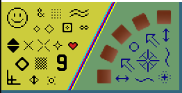
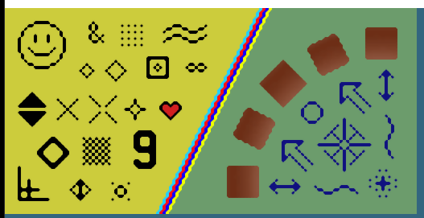
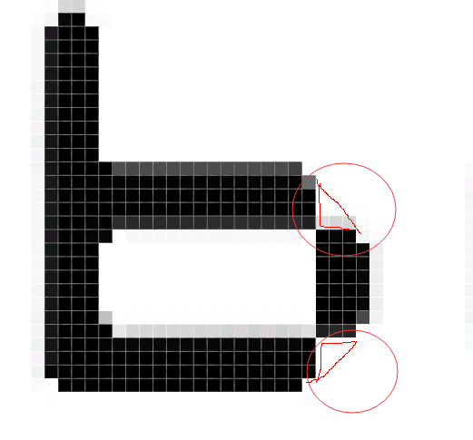
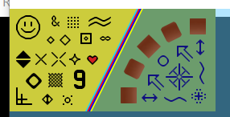
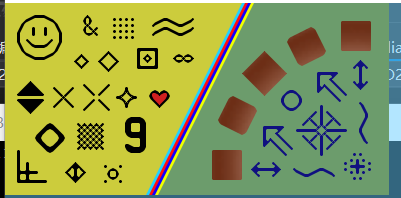
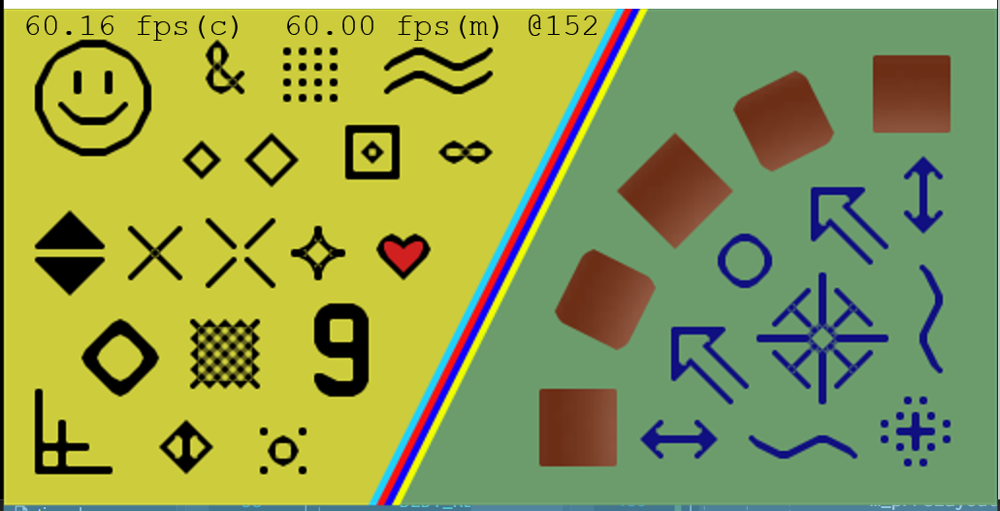
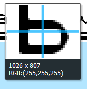

### HQx
进入[HQx](https://code.google.com/archive/p/hqx/)族了, HQx系列有一个特别的地方: 抗锯齿.

根据维基的介绍, HQx大致分为两个, 原版Maxim Stepin的HQx以及效果稍微差但是省空间的ScaleHQ. 

前者, 作者形式发布的代码, 就算出现问题, 我们可以派生出一个LGPL实现分支, 然后直接使用预编译的二进制码即可. 后者, 则是由不同的作者实现被误以为是原版的HQ.

### 2xScaleHQ
那就先说说简单版的ScaleHQ吧, 似乎由guest(r)实现的. 根据libretro的文档, 有两个放大率的, 这里称为scalehq2x 和scalehq4x. 2x应该是在public domain, 而4x是GPL.

代码上根本看不出算法, 只有数学运算, 还有配置参数. 又懒得去研究, 直接简单改写scalehq2x用于支持本框架. 由于抗锯齿的原因, 这个效果在100%下效果最好, 这是效果:

### 4xScaleHQ
这是guest(r)在GPL下发布的, 同2xScaleHQ, 只有数学运算和配置参数:

### ScaleHQ
可以看出, ScaleHQ的优点是: ScaleHQ是专门为Shader编写的算法, 中间几乎没有分支, 全是运算.

缺点非常明显, 折线过渡不自然:

图中两个地方理论上应该有像素过渡的三角.

### 原版HQx

原版Maxim Stepin的HQx(HQ2x, HQ3x, HQ4x)总的来说是依靠查表, 对于一个点周围8点在YUV空间下形成256次可能性, 然后分别处理. 不过还是难不倒大佬们, 移植到了着色器上. 也是以LGPL形式发布的, 建议直接用了, LGPL用二进制文件即可.

实际移植的时候发现图像出现问题, 找了几天终于发现原来是图片载入出现问题了(32bppBGRA vs 32bppPBGRA), 导致LUT的权重读取错了.

(HQ2x-100%下效果)

(HQ3x-100%下效果)

(HQ4x-100%下效果)

(HQ4x后再用双三次插值到原比例的8倍)

HQx处理的效果非常讨人喜, 之前ScaleHQ提到的折线转交处也处理得很不错.

缺点, 除了实现比较困难外, 效果上可能就是把那个笑脸变成相低多边形的圆了.

但是实际上, HQx在文字显示非常不错, 在实际的游戏中就稍微差了一点.

### REF
 - [HQx](https://en.wikipedia.org/wiki/Hqx)
 - [ScaleHQ on libretro](https://github.com/libretro/common-shaders/tree/master/scalehq)