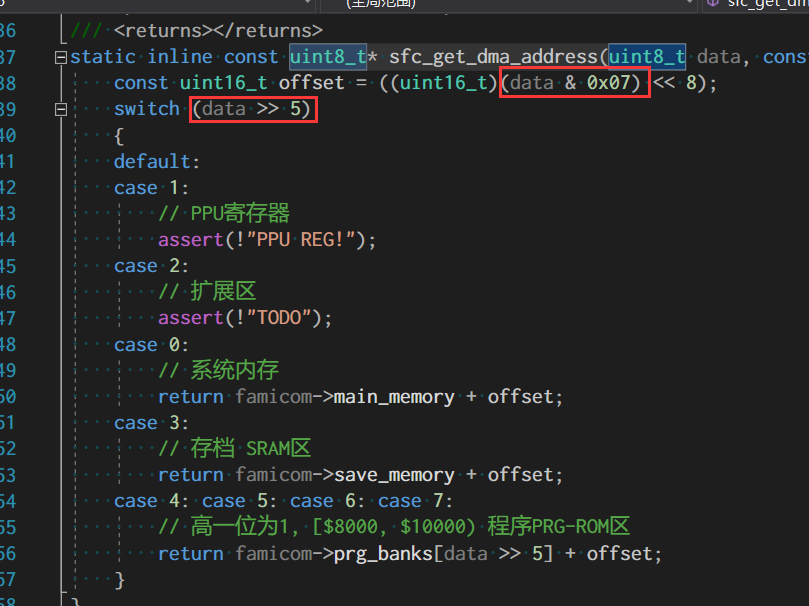
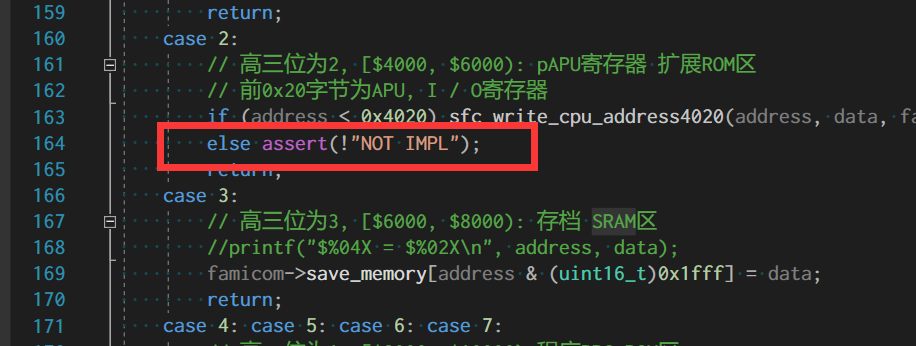
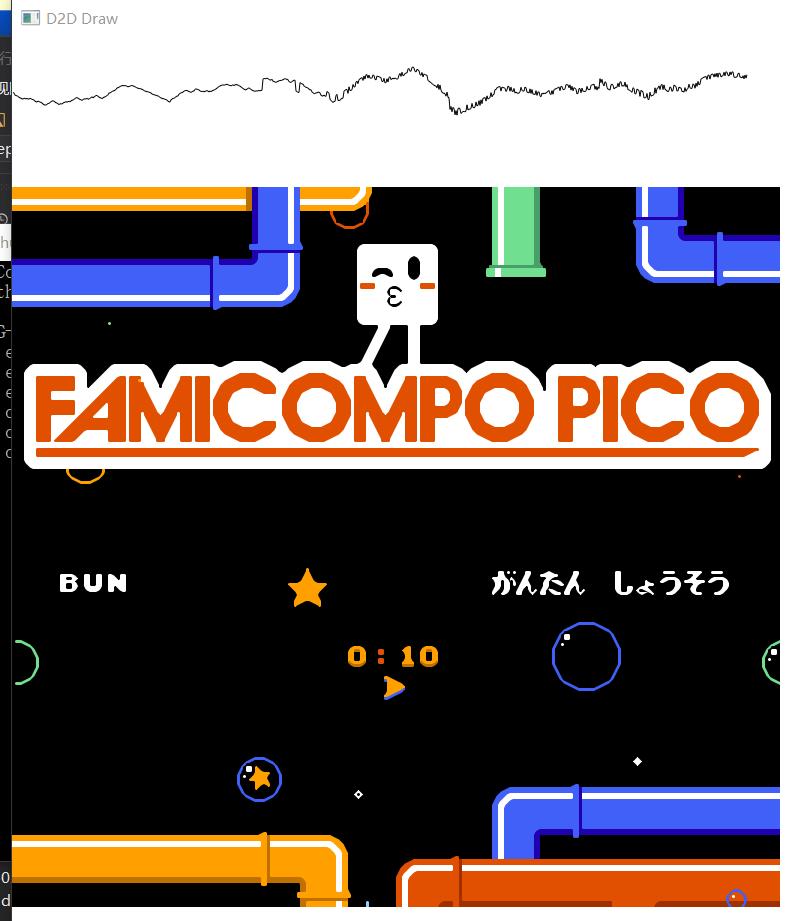

### NSF
红白机音乐格式 NES Sound Format (.nsf), 可以认为就是储存红白机上音乐的音乐格式, 也是第E步的主要实现目标.

在真正介绍nsf之前先介绍Mapper-031, 这个Mapper简单地说就是实现了NSF的一个子集.


### Mapper 031

```
PRG ROM size: Up to 1024 kB
PRG ROM bank size: 4 kB
PRG RAM: None
CHR capacity: 8 kB RAM/ROM
CHR bank size: Not bankswitched
Nametable mirroring: horizontal or vertical, hard wired.
Subject to bus conflicts: No
```

由于音乐才是本体, 所以CHR-ROM/RAM就是Mapper0的水平, 毕竟音乐是存储在PRG里面的. 而RPG窗口大小是4kb! 目前代码的逻辑, PRG BANK大小是8kb, 这就导致没法处理了. 解决方法大致有两个:

 1. 将窗口大小降至4kb
 2. 依然是8kb, 不过mapper手动处理4kb的交换. 需要额外的复制时间与空间

自己权衡了大概3秒钟, 决定将窗口大小降到4kb, 数量从8涨到16了, 下次再降低估计就得选择2了. 这一个小改动会牵一发而动全身, 首当其冲的自然是状态储存. 所以升级到'1.1'版了, 而且由于正式释出所以懒得兼容'1.0'版本.

### BUG 声明
由于这次修改了PRG的BANK窗口大小, 让自己找到了一个BUG, 这个BUG说大不大, 说小也不小:



这样干会丢失D3, D4位的信息, 不过自带RAM刚好2kb, 对于自带的RAM反而是防止越界的好'操作', 所以连测试ROM都没能测试出来.


### PRG bank select $5000-$5FFF

```
address              data
15      bit       0  7  bit  0
-------------------  ---------
0101 .... .... .AAA  PPPP PPPP
                |||  |||| ||||
                |||  ++++-++++- Select 4 kB PRG ROM bank at slot specified by write address.
                +++------------ Specify 4 kB bank slot at: $8000 + (AAA * $1000)
```

可以看出这次写入的地址位于低32kb的区域, 甚至低于SRAM区, 目前这部分的逻辑是:



完全没有处理这部分, 所以只能再增加一个这区域的写接口: ```write_low()```. 初始是$FF, 载入最后的bank. 这个逻辑有点不太懂, 到底是膜一下还是当作有符号的? 毕竟支持到1024kb, 目前简单膜一下好了.

```c
/// <summary>
/// Mapper - 031 - 写入低地址($4020, $6000)
/// </summary>
/// <param name="famicom">The famicom.</param>
/// <param name="addr">The addr.</param>
/// <param name="data">The data.</param>
static void sfc_mapper_1F_write_low(sfc_famicom_t*famicom, uint16_t addr, uint8_t data) {
    // PRG bank select $5000-$5FFF
    if (addr >= 0x5000) {
        // 0101 .... .... .AAA  --    PPPP PPPP
        const uint16_t count = famicom->rom_info.count_prgrom16kb * 4;
        const uint16_t src = data;
        sfc_load_prgrom_4k(famicom, addr & 0x07, src % count);
    }
    // ???
    else {
        assert(!"NOT IMPL");
    }
}
```

### 结果

这个Mapper自然是通往NSF的一把小钥匙, 主要是理解NSF的BANK切换, 当然改动的主要是讲BANK窗口大小降至4kb了. 这里使用pico的ROM作为结果演示:



### REF

 - [NSF](https://wiki.nesdev.com/w/index.php/NSF)
 - [INES Mapper 031](http://wiki.nesdev.com/w/index.php/INES_Mapper_031)
