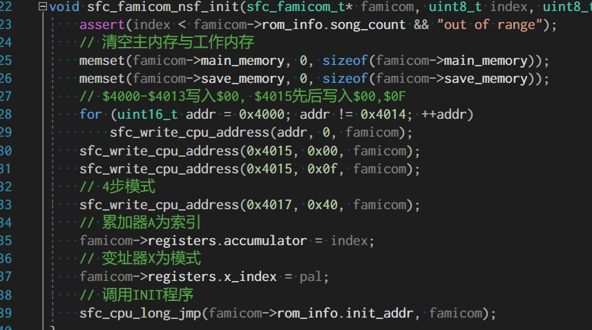
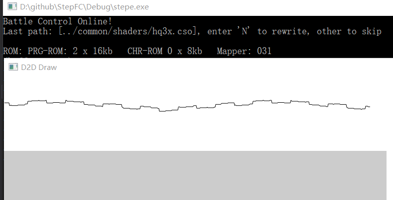

### NSF 文件头

本文github[备份地址](https://github.com/dustpg/BlogFM/issues/42)

那么正式进入NSF文件的探索, 首先说的自然是文件头:
```
offset  # of bytes   Function
----------------------------
$000    5   STRING  'N','E','S','M',$1A (denotes an NES sound format file)
$005    1   BYTE    Version number (currently $01)
$006    1   BYTE    Total songs   (1=1 song, 2=2 songs, etc)
$007    1   BYTE    Starting song (1=1st song, 2=2nd song, etc)
$008    2   WORD    (lo, hi) load address of data ($8000-FFFF)
$00A    2   WORD    (lo, hi) init address of data ($8000-FFFF)
$00C    2   WORD    (lo, hi) play address of data ($8000-FFFF)
$00E    32  STRING  The name of the song, null terminated
$02E    32  STRING  The artist, if known, null terminated
$04E    32  STRING  The copyright holder, null terminated
$06E    2   WORD    (lo, hi) Play speed, in 1/1000000th sec ticks, NTSC (see text)
$070    8   BYTE    Bankswitch init values (see text, and FDS section)
$078    2   WORD    (lo, hi) Play speed, in 1/1000000th sec ticks, PAL (see text)
$07A    1   BYTE    PAL/NTSC bits
                bit 0: if clear, this is an NTSC tune
                bit 0: if set, this is a PAL tune
                bit 1: if set, this is a dual PAL/NTSC tune
                bits 2-7: not used. they *must* be 0
$07B    1   BYTE    Extra Sound Chip Support
                bit 0: if set, this song uses VRC6 audio
                bit 1: if set, this song uses VRC7 audio
                bit 2: if set, this song uses FDS audio
                bit 3: if set, this song uses MMC5 audio
                bit 4: if set, this song uses Namco 163 audio
                bit 5: if set, this song uses Sunsoft 5B audio
                bits 6,7: future expansion: they *must* be 0
$07C    4  ----    4 extra bytes for expansion (must be $00)
$080    nnn ----    The music program/data follows until end of file
```

转换为c的话就是:

```c
/// <summary>
/// NSF 文件头
/// </summary>
typedef struct {
    // NESM
    char        nesm[4];
    // 1A
    uint8_t     u8_1a;
    // 版本号
    uint8_t     ver;
    // 歌曲数量
    uint8_t     count;
    // 起始数
    uint8_t     start;
    // 加载地址[小端]
    uint16_t    load_addr_le;
    // 初始化地址[小端]
    uint16_t    init_addr_le;
    // 播放地址[小端]
    uint16_t    play_addr_le;
    // 歌曲名称
    char        name[32];
    // 作者名称
    char        artist[32];
    // 版权
    char        copyright[32];
    // 播放速度 NTSC[小端]
    uint16_t    play_speed_ntsc_le;
    // Bankswitch 初始值
    uint8_t     bankswitch_init[8];
    // 播放速度 PAL[小端]
    uint16_t    play_speed__pal_le;
    // PAL/NTSC 位
    uint8_t     pal_ntsc_bits;
    // 扩展音频 位
    uint8_t     extra_sound;
    // 扩展位
    uint8_t     expansion[4];

} sfc_nsf_header_t;
```

其中有一些```uint16_t```数据, 文件中是以小端排列的. 大小端的问题就不再累述, 文件载入的话可以简单写为:

```c
sfc_nsf_header_t header;
const size_t count = fread(&header, sizeof(header), 1, file);
// 交换大小端
if (this_is_be()) sfc_nsf_swap_endian(&header);
```


### 相关地址
查看文件头后, 有三个比较特殊的地址: 加载, 初始化, 以及播放.

**加载地址**, PRG-ROM自然是加载在高地址, 也就是$8000开始加载的, 某些ROM可能会从更低的地址加载(不过官方推荐范围是$8000-$FFFF). 

一般地, 载入地址为```$8000```. 特殊地, 为```$8000 + N * $1000```. 这种情况应该是少于32kb的NSF. 更特殊地, 并不是以4kb对齐的地址.

例子: 如果一个NSF内容是```32kb-1```大小, 那么, 加载地址就可能是```$8001```. 为此, 核心部分数据精度再次提高, 之前是以16kb为单位储存的, 现在**以字节为单位储存**.


**初始化地址**, 自然是初始化每首曲子用的地址, 播放前需要初始化工作

**播放地址**, 初始完毕就可以正式播放曲子了.

### 相关字符串
拥有几个字符串的成员, 编码可以考虑为标准的ASCII或者使用了高位的'Windows-1252'编码. 


### 播放速度
文件头拥有两个控制播放速度的, 分别对应N制式与P制式.

```
        1000000                  1000000
rate = ---------       period = ---------
        period                    speed
```

 - 60.002 Hz(16666) 推荐NSF频率
 - 60.099 Hz(16639) 实际N制式频率
 - 50.007 Hz(19997) 猜测的P制式频率

个人认为, 这个项目是在模拟器基础上追加的NSF功能, 所以按照60Hz或者50Hz即可. 除非本体是NSF播放器, 就得严格按照这个频率.

### BANK切换
文件头拥有8个字节的数据分别对应了Mapper-031的BANK切换. 不过前提是这8字节非0: 只要有一个非零则表示使用了BANK切换. 应该在每次初始化前切换至默认BANK. 如果没有使用BANK切换, 则从加载地址一路加载至EOF.

值得注意的是, NSF的BANK数量是以4kb为窗口, 而NES的BANK数量是16kb为窗口的. 比如可能NSF文件是24kb大小, 之前的处理, 是针对16kb窗口大小进行的膜运算:

```c
// 0101 .... .... .AAA  --    PPPP PPPP
const uint16_t count = famicom->rom_info.count_prgrom16kb * 4;
const uint16_t src = data;
sfc_load_prgrom_4k(famicom, addr & 0x07, src % count);
```

所以我们需要针膜的单位是4kb了! 虽然NSF的窗口大小是4kb, 但大小却不是一定以4kb对齐, 前面提到的比如大小是```32kb-1```时, 这里就需要额外处理:

```c
// 0101 .... .... .AAA  --    PPPP PPPP
const uint16_t count = (famicom->rom_info.size_prgrom + 0x0fff)>>12;
const uint16_t src = data;
sfc_load_prgrom_4k(famicom, addr & 0x07, src%count);
```


### 初始化曲子
根据nesdev的介绍, 应该这么初始化曲子:

 - 清空$0000-$07FF, $6000-$7FFF. 这两大RAM区
 - 初始化APU: $4000-$4013写入$00,  $4015先后写入$00, $0F
 - 帧计数器(帧序列器)设置为四步模式: $4017写入$40
 - 如果使用了BANK切换, 初始化
 - 累加器A设为需要播放的曲子的id(从零开始)
 - 变址器X表示是否为PAL值(PAL=1, NTSC=0)
 - 调用INIT程序



文件头有一个表示NP制式的:

```
$07A    1   BYTE    PAL/NTSC bits
                bit 0: if clear, this is an NTSC tune
                bit 0: if set, this is a PAL tune
                bit 1: if set, this is a dual PAL/NTSC tune
```
一般地, 如果是同时支持PAL/NTSC制式的曲子($07A:D1为1)才会使用变址器X传递过来的参数. 所以具体什么频率还是外部控制.

初始化程序必须以```RTS```结束, 但是不要误解:

```
INIT:

xxx
xxx
   JSR
   xxx
   xxx
   RTS          <-   合法的RTS
xxx
RTS             <-   真正的RTS结束
```

### 播放曲子
初始化完毕, 按照目标频率调用. 一般地, 以RTS结束, 但是不是所有的都是. 所以播放曲子的流程是:

```c
void play_nsf(int id) {
    load();
    init(id);
    while (1) play();
}
```

这里和前面提到会以RTS结束, 这样就会导致程序很有可能跳转到$0000执行$00```BRK```. 这自然不是我们想要的, 所以我们有两种做法:

 1. RTS指令做手脚, 检查到调用栈栈空了, 则停止全部CPU运转. 可能需要```long_jmp()```
 2. 调用INIT, PLAY程序前先执行我们自己写的一段小程序, 填充调用栈. 这样INIT就返回到自己写的一段代码中了.

如果是写NSF转成WAV之类的程序, 推荐使用1. 这里使用2就行. 不过值得注意的是: PLAY程序不一定调用```RTS```, 这样调用栈会越来越小, 最后自然是喜闻乐见的'栈溢出'. 应该怎么处理呢?

实际上可以不用处理, 因为只是一个8bit的栈指针, 爆了, 从零开始就行!

### 自定义程序
之前说到用自定义的程序调用INIT/PLAY防止```RTS```到未知的地方.可以这么写:

```
JSR ADDR                ; 调用指定程序

LOOP_POINT:
JMP LOOP_POINT          ; 无限循环
```
这是一个总共为6字节的程序, 形成一个无限循环, 等待下次调用. 那么问题来了, 这段地址放在哪里? 

```
$0000-$07FF	$0800	2KB internal RAM
$0800-$0FFF	$0800	Mirrors of $0000-$07FF
$1000-$17FF	$0800   Mirrors of $0000-$07FF
$1800-$1FFF	$0800   Mirrors of $0000-$07FF
$2000-$2007	$0008	NES PPU registers
$2008-$3FFF	$1FF8	Mirrors of $2000-2007 (repeats every 8 bytes)
$4000-$4017	$0018	NES APU and I/O registers
$4018-$401F	$0008	APU and I/O functionality that is normally disabled. See CPU Test Mode.
$4020-$FFFF	$BFE0	Cartridge space: PRG ROM, PRG RAM, and mapper registers (See Note)
```

wiki为我们列出了NSF的情况:

```
$0000-$01EF
$01F0-$01FF (may be used internally by NSF player)
$0200-$07FF
$4015
$4040-$407F (if FDS is enabled)
$4090 (if FDS is enabled)
$4092 (if FDS is enabled)
$4800 (if Namco 163 is enabled)
$5205-$5206 (if MMC5 is enabled)
$5C00-$5FF5 (if MMC5 is enabled)
$6000-$FFF9
```

可选的第一个可以是```$01F0-$01FF```, 但是我们```JSR```实际就是使用了这部分区域, 还是不用的好.

再一个连续的地址就是大致为```$4100```, 为了方便, 将```$4000-$4200```这512字节定义为'自定义总线内存', 计入BANK映射器. 其中```$4100```开始的256字节是合法写入, 前面256字节仅仅是为了避免意外写入, 实际上可以去掉. 就算不去掉, 程序还是可以将这256字节用作其他地方, 比如保存什么数据文件头什么的:

```c
// 初步BANK
famicom->prg_banks[0] = famicom->main_memory;
famicom->prg_banks[1] = famicom->main_memory;
famicom->prg_banks[4] = famicom->bus_memory;
famicom->prg_banks[6] = famicom->save_memory;
famicom->prg_banks[7] = famicom->save_memory + 4*1024;
```

所以跳转程序可以这么写:

```c
/// <summary>
/// StepFC: NSF用长跳转
/// </summary>
/// <param name="address">The address.</param>
/// <param name="famicom">The famicom.</param>
void sfc_cpu_long_jmp(uint16_t address, sfc_famicom_t* famicom) {
famicom->registers.program_counter = 0x4100;
const uint32_t loop_point = 0x4103;
// JSR
famicom->bus_memory[0x100] = 0x20;
famicom->bus_memory[0x101] = (uint8_t)(address & 0xff);
famicom->bus_memory[0x102] = (uint8_t)(address >> 8);
// JMP $4103
famicom->bus_memory[0x103] = 0x4c;
famicom->bus_memory[0x104] = (uint8_t)(loop_point & 0xff);
famicom->bus_memory[0x105] = (uint8_t)(loop_point >> 8);
}

```

### 帧内处理
之前实现的'ez'模式是处理视频+音频的, 这里只有音频所以可以适当简化, 一般来说, 同步点就是垂直空白触发的NMI. 一般地, 程序会利用垂直同步播放音频保证同步. 而NSF播放'感觉'不用太精确:

```
播放一帧:
        运行1/4帧
        触发帧计数器

        运行1/4帧
        触发帧计数器

        运行1/4帧
        触发帧计数器

        运行1/8帧
        调用PLAY程序

        运行1/8帧
        触发帧计数器

        处理音频事件
```

### 好戏才刚刚开始呢
这样, 基础的NSF就可以播放了, 就直接'嫁接'在Mapper-031即可:

```c
/// <summary>
/// StepFC: MAPPER 031 重置
/// </summary>
/// <param name="famicom">The famicom.</param>
/// <returns></returns>
extern sfc_ecode sfc_mapper_1F_reset(sfc_famicom_t* famicom) {
    const uint32_t size_prgrom = famicom->rom_info.size_prgrom;
    assert(size_prgrom && "bad size");
    // NSF的场合
    if (famicom->rom_info.song_count) {
        uint8_t* const bs_init = famicom->rom_info.bankswitch_init;
        uint64_t bankswi; memcpy(&bankswi, bs_init, sizeof(bankswi));
        // 使用切换
        if (bankswi) {
            assert(famicom->rom_info.load_addr == 0x8000 && "NOT IMPL");
            for (uint16_t i = 0; i != 8; ++i)
                sfc_nsf_switch(famicom, i, bs_init[i]);
        }
        // 直接载入
        else {
            assert(famicom->rom_info.load_addr >= 0x8000 && "NOT IMPL");
            // 起点
            uint16_t i = famicom->rom_info.load_addr >> 12;
            i = i < 8 ? 0 : i - 8;
            // 终点
            uint16_t count = (size_prgrom >> 12) + i;
            if (count > 8) count = 8;
            // 处理
            for (; i != count; ++i)
                sfc_nsf_switch(famicom, i, (uint8_t)i);
        }
    }
    // Mapper-031
    else {
        // PRG-ROM
        const int last = famicom->rom_info.size_prgrom >> 12;
        sfc_load_prgrom_4k(famicom, 7, last - 1);
    }
    // CHR-ROM
    for (int i = 0; i != 8; ++i)
        sfc_load_chrrom_1k(famicom, i, i);
    return SFC_ERROR_OK;
}

```

由于没有图像输出自然就是啥也没有.

.

通过wiki, 我们知道NSF自然是可以使用扩展音频的, 这不奇怪. 但是**NSF允许混用不同的扩展音频**! 例如```2A03+VRC6+FDS+MMC5+FME7```, 所以, 好戏才刚刚开始呢!

### REF 

 - [NSF](https://wiki.nesdev.com/w/index.php/NSF)
 - [NES Music Format Spec](http://www.kevtris.org/nes/nsfspec.txt)