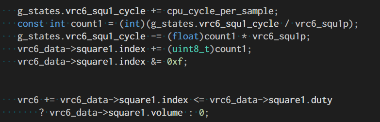
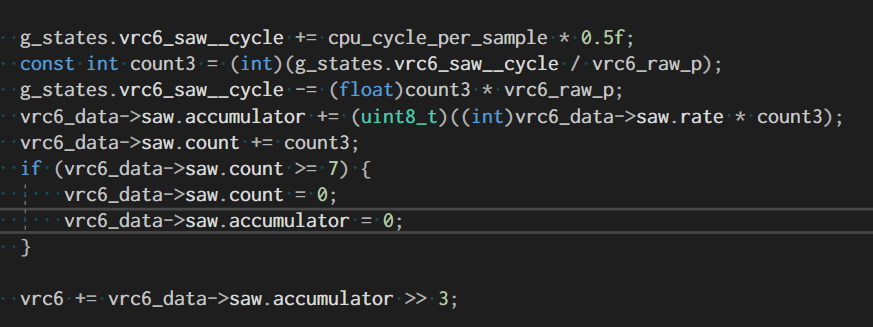
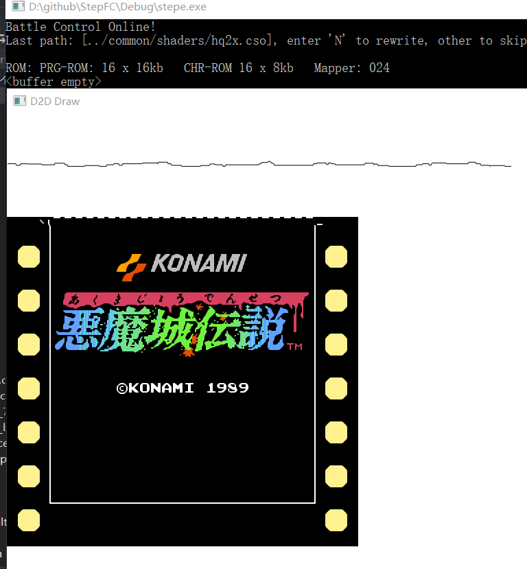
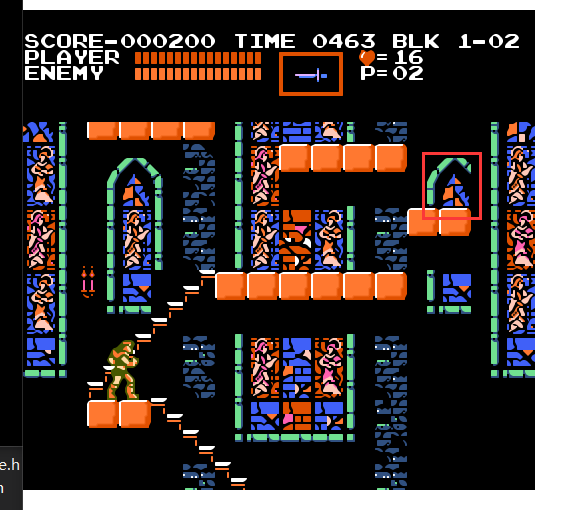

### 可乐妹的VRC6
本文github[备份地址](https://github.com/dustpg/BlogFM/issues/43)

那就从NSF的扩展音源最低位开始吧, VRC6有两个变种:

 - VRC6a(Mapper-024), 用于[恶魔城传说(恶魔城3)](http://bootgod.dyndns.org:7777/profile.php?id=3316)
 - VRC6b(Mapper-026), 用于[魍魎戦記MADARA, Esper Dream II](http://bootgod.dyndns.org:7777/search.php?keywords=26&kwtype=pcb)

当然所述为日版(FC), NES版由于老任的策略不能使用自己搭载扩展音频的卡带. 


### BANK

```
CPU $8000-$BFFF: 16 KB switchable PRG ROM bank
CPU $C000-$DFFF: 8 KB switchable PRG ROM bank
CPU $E000-$FFFF: 8 KB PRG ROM bank, fixed to the last bank
CHR $0000-$03FF: 1 KB switchable CHR ROM bank
CHR $0400-$07FF: 1 KB switchable CHR ROM bank
CHR $0800-$0BFF: 1 KB switchable CHR ROM bank
CHR $0C00-$0FFF: 1 KB switchable CHR ROM bank
CHR $1000-$13FF: 1 KB switchable CHR ROM bank
CHR $1400-$17FF: 1 KB switchable CHR ROM bank
CHR $1800-$1BFF: 1 KB switchable CHR ROM bank
CHR $1C00-$1FFF: 1 KB switchable CHR ROM bank
```

感觉设计很科学, PRG-ROM方面16kb切换, 8kb切换, 8kb固定. CHR-ROM全是1kb可切换

PRG-ROM支持到256kb, CHR-ROM也是.


### 寄存器

由于地址线只有0,1,12-15可用, 镜像地址可以用: 与```$F003```做与运算获得(```$DE6A -> $D002```).

同时两个变种的区别就是: 地址线A0,A1是相反的. 

```
    variant   lines     registers                       Mapper Number
    =================================================================
    VRC6a:    A0, A1    $x000, $x001, $x002, $x003      024
    VRC6b:    A1, A0    $x000, $x002, $x001, $x003      026
```

换句话说, MAPPER-026实现可以为:

```c
void sfc_mapper_vrc6a_write_high(uint16_t addr, uint8_t data) {
    // xxxxx
}

void sfc_mapper_vrc6b_write_high(uint16_t addr, uint8_t data) {
    uint16_t new_addr = addr & 0xfffc;
    new_addr |= (addr & 1) << 1;
    new_addr |= (addr & 2) >> 1;
    sfc_mapper_vrc6a_write_high(new_addr, data);
}
```

### 16k PRG Select ($8000-$8003)

```
7  bit  0
---------
.... PPPP
     ||||
     ++++- Select 16 KB PRG ROM at $8000
```

```16*16=256```

### 8k PRG Select ($C000-$C003)

```
7  bit  0
---------
...P PPPP
   | ||||
   +-++++- Select 8 KB PRG ROM at $C000
```

```8*32=256```

### PPU Banking Style ($B003)

```
7  bit  0
---------
W.PN MMDD
| || ||||
| || ||++- PPU banking mode; see below
| || ++--- Mirroring varies by banking mode, see below
| |+------ 1: Nametables come from CHRROM, 0: Nametables come from CIRAM
| +------- CHR A10 is 1: subject to further rules 0: according to the latched value
+--------- PRG RAM enable

```

CIRAM (Console-Internal RAM, FC内部自带的RAM). 是的! VRC6支持用ROM代替RAM.


现有的游戏只有这几种情况: ``` $20, $24, $28, $2C, $A0, $A4, $A8, $AC```. 


### CHR Select 0…7 ($Dxxx, $Exxx)

为了方便描述, 将```$D000-$D003, $E000-$E003```依次描述为R0-R7. ```$B003```的第三位影响CHR-ROM的切换:

图样表:

```
```[$B003] & $03``` | 0 | 1 | 2 / 3  
--------------------|---|---|-----
$0000-$03FF         | R0| R0| R0
$0400-$07FF         | R1| R0| R1
$0800-$0BFF         | R2| R1| R2
$0C00-$0FFF         | R3| R1| R3
$1000-$13FF         | R4| R2| R4
$1400-$17FF         | R5| R2| R4
$1800-$1BFF         | R6| R3| R5
$1C00-$1FFF         | R7| R3| R5
```

名称表:

```
```[$B003] & $07``` |0/6/7|1/5|2/3/4
--------------------|---|---|-----
$2000-$23FF         |R6 | R4|  R6
$2400-$27FF         |R6 | R5|  R7
$2800-$2BFF         |R7 | R6|  R6
$2C00-$2FFF         |R7 | R7|  R7
```

之前提到名称表拥有大致三种模式: 水平镜像、垂直镜像以及四屏模式. 但是实际上还有更多的模式, 比如三屏、一屏. 详细的还是查看引用链接.


图样表还行, 名称表解释起来太麻烦了, 直接上代码(没有考虑切换名称表切换CHR-ROM):

```c
    // 使用CIRAM 镜像模式
    if (!(ppu_style & SFC_18_B3_FROM_CHRROM)) {
        switch (ppu_style & 0x2F) {
        case 0x20:
        case 0x27: // (这个情况现有的游戏不存在)
            sfc_switch_nametable_mirroring(famicom, SFC_NT_MIR_Vertical);
            break;
        case 0x23: // (这个情况现有的游戏不存在)
        case 0x24: 
            sfc_switch_nametable_mirroring(famicom, SFC_NT_MIR_Horizontal);
            break;
        case 0x28:
        case 0x2F: // (这个情况现有的游戏不存在)
            sfc_switch_nametable_mirroring(famicom, SFC_NT_MIR_SingleLow);
            break;
        case 0x2B: // (这个情况现有的游戏不存在)
        case 0x2C:
            sfc_switch_nametable_mirroring(famicom, SFC_NT_MIR_SingleHigh);
            break;
        default:
            // (这个情况现有的游戏不存在)
            switch (ppu_style & 0x07) {
            case 0x00:
            case 0x06:
            case 0x07:
                famicom->ppu.banks[0x8] = famicom->video_memory + 0x400 * (mapper->registers[6] & 1);
                famicom->ppu.banks[0x9] = famicom->ppu.banks[0x8];
                famicom->ppu.banks[0xa] = famicom->video_memory + 0x400 * (mapper->registers[7] & 1);
                famicom->ppu.banks[0xb] = famicom->ppu.banks[0xa];
                break;
            case 0x01:
            case 0x05:
                famicom->ppu.banks[0x8] = famicom->video_memory + 0x400 * (mapper->registers[4] & 1);
                famicom->ppu.banks[0x9] = famicom->video_memory + 0x400 * (mapper->registers[5] & 1);
                famicom->ppu.banks[0xa] = famicom->video_memory + 0x400 * (mapper->registers[6] & 1);
                famicom->ppu.banks[0xb] = famicom->video_memory + 0x400 * (mapper->registers[7] & 1);
                break;
            case 0x02:
            case 0x03:
            case 0x04:
                famicom->ppu.banks[0x8] = famicom->video_memory + 0x400 * (mapper->registers[6] & 1);
                famicom->ppu.banks[0x9] = famicom->video_memory + 0x400 * (mapper->registers[7] & 1);
                famicom->ppu.banks[0xa] = famicom->ppu.banks[0x8];
                famicom->ppu.banks[0xb] = famicom->ppu.banks[0x9];
                break;
            }
            // 镜像
            famicom->ppu.banks[0xc] = famicom->ppu.banks[0x8];
            famicom->ppu.banks[0xd] = famicom->ppu.banks[0x9];
            famicom->ppu.banks[0xe] = famicom->ppu.banks[0xa];
            famicom->ppu.banks[0xf] = famicom->ppu.banks[0xb];
            break;
        }
    }
    // 使用CHR-ROM(现有的游戏没有)
    else {
        // TODO: 完成
        assert(!"NOT IMPL");
    }
```


### IRQ control ($F00x)

VRC系列的IRQ是相同的逻辑, 与其他IRQ系统不同的是, VRC IRQ是基于CPU周期的. 自然, 即便是禁用PPU渲染, 或者VBlank时, 也能触发IRQ.

当然主要功能还是模拟扫描线(切换模式)

```
       7  bit  0
       ---------
$F000: LLLL LLLL - IRQ Latch
$F001: .... .MEA - IRQ Control
$F002: .... .... - IRQ Acknowledge

A: IRQ Enable after acknowledgement (see IRQ Acknowledge)
E: IRQ Enable (1 = enabled)
M: IRQ Mode (1 = cycle mode, 0 = scanline mode)
```
```$F002```确认IRQ中有一个重要的操作```E=A``` 而不是```E|=A```, 千万不要像自己以为身经百战见得多了, 东边哪个IRQ没有见过? 找了非常长时间的BUG.

扫描线模式, 每根扫描线输出一个时钟信号. 通过将CPU周期除以[114, 114, 113], 然后重复序列. 所以可以认为是除以113.667(NTSC的场合, PAL需要调整至106又16分之5). 不过, 由于目前的架构是基于扫描线进行水平同步的, 所以是反过来的. 

(CPU)周期模式, 每个(CPU)时钟周期输出一个信号. 感觉太夸张了, 毕竟一个指令最少也要花2周期, 不知道是不是自己理解错了.

当输出一个时钟信号时:

 - 如果IRQ计数器为$FF, 重载L值, 触发IRQ
 - 否则计数器+1

当然IRQ被禁止的话什么都不会干.

### VRC6 扩展声部
这部分才是本篇的本体! 很多NSF作者很喜欢VRC6, 原因是增加两个方波和一个锯齿波, 得到了加强但是又不至于太过分.

```
Base|+0|+1|+2|+3
----|--|--|--|---
$9000|方波1占空比-音量|方波1周期-低字节|方波1周期-高字节|频率缩放
$A000|方波2占空比-音量|方波2周期-低字节|方波2周期-高字节|---
$B000|锯齿波音量|锯齿波周期-低字节|锯齿波周期-高字节|---
```

由于NSF的存在, 自己将音频数据放在了核心部分, 而不是依靠Mapper保存.

### Frequency Control ($9003)

```
7  bit  0
---- ----
.... .ABH
      |||
      ||+- Halt
      |+-- 16x frequency (4 octaves up)
      +--- 256x frequency (8 octaves up)

H - halts all oscillators, stopping them in their current state
B - 16x frequency, all oscillators (4 octave increase)
A - 256x frequency, all oscillators (8 octave increase)
```

那三个游戏都没有使用这个这个寄存器, 仅仅是简单```=0```. 考虑不用支持?

### Pulse Control ($9000,$A000)

```
7  bit  0
---- ----
MDDD VVVV
|||| ||||
|||| ++++- Volume
|+++------ Duty Cycle
+--------- Mode (1: ignore duty)
```

## Saw Accum Rate ($B000)

```
7  bit  0
---- ----
..AA AAAA
  ++-++++- Accumulator Rate (controls volume)
```

### Freq Low ($9001,$A001,$B001)

```
7  bit  0
---- ----
FFFF FFFF
|||| ||||
++++-++++- Low 8 bits of frequency
```

### Freq High ($9002,$A002,$B002)

```
7  bit  0
---- ----
E... FFFF
|    ||||
|    ++++- High 4 bits of frequency
+--------- Enable (0 = channel disabled)
```

### 方波
VRC6的方波与2A03自带的方波类似.

```
D value   Duty (percent)
0   1/16   6.25%
1   2/16   12.5%
2   3/16   18.75%
3   4/16   25%
4   5/16   31.25%
5   6/16   37.5%
6   7/16   43.75%
7   8/16   50%
M   16/16   100%
```
```M=1```时, 持续输出当前音量, 也就是可以认为是```[1, 1, ...., 1]```

通过```E=0```, 会复位占空比索引并停止, 输出0. 通过```E=1```, 会从头恢复.

虽然占空比序列长度是16, 为2A03的2倍. 但是由于是CPU频率驱动的, 所以计算公式还是一致的:

```
f = CPU / (16 * (t + 1))
t = (CPU / (16 * f)) - 1
```

具体实现可以考虑像2A03的矩形波一样进行查表, 不过太有规律了, 可以用``` i <= d```进行判断.


这里简单实现为:




### 锯齿波
这算是一个新东西, 不过和三角波相似, 甚至在函数表述上比三角波还简单.

```
     *      *
    *      *
---*------*------
  *      *
 *      *
*      *
```

同样是CPU周期驱动的12bit周期数据. 每两次由周期输出时钟时, 内部的8bit累加器加上```[$B000]:A```, 每次则输出高5bit. 第七次重置归零:

```

Step   Accumulator   Output   Comment
0   $00   $00   
1   $00   $00   (odd step, do nothing)
2   $08   $01   (even step, add A to accumulator)
3   $08   $01   
4   $10   $02   
5   $10   $02   
6   $18   $03   
7   $18   $03   
8   $20   $04   
9   $20   $04   
10  $28   $05   
11  $28   $05   
12  $30   $06   
13  $30   $06   
0   $00   $00   (14th step, reset accumulator)
1   $00   $00   
2   $08   $01   
```

如果A大于42, 会导致8bit数据溢出从而让声音失真. 通过写入```E=0```累加器会复位到下次```E=1```. 频率计算公式为:

```
f = CPU / (14 * (t + 1))
t = (CPU / (14 * f)) - 1
```

这里简单实现为:




### 输出
就连wiki上面介绍VRC6输出的口吻也是比较含糊的, 主要有两点:

 - VRC6方波最大音量和2A03方波最大音量差不多
 - VRC6的三个声部似乎是线性变化的

根据之前DAC中给出的线性逼近的公式: ```   pulse_out = 0.00752 * (pulse1 + pulse2)```, 可知线性因子大概是```0.00752```, 由于不太确定, 可以根据情况上下浮动.




### 要点

 - 高周期有一个使能位, 可以简单实现为: 使能位```E: 0 -> 1```时, 重置索引/累加器状态
 - VRC6支持在名称表中使用ROM代替RAM(偷懒没有完成, 涉及到影响状态读写, 考虑最后一起完成)
 - VRC6的IRQ是基于CPU而不是PPU, 所以水平同步接口增加了一个参数(扫描行)
 - 两个变种区别在于地址线A0, A1反了
 - VRC6扩展声道加起来是一个6bit数据, 但是会除以大约128. 差不多最大音量是0.5
 - 与2A03的最大1.0加在一起会超过1.0, 可能会出现破音现象, 可以添加一个动态阈值来除


### 恶魔城传说模拟出现的问题



(红框处应该有一个蝙蝠状敌人)

同之前的MetalMax, 由于目前精灵是在最后一起渲染的, 导致中途切换BANK会让精灵使用错误的图样表BANK渲染

还有一个小问题就是, 这个画面中, 背景会来回1像素上下跳动, 这个应该是IRQ精度问题

### REF

 - [VRC6](https://wiki.nesdev.com/w/index.php/VRC6)
 - [VRC6 audio](https://wiki.nesdev.com/w/index.php/VRC6_audio)
 - [VRC IRQ](https://wiki.nesdev.com/w/index.php/VRC_IRQ)
 - [Mirroring](https://wiki.nesdev.com/w/index.php/Mirroring)