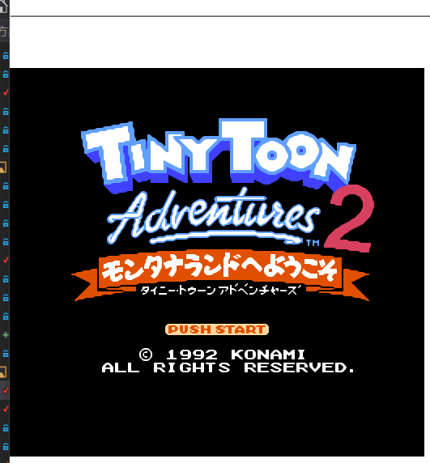
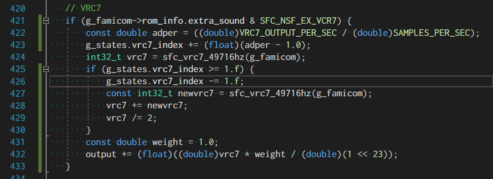
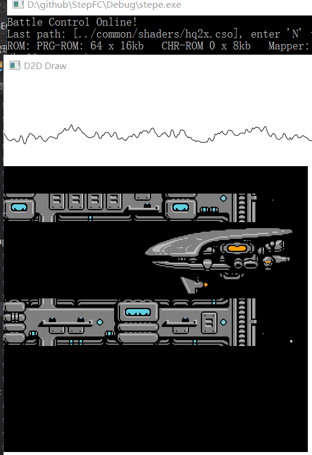
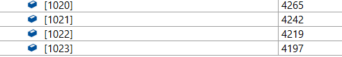
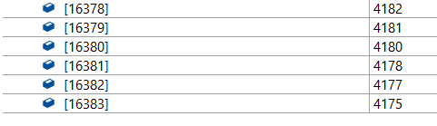
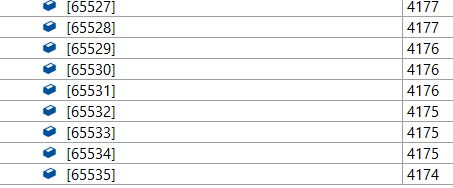

### 拉格朗日点

本文githgub[备份地址](https://github.com/dustpg/BlogFM/issues/44)

之所以将游戏名称作为小标题, 自然是说到可乐妹的VRC7, 就不得不说'[拉格朗日点](http://bootgod.dyndns.org:7777/profile.php?id=3643)'了, 因为这是一款唯一使用了VRC7的游戏. 被不少人冠上'FC最强音乐'的帽子.

 当然实际上还有一款'[兔宝宝历险记2](http://bootgod.dyndns.org:7777/profile.php?id=3834)(日版)'也使用了VRC7, 不过'兔宝宝历险记2'没有使用到VRC7的扩展音频(实体卡带比前者小了不少, 可以看作前者使用了VRC7a, 后者使用了VRC7b). 


### BANK

```
CPU $8000-$9FFF: 8 KB switchable PRG ROM bank
CPU $A000-$BFFF: 8 KB switchable PRG ROM bank
CPU $C000-$DFFF: 8 KB switchable PRG ROM bank
CPU $E000-$FFFF: 8 KB PRG ROM bank, fixed to the last bank
CHR $0000-$03FF: 1 KB switchable CHR ROM bank
CHR $0400-$07FF: 1 KB switchable CHR ROM bank
CHR $0800-$0BFF: 1 KB switchable CHR ROM bank
CHR $0C00-$0FFF: 1 KB switchable CHR ROM bank
CHR $1000-$13FF: 1 KB switchable CHR ROM bank
CHR $1400-$17FF: 1 KB switchable CHR ROM bank
CHR $1800-$1BFF: 1 KB switchable CHR ROM bank
CHR $1C00-$1FFF: 1 KB switchable CHR ROM bank
```

感觉都还科学. 变种区别为

 - VRC7b 使用 A3 来选寄存器($x008)
 - VRC7a 使用 A4 来选寄存器($x010)

### PRG Select 0 ($8000)

```
7  bit  0
---------
..PP PPPP
  || ||||
  ++-++++- Select 8 KB PRG ROM at $8000
```

```64*8=512```


### PRG Select 1 ($8010, $8008)

```
7  bit  0
---------
..PP PPPP
  || ||||
  ++-++++- Select 8 KB PRG ROM at $A000
```

### PRG Select 2 ($9000)

```
7  bit  0
---------
..PP PPPP
  || ||||
  ++-++++- Select 8 KB PRG ROM at $C000
```


### CHR Select 0…7 ($A000…$DFFF)


Write to CPU address  |  1KB CHR bank affected
----------------------|---------------
$A000           |  $0000-$03FF
$A008 or $A010  |  $0400-$07FF
$B000           |  $0800-$0BFF
$B008 or $B010  |  $0C00-$0FFF
$C000           |  $1000-$13FF
$C008 or $C010  |  $1400-$17FF
$D000           |  $1800-$1BFF
$D008 or $D010  |  $1C00-$1FFF


### Mirroring Control ($E000)

```
7  bit  0
---------
RS.. ..MM
||     ||
||     ++- Mirroring (0: vertical; 1: horizontal;
||                        2: one-screen, lower bank; 3: one-screen, upper bank)
|+-------- Silence expansion sound if set
+--------- WRAM enable (1: enable WRAM, 0: protect)
```

### IRQ Control ($E008 - $F010)

```
$E008, $E010:  IRQ Latch
       $F000:  IRQ Control
$F008, $F010:  IRQ Acknowledge
```

对比起VRC6起来, 简直不知道友好到哪里去! 根据地址线的规律, 可以使用:

```c
    const uint16_t vrc7a = address >> 4;
    const uint16_t vrc7b = address >> 3;
    const uint16_t base = (((address >> 11) & 0xfffe) | ((vrc7a | vrc7b) & 1)) & 0xf;
```

将分散的数据聚集在一起方便```switch```编写.


### 兔宝宝历险记2 模拟出现的问题



一开始这个东西根本就不能运行, 到处出错. 一步一步反汇编后发现, 其实是IRQ的实现有问题. ```CLI```后不久, 强行触发中断导致程序乱跑.

根本原因还是IRQ实现有问题(废话), APU禁用IRQ后依然触发了已经挂起的IRQ. 目前先将挂起的IRQ清除掉, 以后好好研究一下IRQ.


### VRC7 扩展音频

VRC7拥有6个FM合成音频声道, 实现了Yamaha YM2413 OPLL的一个功能子集(阉割版). 似乎叫做'Yamaha DS1001', 下面为了方便描述, VRC7与'Yamaha DS1001'在描述上等价.

前面有一个寄存器```Mirroring Control ($E000)```, 其中```Silence```位为1的话, 会让VRC7部分静音并清空相关数据状态.


### Audio Register Select ($9010)

```
7......0
VVVVVVVV
++++++++- The 8-bit internal register to select for use with $9030
```

写入后, 程序不得在6个CPU周期(N制, 实际是12个内部周期)内写入```$9030```以及```$9010```, VRC7内部处理需要一点时间.


### Audio Register Write ($9030)

```
7......0
VVVVVVVV
++++++++- The 8-bit value to write to the internal register selected with $9010
```

写入后, 程序不得在42个CPU周期(N制, 实际是84个内部周期)内写入```$9030```以及```$9010```, VRC7内部处理需要一点时间.

42周期可是比三分之一扫描行还多! 不过, 一般地, 作为模拟器不必担心.

### 内部寄存器

虽然```$9010```表明几乎有256个寄存器, 似乎内部只有26个: 

- ```$00-$07```自定义Patch
- ```$10-$15, $20-25, $30-35```分别控制拥有的6个FM声道
- 至于合成器中Patch的概念, 简单可以理解为音色的一种描述

### 频率调制


> FM是使高频振荡波的频率按调制信号规律变化的一种调制方式. 采用不同调制波频率和调制指数, 就可以方便地合成具有不同频谱分布的波形, 再现某些乐器的音色.

翻开(已经不存在的)大学教材, 回想起被傅里叶老人家支配的痛苦, 不由得感慨万分, 于是合上(已经不存在的)这本教材.

频率调制(Frequency modulation)FM, 现在似乎变成了电台的代名词了. 简单来说, 这里就是通过调制振荡器(Modulator)与载波振荡器(Carrier)进行合成, 即双算子-FM. 


在音乐合成时, 双算子-FM可以采用:

```

F(t) = A sin(ωt + I sin ωt )
             c          m


     Modulator              Carrier
     调制振荡器             载波振荡器
  +-----------------+  +-----------------+
  |                 |  |                 |
  | +-+    +------+ |  | +-+    +------+ |
+-->+X+--->+ Sin  +------+X+--->+  Sin +---> 
  | +++    +--+---+ |  | +++    +---+--+ |
  |  ^        ^     |  |  ^         ^    |
  |  |        | I   |  |  |         | A  |
  |  |        |     |  |  |         |    |
  | -|-    +--+---+ |  | -|-    +---+--+ |
  | P|G    |  EG  | |  | P|G    |  EG  | |
  | -|-    +------+ |  | -|-    +------+ |
  |  |              |  |  |              |
  +--|--------------+  +--|--------------+
     |                    |
     +                    +
     ωm                   ωc

EG: 包络发生器 Envelope Generator
PG: 相位发生器 Phase    Generator

```

ADSR包络提供一个比较自然的```A(t)```, ```I(t)```函数:


```

   ON            OFF
    ---------------
---|              |-----------
                   
       /\          
      /  \________ 
     /            \
    /              \

    AAAADDSSSSSSSSRR 
```


VRC7内部拥有15个预置好的乐器PATCH和1个自定义PATCH, 也就是每8字节一个乐器:


Register  |  Bitfield  |  Description
----------|------------|-------------
$00  |  TVSK MMMM  |  Modulator tremolo (T), vibrato (V), sustain (S), key rate scaling (K), multiplier (M)
$01  |  TVSK MMMM  |  Carrier tremolo (T), vibrato (V), sustain (S), key rate scaling (K), multiplier (M)
$02  |  KKOO OOOO  |  Modulator key level scaling (K), output level (O)
$03  |  KK-Q WFFF  |  Carrier key level scaling (K), unused (-), carrier waveform (Q), modulator waveform (W), feedback (F)
$04  |  AAAA DDDD  |  Modulator attack (A), decay (D)
$05  |  AAAA DDDD  |  Carrier attack (A), decay (D)
$06  |  SSSS RRRR  |  Modulator sustain (S), release (R)
$07  |  SSSS RRRR  |  Carrier sustain (S), release (R)


- vibrato, 一般作抖音, 频率的改变(FM), 使能位
- tremolo, 一般作颤音, 音量的改变(AM), 使能位
- attack,  起音, 用于ADSR包络
- decay,   衰减, 用于ADSR包络
- sustain, 延音, 用于ADSR包络
- release, 释音, 用于ADSR包络
- $0$1: sustain, ASDR包络中, S阶段用
- key rate scaling, 调整ADSR包络速度
- multiplier, 倍乘因子(需要查表)
- output level, 调整调制器的基础'音量(衰减值)'
- waveform, 0: 正弦. 1: 半波整流正弦(小于0的被钳制到0)
- $4-$7, ADSR包络用数据. 0:暂停. 1:最慢. F:最快
- key level scaling, feedback 后面用的参数 


### 声道


Register  |  Bitfield  |  Description
----------|------------|-------------
$10-$15  |  LLLL LLLL  |  Channel low 8 bits of frequency
$20-$25  |  --ST OOOH  |  Channel sustain (S), trigger (T), octave (O), high bit of frequency (H)
$30-$35  |  IIII VVVV  |   Channel instrument (I), volume (V)


 - $AB中, A就是上面三种情况, B就是声道编号: 0-5共计6声道.
 - $3X:I, 就是乐器编号0-F
 - $3X:V, 声道音量0-F, 当然实际没有音量的概念
 - $2X:S, 为真的话, 会用```$5```替换掉PATCH中的'R'阶段原本的数据
 - $2X:T,  ```0->1```我们可以认为是键盘按下, ```1->0```则可以认为是键盘弹起. 键盘按下就能弹出一个音符, 按键弹起则进入音符ADSR的'R'阶段. 如果键盘敲不响, 肯定是卡住了: ```0->0, 1->1```.
 - $1X的低8位, 与$2X的最低一位作为高位数据, 合成的9bit(freq). 以及```$2X:O```3bit的八度数据. 这两个合在一起定义了一个输出频率:

```
     49716 Hz * freq
F = -----------------
     2^(19 - octave)  
```

例如, A440, 记作A4, 八度(octave)为4. 这时freq为288.

49716Hz(49715.909Hz)是因为内部需要72周期处理全部声道, 所以可以反推VRC7的内部运行频率大致是```3.579552MHz```, 大约是N制CPU频率的两倍. 

而且这个东西是硬件, 不会说插在P制红白机上就自动降频了(不过由于是VRC7内部驱动, 所以插在P制上也是发出的是同一个频率音符, 不像内部声部). 并且, 由于49716Hz>44100Hz, 所以我们可以认为, 最后输出是由各个声道通过混频得到的.

下面, 如果没有特殊说明, 说到VRC7的时钟周期, 是指```49716Hz```的周期.


### VRC7的场合

'VRC7 Audio'里面并没有详细介绍细节, 不过下面论坛链接就有了.

**相位计算**:

每个算子拥有一个18bit的计数器用于确定当前相位, 每个时钟周期都会递增:

```

$00/$01 MMMM  $0  $1  $2  $3  $4  $5  $6  $7  $8  $9  $A  $B  $C  $D  $E  $F
Multiplier    1/2  1   2   3   4   5   6   7   8   9  10  10  12  12  15  15

phase += F * (1<<O) * M * V / 2

```

 - F = $2X:D0  $1X 组成的9bit数据
 - O = $2X:D1-D3 3bit的八度信息
 - M = $0/$1 经过查表的倍乘因子. 由于第一个是乘以二分之一, 可以考虑LUT预乘2, 最后再除以2
 - V = vibrato(FM)输出. 如果vibrato=0, V=1. 后面说明AM/FM的情况

实际使用中会使用'phase_secondary': ``` phase_secondary = phase + adj```

 - 对于载波器: ```adj```是调制器的输出. 超过18bit的将会舍弃
 - 对于调制器, $03的3bit反馈值
 - 当```F```为0: ```adj=0```
 - 其他情况, ```adj = previous_output_of_modulator >> (8 - F)```
 - 由于这个是代表相位, ```phase_secondary```对于调制器就是利用相位差, 定位指定的相位:

```
$03         FFF    $0     $1     $2     $3     $4    $5    $6    $7
Modulation Index    0    π/16    π/8    π/4    π/2    π    2π    4π
```

18bit的'phase_secondary'构造为: ```[RI IIII III. .... ....]```

R和I都是之后需要使用的:

 - 其中'I'是(半)正弦表查表用的索引值. 具体使用多少位看具体实现, 最长可以用到17bit...太长了.
 - 'R'为1的话, 表示在正弦波的下半部分. 前面提到了, $3的waveform会决定是否钳制负数到0

**输出计算**:

每个周期每个算子输出一个衰减值:

```
TOTAL = half_sine_table[I] + base + key_scale + envelope + AM
```

其中```half_sine_table```并不是真正的正弦函数表, 而是衰减值:

```
sin(pi/2) = 1   ~~~>  I='0100 0000'  ~~~>  half_sine_table[ I ] = 0 dB
sin(0) = 0      ~~~>  I='0000 0000'  ~~~>  half_sine_table[ I ] = +inf dB
```

其中```base```:

 - 调制器: ```base = (0.75dB * L)```, L是$02的6bit基础衰减值
 - 载波器: ```base = (3.00dB * V)```, V是$3X的4bit基础衰减值
 - 后面会将浮点映射到整型(就是单位化而已)


其中```key_scale```是$02$03的2bit值```K```:

```
F: 9bit的频率数据
Oct: 八度

IF K==0, THEN
  key_scale = 0
ELSE
  A = table[ F >> 5 ] - 6 * (7-Oct)
  IF A < 0, THEN
    key_scale = 0
  ELSE
    key_scale = A >> (3-K)
  ENDIF
ENDIF

  
table:
   F:     $0     $1     $2     $3     $4     $5     $6     $7     $8     $9     $A     $B     $C     $D     $E     $F
   A:     0.00  18.00  24.00  27.75  30.00  32.25  33.75  35.25  36.00  37.50  38.25  39.00  39.75  40.50  41.25  42.00
```

后面的包络```envelope```, AM, 后面说明.

 1. 到这里, 每个算子的输出就计算好了. 不过这是一个衰减值, 需要转换成一个初步的线性输出值, 20bit.
 2. 根据'R'与'waveform'的值决定是否钳制为0.
 3. 还要通过一个滤波器, 不过很简单, 只需要和前一个输出(不是最终值)做平均就行
 4. 输出线性值
 5. 衰减值与线性值转换公式为:

```
dB     = -20 * log10( Linear ) * scale      (if Linear = 0, dB = +inf)
Linear = 10 ^ (dB / -20 / scale)
```


### 包络发生器

每个算子的包络发生器拥有一个23bit的计数器(记为EGC), 为输出添加衰减值(控制音量). 拥有ADSR阶段, 结束后进入空状态(Idle).

除开**Attack**阶段, ```EGC```为零时输出0dB, ```EGC```为```1<<23```时, 输出48dB. 文中建议dB使用```(1<<23)/48```作为基础单位, 以做出最少的单位转换.

这里列出一些数据之后会用上:

 - OF: $2X的低四位, 由八度和频率最高位组成的4bit数据
 - K: $0$1的'key rate scaling'
 - KO: ```K ? OF : OF >> 2```
 - R: 基础速率, 每个阶段不同, $04-$08的数据
 - RKS: ```R*4 + KO```
 - RH: ```RKS >> 2```, 超过15则被钳制到15
 - RL: ```RKS & 3```
 - 注: 当R为0, EGC不会增加, 所以不用下面的计算了

**Attack**阶段:

 - ```R```是对应的**Attack**速率
 - ```EGC += (12 * (RL+4)) << RH```
 - ```EGC```超过23bit范围, 归零, 进入**Decay**阶段.
 - **Attack**阶段输出是: ```AO(EGC) = 48 dB - (48 dB * ln(EGC) / ln(1<<23))```

**Decay**阶段:

 - ```R```是对应的**Decay**速率
 - ```EGC += (RL+4) << (RH-1)```
 - 当EGC达到对应的**Sustain**值时, 进入**Sustain**阶段.
 - 具体是```EGC >= (3 * Sustain * (1<<23) / 48)```

**Sustain**阶段:

 - 如果``` $0$1: sustain```为0, ```R```是对应的**Release**速率
 - 否则, ```R=0```
 - ```EGC += (RL+4) << (RH-1)```
 - 如果超过EGC本身范围, 进入**Idle**阶段
 
**Release**阶段:

 - ```$2X:S```为1的话, ```R=5```
 - 另外, ``` $0$1: sustain```为0的话, ```R```是对应的**Release**速率
 - 否则, ```R=7```
 - ```EGC += (RL+4) << (RH-1)```
 - 如果超过EGC本身范围, 进入**Idle**阶段

**Idle**阶段:

 - 始终输出48dB

### 敲键盘

敲下和弹起后会处理一些事. 前面说了, 卡住的不算, 换一个键盘再来.

**敲下**:

 - ```EGC=0```
 - 18bit的相位计数器归零
 - 进入**Attack**阶段

**弹起**：

 - 如果当前为**Attack**阶段, EGC置为Attack输出函数(```EGC=AO(EGC)```)
 - 进入**Release**阶段

### AM/FM

前面提到的什么抖音颤音就在这了. 与前面不同的是, AM/FM的状态是全算子共用的(VRC7就一个AM/FM). AM/FM拥有一个20bit的计数器, 每个周期加上```rate```, 有一个共有的```sinx = sin(2 * PI * counter / (1<<20))```.

**AM**:

 - ```rate = 78```
 - ```AM_output = (1.0 + sinx) * 0.6 dB```   (emu2413 使用的是 1.2 dB)

**FM**:

 - ```rate = 105```
 - ```FM_output = 2 ^ (13.75 / 1200 * sinx)```   
 - '^'是指指数运算

也就是说, FM/AM的计算不受用户(这里是指程序猿)的影响, 用户能控制的是决定用不用AM/FM.

可以看出很多地方的计算相当复杂, 具体可以用查表实现. 涉及到精度的查表, 自己会用常量控制, 然后试试什么精度可以接受.

### 实际编写

实际编写中自然是遇到了大量问题:

 - AM冠FM戴. 经常有两个差不多的东西(这里就是AM/FM), 第二个就会直接复制, 但是没有完全修改.
 - 建立查找表时, 浮点的```inf```需要特别处理.
 - 最大问题还是:
 - ```op->key_scale = (uint32_t)a >> (3 - key_scale_bits)```
 - 这句没有问题. 等等, 这句好像等价于:
 - ```op->key_scale = ((uint32_t)a << key_scale_bits) >> 3```
 - 算了, 还是按照文档写的吧, 删掉:
 - ```op->key_scale = (uint32_t)a << (3 - key_scale_bits)```
 - 于是右移变成左移了....花了半天才找到
 - 建议大家这种情况: 不要修改, 用```ctrl+z```
 - 几乎全是手贱

还一个架构上的问题:

之前提到了, 目前的处理模式是处理上一个状态. 所以外部有一个状态机, 保存了模拟器声部的上一次状态. 但是由于VRC7状态太复杂了, 不方便弄, 所以实现与其他不同:

 - 其实只有一点, 就是在修改状态前触发```audio_changed```事件
 - 这样内部本身就保存的上次状态, 就能用了
 - 等等...为什么之前不这么弄? 忘了, 可能有bug?

### 合并输出

 - 前面提到了, 由于频率太高, 所以认为是通过混频得到的. 这是一点.
 - 是的, 由于59716Hz比目前使用的44100Hz大, 所以涉及到一个'重采样'的步骤.
 - 问题: 为什么之前的不需要重采样? 知道的小伙伴可以回复评论!
 - 方案1: 简单地可以舍弃掉中间错位的样本
 - 方案2: 再稍微好一点的, 上步舍去的样本于下一次做平均
 - 方案3: 第三个自然就是, 进行比较系统地重采样. 
 - 例如先通过一个22kHz的低通滤波, 然后针对每个样本进行权重分配
 - 这里简单地平均一下就好了(方案2)
 - 最后....
 - 怎么和2A03合并呢...这文中没有提到权重
 - 输出是一个20bit的数据, 不过可能带符号, 也就是21bit有符号.
 - 阉割版只有6个声道, 但是明显地, 应该有8个.
 - 也就是24bit有符号! 等等, 这不比CD音质还好?(内部全部使用双精度模拟的话肯定比CD音质好. 卡带上肯定不是, 不过, 还要什么自行车)
 - 以1.0为上限, 应该除以```(double)(1<<23)``` (单精度浮点捉襟见肘了), 理论最大值为0.75(6声道)
 - 还是建议用户可调整




### PATCH表


预置PATCH似乎到目前还没有明确值, 自己使用的自然是wiki提供的:

```c
// 内部PATCH表
const uint8_t sfc_vrc7_internal_patch_set[128] = {
    0x00, 0x00, 0x00, 0x00, 0x00, 0x00, 0x00, 0x00, // Custom
    0x03, 0x21, 0x05, 0x06, 0xB8, 0x81, 0x42, 0x27, // Buzzy Bell
    0x13, 0x41, 0x13, 0x0D, 0xD8, 0xD6, 0x23, 0x12, // Guitar
    0x31, 0x11, 0x08, 0x08, 0xFA, 0x9A, 0x22, 0x02, // Wurly
    0x31, 0x61, 0x18, 0x07, 0x78, 0x64, 0x30, 0x27, // Flute
    0x22, 0x21, 0x1E, 0x06, 0xF0, 0x76, 0x08, 0x28, // Clarinet
    0x02, 0x01, 0x06, 0x00, 0xF0, 0xF2, 0x03, 0xF5, // Synth
    0x21, 0x61, 0x1D, 0x07, 0x82, 0x81, 0x16, 0x07, // Trumpet
    0x23, 0x21, 0x1A, 0x17, 0xCF, 0x72, 0x25, 0x17, // Organ
    0x15, 0x11, 0x25, 0x00, 0x4F, 0x71, 0x00, 0x11, // Bells
    0x85, 0x01, 0x12, 0x0F, 0x99, 0xA2, 0x40, 0x02, // Vibes
    0x07, 0xC1, 0x69, 0x07, 0xF3, 0xF5, 0xA7, 0x12, // Vibraphone
    0x71, 0x23, 0x0D, 0x06, 0x67, 0x75, 0x23, 0x16, // Tutti
    0x01, 0x02, 0xD3, 0x05, 0xA3, 0x92, 0xF7, 0x52, // Fretless
    0x61, 0x63, 0x0C, 0x00, 0x94, 0xAF, 0x34, 0x06, // Synth Bass
    0x21, 0x72, 0x0D, 0x00, 0xC1, 0xA0, 0x54, 0x16, // Sweep
};
```

这有128字节, 之前提到自定义BUS有256字节咩用到, 刚好可以用! 不过由于不在APU区, 储存状态时需要提供接口写入状态(这里是读取, 写入类似):

```c
/// <summary>
/// VRC7: 从流读取至RAM
/// </summary>
/// <param name="famicom">The famicom.</param>
static void sfc_mapper_55_read_ram(sfc_famicom_t* famicom) {
    // 读取VRC7 PATCH表
    famicom->interfaces.sl_read_stream(
        famicom->argument,
        sfc_get_vrc7_patch(famicom),
        sizeof(sfc_vrc7_internal_patch_set)
    );
    // 流中读取至CHR-RAM[拉格朗日点使用了CHR-RAM]
    sfc_mapper_rrfs_defualt(famicom);
}
```

### 拉格朗日点 模拟出现的问题

音效: 开头start就出现问题了. 遂搜索论坛, 频率扫描的位移器, 如果为0则不进行扫描.


坑爹呢这是! wiki用0作为例子自己还以为是可以是0的! 这个问题已经在前面的博客修改并注明了(希望不要再出幺蛾子). 之前的代码自然是错的, 不过也不会去改了.


这游戏感觉完全在炫耀机能一般, 第一个BGM就在大量使用FM特性. 



- 场景突然消失
- 猜测1: 目前处理'P'精灵有点问题, 会让后来的'P'精灵跑到之前的'P'精灵下面
- 猜测2: 同之前的, 精灵渲染采用了错误的BANK
- 没有去验证, 不过前者可能性较低

### REF

- [VRC7](https://wiki.nesdev.com/w/index.php/VRC7)
- [VRC7 Audio](https://wiki.nesdev.com/w/index.php/VRC7_audio)
- VRC7 Sound
- 多媒体技术基础及应用
- 调频(FM)音乐合成原理与实现
- 日本游戏音乐发展: Diggin'in the carts -- P2: The Outer reaches of 8-bit


### 附录: 各个表长的研究


### FM

第一个说FM是因为有两个考虑的地方, 深度与宽度, 其中如果采用的是浮点的话, '深度'就无需考虑了. 但是代码就这一个地方使用了浮点也太奇怪了.

```
    for (int i = 0; i != SFC_VRC7_FM_LUTLEN; ++i) {
        const double sinx = sin(SFC_2PI * i / SFC_VRC7_FM_LUTLEN);
        const double out = pow(2.0, 13.75 / 1200.0 * sinx);
        sfc_vrc7_fmlut[i] = out;
    }
```


宽度同其他的, 这里谈谈深度. ```F * (1<<O) * M * V / 2```, 转成```(F * (1<<O) * M / 2) * V```. 其中```(F * (1<<O) * M / 2)```播放一个音符中, 是一个固定值.

 - 最大值: 490560, 19bit
 - FM最大系数(约): 1.008
 - 要怎么用就能将一个490560 * 1.008用整型模拟?
 - 当然可以用: ```490560 * 4128 / 4096```之类的
 - 这里的深度其实就是指分母的精度
 - 对于32bit可以使用到```8192```
 - 不过精度还仅仅是可以一用:

```c
/// <summary>
/// StepFC: VRC7 FM计算
/// </summary>
/// <param name="left">The left.</param>
/// <param name="right">The right.</param>
/// <returns></returns>
static inline uint32_t sfc_vrc7_fm_do(uint32_t left, sfc_vrc7_fm_t right) {
#ifdef SFC_FM_FLOAT
    return (uint32_t)((double)left * (double)right);
#else
    return (left * right) >> SFC_VRC7_INT_BITWIDTH;
#endif
}
```

 - 现在舍弃浮点的整数部分, 1.008中间可是很多位浪费了
 - 即: ```a * 1.008``` -> ```a + a*0.008```
 - 这样就有很多位可以用了(可以用到20), 但是小心负数方向

```c
/// <summary>
/// StepFC: VRC7 FM计算
/// </summary>
/// <param name="left">The left.</param>
/// <param name="right">The right.</param>
/// <returns></returns>
static inline uint32_t sfc_vrc7_fm_do(uint32_t left, sfc_vrc7_fm_t right) {
#ifdef SFC_FM_FLOAT
    return (uint32_t)((double)left * (double)right);
#else
    const int32_t ileft = (int32_t)left;
    const int32_t extra = (ileft * right) / (1 << SFC_VRC7_INT_BITWIDTH);
    return (uint32_t)(ileft + extra);
#endif
}

```

实际实现中, 由于有除以4的操作, 这样会丢失精度. 所以上面函数```uint32_t left```, 实际是还没有除以4的```uint32_t left_x4```


### 宽度

 - FM/AM表宽度不必太大, 控制抖音/颤音的, 256足矣. 
 - 半正弦表可以适当加大, 比如1024.
 - Attack输出表不必太大, 128都行, 自己用的256
 - 衰减转线性, 由于对数的原因, 这个表必须足够长不然精度不够
 - 评选标准大致是最后几个出现重复值



精度10位时, 最后几个差距有点大.




精度14位时, 精度大致介于1与2之间.





精度16位时, 精度已经有0.5了.


所以选择: 15位, 这基本是最低要求, 可以使用16位

```c
// 可修改
enum {
#if 1
    // VRC7 半正弦表位长
    SFC_VRC7_HALF_SINE_LUT_BIT = 10,
    // VRC7 AM 表位长
    SFC_VRC7_AM_LUT_BIT = 8,
    // VRC7 FM 表位长
    SFC_VRC7_FM_LUT_BIT = 8,
    // VRC7 Attack输出 表位长
    SFC_VRC7_ATKOUT_LUT_BIT = 8,
    // VRC7 衰减转线性查找表位长
    SFC_VRC7_A2L_LUT_BIT = 15,
#else
    // VRC7 半正弦表位长
    SFC_VRC7_HALF_SINE_LUT_BIT = 16,
    // VRC7 AM 表位长
    SFC_VRC7_AM_LUT_BIT = 16,
    // VRC7 FM 表位长
    SFC_VRC7_FM_LUT_BIT = 16,
    // VRC7 Attack输出 表位长
    SFC_VRC7_ATKOUT_LUT_BIT = 16,
    // VRC7 衰减转线性查找表位长
    SFC_VRC7_A2L_LUT_BIT = 16,
#endif
};
```

