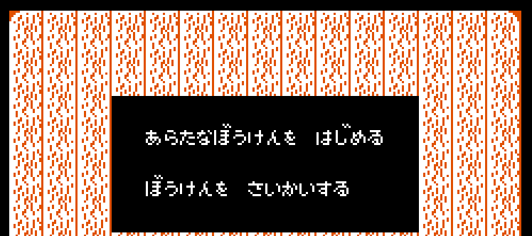

### 任地狱MMC5

本文github[备份地址](https://github.com/dustpg/BlogFM/issues/46)

本文编写以及具体实现中, wiki的'MMC5'页面居然进行了修改(主要是针对BANK切换的说明进行了修正).

MMC5的Mapper编号就是005, 还是有不少的游戏(NesCartDb记录24款, 有美版日版之分). 不过用到MMC5扩展音源的只有:

 - 光荣圣战([Just Breed](http://bootgod.dyndns.org:7777/profile.php?id=1409))
 - 金属之光([Metal Slader Glory](http://bootgod.dyndns.org:7777/profile.php?id=4733))
 - 新四人麻将: 役满天下([Shin 4 Nin Uchi Mahjong: Yakuman Tengoku](http://bootgod.dyndns.org:7777/profile.php?id=1532))
 - 宇宙警备队 SDF([Uchuu Keibitai SDF](http://bootgod.dyndns.org:7777/profile.php?id=4595))

其中值得一提的是, *金属之光*被称为画面最好的FC游戏, 毕竟是可视小说(VN)类型. 其ROM大小是1MB, 在那时肯定是巨无霸水平的.

不过虽然只有少数用了扩展音源, 不过不像VRC7, MMC5没用上的游戏卡带还是拥有相应的硬件(至少FC版).


### PRG-RAM

MMC5支持切换RAM-BANK, 这对于目前架构来说又是致命的, 只能再想想. 但是这不是最致命的, 最致命的是信息缺失.

例如《[大航海時代](http://bootgod.dyndns.org:7777/profile.php?id=3996)》, 数据库中表明其拥有一个电池供电支持的16kb WRAM(SRAM). 一般地, 原始iNES文件头有:

 - 8: Size of PRG RAM in 8 KB units (Value 0 infers 8 KB for compatibility; see PRG RAM circuit)

亦或者NES 2.0的文件头:

 - Byte 10 (RAM size)

但是自己手上的*大航海時代*ROM这两个字节均是0. 也就是说ROM信息不够完整, wiki给出的解决方案是: **假定为64kb大小**.

### 强大的MMC5

MMC5性能非常地强大:

 - 4种RPG-ROM切换模式
 - 4种CHR-ROM切换模式
 - 最高支持到128kb的WRAM, 除了WRAM的$6000-$7FFF, 甚至还能映射到$8000-$DFFF
 - 还有一个8bit-8bit到16bit的乘法器
 - 基于扫描线的IRQ计数器
 - 能够让8x16精灵和背景使用不同的CHR-BANK(黑科技啊)
 - "填充模式"的名称表, 用于场景转换很有用
 - 1024字节的'on-chip'内存, 用途还不少
 - MMC5扩展音源(自然)

### BANK 切换

**PRG mode 0**:

 - CPU $6000-$7FFF: 8 KB switchable PRG RAM bank
 - CPU $8000-$FFFF: 32 KB switchable PRG ROM bank

**PRG mode 1**:

 - CPU $6000-$7FFF: 8 KB switchable PRG RAM bank
 - CPU $8000-$BFFF: 16 KB switchable PRG ROM/RAM bank
 - CPU $C000-$FFFF: 16 KB switchable PRG ROM bank

**PRG mode 2**:

 - CPU $6000-$7FFF: 8 KB switchable PRG RAM bank
 - CPU $8000-$BFFF: 16 KB switchable PRG ROM/RAM bank
 - CPU $C000-$DFFF: 8 KB switchable PRG ROM/RAM bank
 - CPU $E000-$FFFF: 8 KB switchable PRG ROM bank

**PRG mode 3**:

 - CPU $6000-$7FFF: 8 KB switchable PRG RAM bank
 - CPU $8000-$9FFF: 8 KB switchable PRG ROM/RAM bank
 - CPU $A000-$BFFF: 8 KB switchable PRG ROM/RAM bank
 - CPU $C000-$DFFF: 8 KB switchable PRG ROM/RAM bank
 - CPU $E000-$FFFF: 8 KB switchable PRG ROM bank

PRG-BANK 最后一个8kb BANK一定是ROM.

**CHR mode 0**:

 - PPU $0000-$1FFF: 8 KB switchable CHR bank

**CHR mode 1**:

 - PPU $0000-$0FFF: 4 KB switchable CHR bank
 - PPU $1000-$1FFF: 4 KB switchable CHR bank

**CHR mode 2**:

 - PPU $0000-$07FF: 2 KB switchable CHR bank
 - PPU $0800-$0FFF: 2 KB switchable CHR bank
 - PPU $1000-$17FF: 2 KB switchable CHR bank
 - PPU $1800-$1FFF: 2 KB switchable CHR bank

**CHR mode 3**:

 - PPU $0000-$03FF: 1 KB switchable CHR bank
 - PPU $0400-$07FF: 1 KB switchable CHR bank
 - PPU $0800-$0BFF: 1 KB switchable CHR bank
 - PPU $0C00-$0FFF: 1 KB switchable CHR bank
 - PPU $1000-$13FF: 1 KB switchable CHR bank
 - PPU $1400-$17FF: 1 KB switchable CHR bank
 - PPU $1800-$1BFF: 1 KB switchable CHR bank
 - PPU $1C00-$1FFF: 1 KB switchable CHR bank

CHR-BANK这里倒是没有什么.


### PRG mode ($5100)

```
7  bit  0
---- ----
xxxx xxPP
       ||
       ++- Select PRG banking mode
```
大部分游戏使用的是模式3(除了*恶魔城3*-美版, 用了模式2). 暗荣的游戏从来不写入该寄存器, 可知默认是模式3.


### CHR mode ($5101)

```
7  bit  0
---- ----
xxxx xxCC
       ||
       ++- Select CHR banking mode
```

*金属之光*使用的是模式1, 其他的使用的是模式3

### PRG RAM Protect 1 ($5102)

```
7  bit  0
---- ----
xxxx xxWW
       ||
       ++- RAM protect 1
```

D1D0位必须是'10'(2)才能正常写入. 需要结合$5103.

### PRG RAM Protect 2 ($5103)

```
7  bit  0
---- ----
xxxx xxWW
       ||
       ++- RAM protect 2
```

D1D0位必须是'01'(1)才能正常写入. 同样需要结合$5102.

### Extended RAM mode ($5104)

```
7  bit  0
---- ----
xxxx xxXX
       ||
       ++- Specify extended RAM usage
```

- 0 -Split模式, 作为额外的名称表使用
- 1 -Split+ExGrafix模式, 作为扩展用属性表(自然也能用于名称表)
- 2 -ExRAM模式, 作为一般的RAM
- 3 -ExRAM模式, 作为一般的RAM, 写入保护

**ExRAM@$000-$3BF**:

 - ExGrafix模式: 用于强化背景显示
 - Split模式: **待补充**
 - ExRAM模式: 扩展用

 
**ExRAM@$3C0-$3FF**:

 - ExGrafix模式: 未使用
 - Split模式: **待补充**
 - ExRAM模式: 扩展用


### Nametable mapping ($5105)

```
7  bit  0
---- ----
DDCC BBAA
|||| ||||
|||| ||++- Select nametable at PPU $2000-$23FF
|||| ++--- Select nametable at PPU $2400-$27FF
||++------ Select nametable at PPU $2800-$2BFF
++-------- Select nametable at PPU $2C00-$2FFF
```

 - 0 -自带的VRAM-前1kb
 - 1 -自带的VRAM-后1kb
 - 2 -内部扩展RAM, 不过$5104必须是模式00或者01, 否则全部读取到0
 - 3 -填充模式数据

MMC5内部实现应该是, 例如模式3, 就根据地址返回填充数据就行. 作为模拟器的话, 可以实现为:

```c
    for (int i = 0; i != 4; ++i) {
        uint8_t* ptr = NULL;
        switch (value & 3)
        {
        case 0:
            ptr = famicom->video_memory + 1024 * 0;
            break;
        case 1:
            ptr = famicom->video_memory + 1024 * 1;
            break;
        case 2:
            //ptr = (mapper->exram_mode & 2) ? sfc_mmc5_zero_nt(famicom) : sfc_mmc5_exram(famicom);
            ptr = sfc_mmc5_exram(famicom);
            break;
        case 3:
            ptr = sfc_mmc5_fill_nt(famicom);
            break;
        }
        value >>= 2;
        base[i] = ptr;
    }
```


### Fill-mode tile ($5106)

8位均用于'填充模式'的图块编号

### Fill-mode color ($5107)

低2位用于'填充模式'的属性位, 实际填充的的是:

```c
color = value & 3;
color = color | (color << 2) | (color << 4) | (color << 6);
```

可以具体平台使用位运算或者查表.


### PRG Bank 0, 1, 2 ($5110-5112)

不在PRG空间内, 无效.

### PRG Bank 3, RAM Only ($5113)

```
7  bit  0
---- ----
xxxx BBBB
     ||||
     ++++- PRG RAM bank number at $6000-$7FFF
      +--- Select PRG RAM chip 
```

这个就比较复杂了, 这就是前面提到的信息不完整. 就目前而言有以下几种情况:

 - 0KB: No chips
 - 8KB: 1x 8KB chip
 - 16KB: 2x 8KB chip
 - 32KB: 1x 32KB chip

D2位表示哪个'chip'. wiki建议始终假设为64kb, 然后根据这4bit(3bit)载入偏移数据, 因为2x8kb模式是写入'100'而不是'001'. 

 - 实际上有能力最多支持到128kb, 但是实际上最多搭载了32kb额外RAM.
 - 自己打算使用32kb的实现, 但是将D2与D1做'异或'运算, 然后使用D1D0进行判断.
 - 这要求游戏使用非常标准思路的进行切换, 可能会有BUG(而且不支持64~128kb的额外RAM).
 - 这样内部本来WRAM有8kb就富余出来了, 用于MMC5内部其他的RAM.
 - 对, C/C++程序猿就是抠门.

```c
    case 0x5104:
        // Extended RAM mode ($5104)
#ifndef NDEBUG
        printf("[%5d]MMC5: Extended RAM mode ($5104) = %02x\n", famicom->frame_counter, value & 3);
#endif
        mapper->exram_mode = value & 3;
        mapper->exram_write_mask_mmc5 = 0x00;
        famicom->ppu.data.ppu_mode = SFC_EZPPU_Normal;
        if (mapper->exram_mode == 1) {
            mapper->exram_write_mask_mmc5 = 0xff;
            famicom->ppu.data.ppu_mode = SFC_EXPPU_ExGrafix;
        }
        break;
```

### PRG Bank 4, ROM/RAM ($5114)

```
7  bit  0
---- ----
RBBB BBBB
|||| ||||
|+++-++++- PRG ROM bank number
|    ++++- PRG RAM bank number
|     +--- Select PRG RAM chip 
+--------- RAM/ROM toggle (0: RAM; 1: ROM)
```

 - 模式 0 - 忽略
 - 模式 1 - 忽略
 - 模式 2 - 忽略
 - 模式 3 - 选择 8KB PRG bank @ $8000-$9FFF


### PRG Bank 5, ROM/RAM ($5115)

```
7  bit  0
---- ----
RBBB BBBB
|||| ||||
|+++-++++- PRG ROM bank number
|    ++++- PRG RAM bank number
|     +--- Select PRG RAM chip 
+--------- RAM/ROM toggle (0: RAM; 1: ROM)
```

 - 模式 0 - 忽略
 - 模式 1 - 选择 16KB PRG bank @ $8000-$BFFF (忽略最低位)
 - 模式 2 - 选择 16KB PRG bank @ $8000-$BFFF (忽略最低位)
 - 模式 3 - 选择 8KB PRG bank @ $A000-$BFFF


### PRG Bank 6, ROM/RAM ($5116)

```
7  bit  0
---- ----
RBBB BBBB
|||| ||||
|+++-++++- PRG ROM bank number
|    ++++- PRG RAM bank number
|     +--- Select PRG RAM chip 
+--------- RAM/ROM toggle (0: RAM; 1: ROM)
```

 - Mode 0 - 忽略
 - Mode 1 - 忽略
 - Mode 2 - 选择 8KB PRG bank @ $C000-$DFFF
 - Mode 3 - 选择 8KB PRG bank @ $C000-$DFFF


### PRG Bank 7, ROM Only ($5117)

```
7  bit  0
---- ----
xBBB BBBB
 ||| ||||
 +++-++++- PRG ROM bank number
```

 - 模式 0 - 选择32KB PRG-ROM bank @ $8000-$FFFF (忽略低2位)
 - 模式 1 - 选择 16KB PRG-ROM bank @ $C000-$FFFF (忽略最低1位)
 - 模式 2 - 选择 8KB PRG-ROM bank @ $E000-$FFFF
 - 模式 3 - 选择 8KB PRG-ROM bank @ $E000-$FFFF

似乎启动时是往$5117写入$FF, 也就是最后8kb RPG-BANK载入最后一个BANK.


### CHR Bankswitching ($5120-$5130)

前面提到了MMC5的'黑科技'——8x16精灵使用的图样表允许和背景使用的不同. 8x8模式只会使用$5120-$5127, 而8x16模式下$5120-$5127是针对精灵, $5128-$512B是针对背景. 

并且, 最后一次写入的部分(前8, 后4), 会用于 PPUDATA ($2007) 

wiki提到到目前未知还不清楚MMC5是怎么检测PPU处于哪种模式的, 真的'黑科技'.

写入地址 |  1 KiB | 2 KiB | 4 KiB | 8 KiB
--------|--------|-------|-------|-------
$5120   | BANK0  |   -   |   -   |   -   
$5121   | BANK1  |BANK0-1|   -   |   - 
$5122   | BANK2  |   -   |   -   |   -   
$5123   | BANK3  |BANK2-3|BANK0-3|   -
$5124   | BANK4  |   -   |   -   |   -   
$5125   | BANK5  |BANK4-5|   -   |   -   
$5126   | BANK6  |   -   |   -   |   -   
$5127   | BANK7  |BANK5-7|BANK4-7|BANK0-7
$5128   |BANK0, 4|   -   |   -   |   -  
$5129   |BANK1, 5| 01,45 |   -   |   -
$512A   |BANK2, 6|   -   |   -   |   -   
$512B   |BANK3, 7| 23,67 |0-4,5-7| 0-7


根据$5130的说法, 比如8kb模式就是选择的是8kb为窗口的BANK编号.


### Upper CHR Bank bits ($5130)

```
7  bit  0
---- ----
xxxx xxBB
       ||
       ++- Upper bits for subsequent CHR bank writes
```

当使用1kb模式时, 最多只能访问256kb的CHR-ROM, 要访问整个1024kb就需要这两位了. 不过唯一一个超过256kb CHR-ROM的*金属之光*却使用的是4kb模式. 换句话说就是没有一个游戏使用了这个机能(甚至连初始化都没有).


### Expansion RAM ($5C00-$5FFF, read/write)

 - 模式 0/1 - 不可读, 仅可在PPU渲染时可写(否则写入0)
 - 模式 2 - 可读可写
 - 模式 3 - 只读

模式1下( ExGrafix 模式), 就是MMC5实现的一个难点了: 扩展RAM区每个字节可以用来强化背景显示.

```
7  bit  0
---- ----
AACC CCCC
|||| ||||
||++-++++- Select 4 KB CHR bank to use with specified tile
++-------- Select palette to use with specified tile
```

```4*64=256```, 为了使用整个1024kb空间, 需要配合$5130的两位进行使用.


这种模式下基本可以确定使用的是单屏模式下. 举个栗子, 第一个图块$2000. 原本的模式下, 首先确定背景是用的哪个图样表, 然后利用[$2000]的数据, 获取图样数据.

现在ExGrafix模式下, 会在ExRAM:$000获取相应信息, 而本来的图样表几乎完全是为精灵服务的.

高精度的模拟器应该是模拟读取过程, 不过作为中精度的模拟器可以直接拿渲染开刀.


### Split模式相关寄存器

**待补充**

目前只有*宇宙警备队 SDF*使用了该模式, 这个模式目前不想实现(懒), 等待以后实现吧.

### IRQ Counter ($5203) 

用于指定扫描线id来触发IRQ, 内部比如写入$04会在第5条可见扫描线**开始时**触发. 写入0应该是触发不了IRQ的. 由于是基于扫描线的, 所以应该只会在可见扫描线触发相关同步操作. 

目前的Ez模式下, 本身自己是在每条扫描线**最后**触发水平同步的, 所以就是应该写入多少就在第几条触发.

### IRQ Status ($5204, write)

```
7  bit  0
---- ----
Exxx xxxx
|
+--------- IRQ Enable flag (1=IRQs enabled)
```

写入仅仅用来启用/关闭IRQ功能, 即时关闭也能在本来可以触发IRQ情况将'Pending'置为1(当然不会触发IRQ).


### IRQ Status ($5204, read)

```
7  bit  0
---- ----
SVxx xxxx  MMC5A default power-on value = $00
||
|+-------- "In Frame" signal
+--------- IRQ Pending flag
```

'In Frame'是当MMC5不再检测到扫描线信号时, 比如最后一根扫描线扫过, 或者说PPU没有渲染背景/精灵($2001相关位). 也就是说实际上如果中途关闭渲染, 会提前清除'In Frame'标志(懒得实现).

'Pending'标志会在MMC5的相关IRQ挂起时触发, 读取后清除(确认IRQ), 或者在'In Frame'0->1时也会清除.

### Unsigned 8x8 to 16 Multiplier ($5205, $5206 read/write)

这就是那个16位乘法器了, 写入会进行乘法运算. 读取时, 低地址读取地址, 高地址读取高地址.

### 其他寄存器

其他还有一些就不介绍了

### switch-case

由于地址部分连续, 部分离散, 所以只好直接用case了, 让编译器自己优化.

```c
switch (address)
{
case 0x5100:
    // ...
case 0x5101:
    // ...
case 0x5102:
    // ...
    // ...
};
```

### 新接口

```read_low```, 读取[$4020, $6000), 这部分区域会调用该接口. 在**正常情况下**, 与之前的PRG段快速访问优化不冲突. 


### 区别ROM RAM

目前是使用的32bit整型保存偏移量, 但是没有办法区别BANK是来自ROM还是RAM. 所以现在统一用最高位区别RAM与ROM.

```c
/// <summary>
/// StepFC: 利用指针创建偏移量
/// </summary>
/// <param name="famicom">The famicom.</param>
/// <param name="ptr">The PTR.</param>
/// <returns></returns>
static inline uint32_t sfc_make_offset(sfc_famicom_t* famicom, const uint8_t* ptr) {
    const uint8_t* const fc0 = famicom->video_memory;
    const uint8_t* const fc1 = (const uint8_t*)(famicom + 1);
    // RAM
    if (ptr >= fc0 && ptr < fc1) {
        const uintptr_t rv = ptr - fc0;
        // 256 MiB够大了
        assert(rv < 0x10000000);
        return (uint32_t)rv;
    }
    // ROM
    else {
        const uintptr_t rv = ptr - famicom->rom_info.data_prgrom;
        // 256 MiB够大了
        assert(rv < 0x10000000);
        return (uint32_t)rv | (uint32_t)0x80000000;
    }
}

/// <summary>
/// StepFC: 利用偏移量创建指针
/// </summary>
/// <param name="famicom">The famicom.</param>
/// <param name="offset">The offset.</param>
/// <returns></returns>
static inline uint8_t* sfc_make_pointer(sfc_famicom_t* famicom, uint32_t offset) {
    // ROM
    if (offset & 0x80000000) return famicom->rom_info.data_prgrom + (offset & 0x7fffffff);
     // RAM
    else return famicom->video_memory + offset;
}
```


之前的文件头"-StepFC-SRAMWRAM"完全没有必要, 但是看着文件管理器显示9kb有点烦, 干脆去掉了. 完全根据大小信息判断:

 - 8kb: SRAM
 - 32kb: MMC5 PRG-RAM


### 模拟大航海时代出现的问题




由于使用了MMC5-ExGrafix模式, 这个背景显示老是有问题. 以为是ExGrafix模式实现有问题, 结果发现是因为很久没碰渲染层导致逻辑忘了. 

目前的实现每个像素有效位为低5位: [xxxA BCDE], 其中E是判断是否为全局背景: ```E = C | D```, CD是图样的低两位, AB是属性位, 自己还以为是[xxxx ABCD]模式.


### MMC5 扩展音源

MMC5的扩展音源相对其他来讲很简单——因为实际上已经实现过了: 和2A03的相关声道几乎一致. 对比起VRC6来, 没有锯齿波也罢了, 方波还没有什么特色. 

所以在NSF创作者看来, MMC5扩展音源毫无特色. 用上MMC5基本上意味着已经没有其他扩展音源的可用了——MMC5仅仅是陪衬品.

### Pulse 1 ($5000-$5003)

与2A03的方波区别:

 - $5001没有效果, MMC5方波没有扫描单元
 - 周期小于8并不会静音——会输出超声波
 - 似乎等于0(周期为1)时才会静音
 - 论坛上有人提出, 部分模拟器到7就静音是错误的实现. 但是就自己的观点, 模拟器发出超声波应该需要一个高质量的滤波器, 所以这个应该算'风格'而不是错误
 - 长度计数器速率会两倍于2A03的长度计数器运作(240Hz)
 - MMC5没有帧计数器(序列器), 包络(以及长度计数器)始终以240Hz运行(当然, 具体实现上, 可以借用已经实现了的帧序列器)

### Pulse 2 ($5004-$5007)

第二个方波, 同上, 由于没有扫描单元, 完全一致(2A03的两个方波在扫描上有所区别——反码与补码).

### PCM Mode/IRQ ($5010) Write

```
7  bit  0
---- ----
Ixxx xxxM
|       |
|       +- Mode select (0 = write mode. 1 = read mode.)
+--------- PCM IRQ enable (1 = enabled.)
```

### PCM Mode/IRQ ($5010) Read


```
7  bit  0
---- ----
Ixxx xxxM  MMC5A default power-on read value = $01
|       |
|       +- In theory but not verified: Read back of mode select (0 = write mode. 1 = read mode.)
+--------- IRQ (0 = No IRQ triggered. 1 = IRQ was triggered.) Reading $5010 acknowledges the IRQ and clears this flag.
```

### Raw PCM ($5011)

```
7  bit  0
---- ----
WWWW WWWW
|||| ||||
++++-++++- 8-bit PCM data
```

读取模式会忽略缩写内容, 写入$00不会影响输出(PCM值可能为0啊, 需不需要实现?)


### PCM IRQ

有兴趣的可以自行了解.


### Status ($5015, read/write)

类似$4015, 只有最低两位使用了.


### 模拟金属之光出现的问题

**MMC5音源**

一开始, *金属之光*使用MMC5的二号方波, 用于播放文字'哔哔哔'的音效. 但是似乎希望, 通过往$5004写入$00来静音方波. 找了很久, 甚至一行一行对照其他模拟器的实现, 的确写入$00不能静音!

似乎陷入僵局, 又只好一步一步反汇编, 发现是通过读取$5DD5的数据写入$5004的, 所以结果是ExRAM实现有问题而不是方波!

之前不小心实现为:

```c
mapper->exram_write_mask_mmc5 = 0x00;
famicom->ppu.data.ppu_mode = SFC_EZPPU_Normal;
if (mapper->exram_mode == 1) {
    famicom->ppu.data.ppu_mode = SFC_EXPPU_ExGrafix;
    mapper->exram_write_mask_mmc5 = 0xff;
}
```

*金属之光*使用的是模式2——ExRAM模式, 让所有数据写入0了, 应该实现为:

```c
mapper->exram_write_mask_mmc5 = 0x00;
famicom->ppu.data.ppu_mode = SFC_EZPPU_Normal;
if (mapper->exram_mode == 1) 
    famicom->ppu.data.ppu_mode = SFC_EXPPU_ExGrafix;
else if (mapper->exram_mode == 2) 
    mapper->exram_write_mask_mmc5 = 0xff;

```


**MMC5图像**

*金属之光*虽然写入了两段CHR-BANK切换用寄存器, 也使用了8x16精灵模式, 也就是说使用了'黑科技'. 但是目前来看(时间原因, 主要是没有汉化玩不下去), 两段CHR-BANK切换写入的内容是一样的, 也就是实际上没有利用这一机能.


简单来说有两个问题：

 - 第一段, 令人吃惊的是, *金属之光*在大致160行生成一个IRQ, 然后取消背景(与精灵)显示. 前面提到MMC5是检测扫描线的, 取消的话会让MMC5以为提前进入到了不可见阶段. 不过这不是问题, 第一段是灰色的, 原因是'烫烫烫': 没有渲染实际应该是渲染黑色, 实现时直接```return```了.
 - 第二段, 也让人吃惊的是, *金属之光*触发IRQ后会修改调色板! 因为目前Ez模式是假定调色板不会在渲染时修改(所以*金属之光*在160行后开始取消渲染了), 背景最多同时使用12+1种颜色. 这样一换能使用的颜色就翻倍了, 不过这游戏仅仅用来处理字体颜色.

第一个BUG目前来说不可能修改, 原因是因为储存的是调色板索引, 不能表示'黑色'. 第二个BUG和之前的IRQ中切换BANK一样, 有两种解决方案:

 1. 储存调色板实际颜色信息, 这样其实两个BUG都能一起解决掉.
 2. 将画面分割成两部分——IRQ作为分界线. 保存独立的相关数据作为备份信息. 这样的话能够连带BANK切换的问题一起解决

目前来看, 这两种解决方案的选择应该是: 两个都要(我全都要)! 可以用来解决目前渲染的3个已知BUG, 交给后面完成吧(懒)!

### 简单汇总

MMC5近乎20款游戏中, 这里仅仅测试了两款——*大航海时代*与*金属之光*.

*大航海时代*使用了ExGrafix模式, 但是仅仅是方便程序猿进行场景布置, 而没有渲染出令人信服的画面.

*金属之光*: MMC5的三个图像加强的功能, *金属之光*实际都没用上(大概), MMC5的额外音源也仅仅用来放文字'哔哔'音效(大概). 可以看出这游戏似乎一开始可能并没有打算使用MMC5.

总的来说MMC5是一款非常强大的MMC, 导致模拟器大幅度地进行调整, 甚至在渲染层打洞来支持MMC5特性. 由于精力原因目前还没有完全模拟: Split模式与'黑科技'模式没有实现, 打上'TODO'等待以后慢慢补上.

(RAM写入保护也没有实现, 填充模式实现了, 但似乎没用过导致没法测试)


### REF

 - [MMC5](https://wiki.nesdev.com/w/index.php/MMC5)
 - [MMC5 audio](https://wiki.nesdev.com/w/index.php/MMC5_audio)