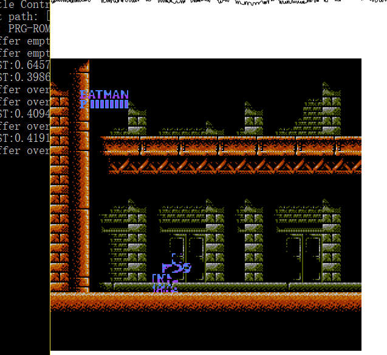
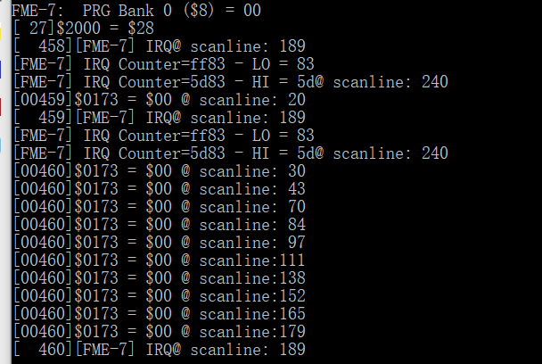
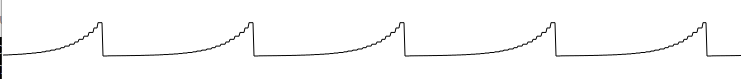

### Sunsoft FME-7

本文githubg[备份地址](https://github.com/dustpg/BlogFM/issues/48)

其实FME-7并不是NSF扩展音频所支持的芯片名称, 而是其变种——Sunsoft 5B. Sunsoft FMT-7, 5A以及5B共用一个Mapper编号——69. 由于格式原因, 程序中FME7代指Mapper069, 包括(甚至特指)Sunsoft 5B, 但是其实FME7是5B的子集.


### Sun电子

比起其他厂商, 例如NSF就有提到的科乐美, 任天堂以及南梦宫. Sun电子似乎进入21世纪后就逐渐淡出游戏和行业了. 翻了一下发行游戏列表, 近10年就发行了几款, 不过似乎在吃老本——还有当初FC很好玩的《[超惑星战记](http://bootgod.dyndns.org:7777/profile.php?id=3923)》的续作. 

Sun电子在FC时代出了很多不错的作品, 但其实在这里都不重要, 重要的其编曲水平之高. 例如仅仅使用2A03的《[RAF世界](http://bootgod.dyndns.org:7777/profile.php?id=3921)》, 这样一个高编曲水平的开发商的Sunsoft 5B又如何呢?


### 吉米克!

《[Gimmick!](http://bootgod.dyndns.org:7777/profile.php?id=2695)》, 感觉和 *拉格朗日点* 很相似——唯一一个使用了独立扩展音频的游戏, 一个是VRC7, 一个是5B.

但是其实 *吉米克!* 也没有完全了利用5B的机能——没有使用到噪音发生器和包络发生器.


### FME7总览

wiki介绍FME7支持到512kb的PRG-RAM, 这是目前来看最多的PRG-RAM, 但是自己一个一个看了目前的游戏列表, 最多的也就是8kb的WRAM.

对于PRG-RAM来说, 目前还是直接声明在结构里面, 直接增加512k的PRG-RAM感觉没有什么必要. 如果真的需要实现, 这部分最好使用动态申请, 然后ROM-RAM区分需要从1bit提高到2bit用来区分这部分的RAM(并且, 目前没有一些游戏内运行时错误的处理, 可能需要使用```long_jmp```).

 - CPU $6000-$7FFF: 8 KB Bankable PRG ROM or PRG RAM
 - CPU $8000-$9FFF: 8 KB Bankable PRG ROM
 - CPU $A000-$BFFF: 8 KB Bankable PRG ROM
 - CPU $C000-$DFFF: 8 KB Bankable PRG ROM
 - CPU $E000-$FFFF: 8 KB PRG ROM, fixed to the last bank of ROM
 - PPU $0000-$03FF: 1 KB Bankable CHR ROM
 - PPU $0400-$07FF: 1 KB Bankable CHR ROM
 - PPU $0800-$0BFF: 1 KB Bankable CHR ROM
 - PPU $0C00-$0FFF: 1 KB Bankable CHR ROM
 - PPU $1000-$13FF: 1 KB Bankable CHR ROM
 - PPU $1400-$17FF: 1 KB Bankable CHR ROM
 - PPU $1800-$1BFF: 1 KB Bankable CHR ROM
 - PPU $1C00-$1FFF: 1 KB Bankable CHR ROM

### 寄存器

FME7与其他的MMC有所不同的是, 先将命令写入命令寄存器($8000-9FFF), 再把参数写入参数寄存器($A000-BFFF).

 - $0-7 控制CHR切换
 - $8-C 控制PRG切换
 - $C 控制名称表的镜像规则
 - $D-F  IRQ控制

### 命令: CHR Bank 0-7 ($0-7)

```
7  bit  0
---- ----
BBBB BBBB
|||| ||||
++++-++++- The bank number to select for the specified bank.
```

8个就是1kb的BANK. 注意防止溢出的操作.

### 命令: PRG Bank 0 ($8)

```
7  bit  0
---- ----
ERbB BBBB
|||| ||||
||++-++++- The bank number to select at CPU $6000 - $7FFF
|+------- RAM / ROM Select Bit
|         0 = PRG ROM
|         1 = PRG RAM
+-------- RAM Enable Bit (6264 +CE line)
          0 = PRG RAM Disabled
          1 = PRG RAM Enabled
```

支持切换512kb的ROM/RAM. 之前提到了, 最多的就是使用了8kb的WRAM. ROM方面, 其实还是没有游戏真正利用可以切换ROM-BANK. 不过现在没有实现写入保护, 切换到ROM再写入的话有点危险. 

### 命令: PRG Bank 1-3 ($9-B)

```
7  bit  0
---- ----
..bB BBBB
  || ||||
  ++-++++- The bank number to select for the specified bank.
```

用于切换$8000-$9FFF, $A000-$BFFF, $C000-$DFFF的BANK. 注意防止溢出的操作.

### 命令: Name Table Mirroring ($C)

```
7  bit  0
---- ----
.... ..MM
       ||
       ++- Mirroring Mode
            0 = Vertical
            1 = Horizontal
            2 = One Screen Mirroring from $2000 ("1ScA")
            3 = One Screen Mirroring from $2400 ("1ScB")
```

中规中矩没什么可以说, 自己目前的是[2,3,0,1]的顺序, 可以用```[2,3,0,1][mode]```查表外, 自然就是```mode XOR 2```就行了.

### 命令: IRQ Control ($D)

```
7  bit  0
---- ----
C... ...T
|       |
|       +- IRQ Enable
|           0 = Do not generate IRQs
|           1 = Do generate IRQs
+-------- IRQ Counter Enable
            0 = Disable Counter Decrement
            1 = Enable Counter Decrement
```

FME7的IRQ是通过一个16bit的计数器, D7启动时会在每个CPU周期递减. 当D0启动并且计数器从$0000变成$FFFF触发IRQ.

写入该命令以确认IRQ.

### 命令: IRQ Counter Low Byte ($E)

IRQ计数器的低8位

### 命令: IRQ Counter High Byte ($F)

IRQ计数器的高8位


### 模拟蝙蝠侠出现的问题

Sun电子出品的《蝙蝠侠》难度比较高, 反正小时候没通关就是了, 还是老问题, 让蝙蝠侠变成字母侠了:



**游戏问题**

有2个问题, 模拟出现问题(瑕疵), 但是使用其他模拟器也是同样的:

 - 标题BGM: Sunsoft出品感觉肯定没问题, 但是发现标题的BGM在播放时, 切换声道音高有点不自然. 其他模拟器也是这样的, 所以应该是本身问题.
 - 标题过场画面闪烁, 其他模拟器也是同样的.


### 5B扩展音频

FME7写入高地址有两个空缺的位置, 就是为音频准备的. 硬件方面是Yamaha YM2149F(出现了, 又是雅马哈)的一种.


### Audio Register Select ($C000-$DFFF)

```
7......0
----RRRR
    ++++- The 4-bit internal register to select for use with $E000
```

### Audio Register Write ($E000-$FFFF)

```
7......0
VVVVVVVV
++++++++- The 8-bit value to write to the internal register selected with $C000
```

### YM2149F 内部寄存器


寄存器 |   位域   | 说明
-------|---------|-----------------
  $00  |LLLL LLLL| 声道A周期 低字节
  $01  |---- HHHH| 声道A周期 高4位
  $02  |LLLL LLLL| 声道B周期 低字节
  $03  |---- HHHH| 声道B周期 高4位
  $04  |LLLL LLLL| 声道C周期 低字节
  $05  |---- HHHH| 声道C周期 高4位
  $06  |---P PPPP| 噪音周期
  $07  |--CB A---| 声道A/B/C上禁用噪声(Noise)
  ---  |---- -cba| 声道a/b/c上禁用声调(Tone )
  $08  |---E VVVV| 声道A包络使能(E) 音量(V)
  $09  |---E VVVV| 声道B包络使能(E) 音量(V)
  $0A  |---E VVVV| 声道C包络使能(E) 音量(V)
  $0B  |LLLL LLLL| 包络周期 低字节
  $0C  |HHHH HHHH| 包络周期 高字节
  $0D  |---- CAaH| 包络重置与形状
  ---  |   ---   | continue (C)
  ---  |   ---   | attack (A)
  ---  |   ---   | alternate (a)
  ---  |   ---   | hold (H)
  $0E  |---- ----| I/O端口A(未使用)
  $0F  |---- ----| I/O端口B(未使用)


**$07音调/噪声禁用位**:

 - 禁用噪音: 输出音调
 - 禁用音调: 输出噪音
 - 都禁用: 输出恒定音量
 - 都启动: 输出音调'逻辑与'噪音


### 声音

一共拥有3个声道输出方波, 当然还有一个噪音发生器与包络发生器, 允许这三个声道使用.

5B通过CPU驱动, 不过YM2149F和APU类似, 内部有一个分频器可以让频率降低一半. 而 *吉米克!* 正是使用了这个模式.

与其他芯片声道对比, 5B的周期就是真正的周期, 不用+1s, 周期0**似乎**同周期1等价.

### 声调

声调发生器用来产生方波:

 - 频率 ```Frequency = Clock / (2 * 16 * Period)```
 - 周期 ```Period = Clock / (2 * 16 * Frequency)```
 - 多除了2是因为使用了倍分频器


方波(square), 之前的2A03也提到, 真正的应该叫做脉冲波(pulse), 其中50%占空比的称为方波. 由于wiki整篇没有提到占空比, 所以5B发出的应该就是真正的方波. 其中, 方波的01的'交替频率'自然是上面的两倍.

如果包络使能位设为1, 音量由包络控制, 否则输出自身的音量.

### 噪音

噪音发生器利用$06通过的5bit周期生成一个1bit的随机波.

 - 频率 ```Frequency = Clock / (2 * 16 * Period)```
 - 周期 ```Period = Clock / (2 * 16 * Frequency)```
 - 多除了2是因为使用了倍分频器
 - 随机数发生器可能是一个17bit的LFSR, 抽头(taps)为D16, D13.
 - 由于抽头在高位, 应该是伽罗瓦的LFSR实现(one-to-many LFSR):

```c
// LFSR FME7模式 - Galois LFSR
static inline uint32_t sfc_lfsr_fme7(uint32_t v) {
    // D16 D13
    const uint32_t bit = v & 1; v >>= 1;
    // 实现1
    //if (bit) v ^= (uint32_t)0x12000;
    // 实现2
    const uint32_t mask = (uint32_t)(-(int32_t)bit);
    v ^= mask & (uint32_t)0x12000;
    return v;
}

```


### 包络频率

包络的每一个斜面(ramp)的频率如下:

 - 频率```Frequency = Clock / (2 * 256 * Period)```
 - 周期```Period = Clock / (2 * 256 * Frequency)```
 - 多除了2是因为使用了倍分频器

每个Ramp又被细分成32步, 对应的就是'音量'的改变.


左边部分就是对应的固定音量. 右边部分则是包络使用的, 可以看出:

 - [L15] = [R31]
 - [L14] = [R29]
 - ...
 - [L1] = [R3] (虽然看不清但是应该是)
 - [L0] = [R0] (虽然看不清但是应该是) = 0

也就是可以用两个LUT, 反正要用, 不差这一个.

### 包络形状

通过写入$0D能够重置包络, 然后从4个参数选择其形状:

 - 续 Continue, Continue指定包络在Attack后是否继续震荡. 如果为0(续不了), 后两个参数不起作用
 - 起 Attack, Attack指定是高到底(0), 还是低到高(1)
 - 换 Alternate, Alternate指定信号在Attack后是否上下交换
 - 持 Hold, Hold指定信号在Attack后的保持值.
 - Alternate+Hold时, 会在Attack后交换Hold值然后保持下去
 - 其实不用理解, 只需要查表就行


```
   值  |  续 |  起  | 换  |持|    形状
-------|-----|-----|-----|--|------------
$00-$03|  0  |  0  |  x  |x |   \_______
$04-$07|  0  |  1  |  x  |x |   /_______
$08    |  1  |  0  |  0  |0 |   \\\\\\\\
$09    |  1  |  0  |  0  |1 |   \_______
$0A    |  1  |  0  |  1  |0 |   \/\/\/\/
$0B    |  1  |  0  |  1  |1 |   \¯¯¯¯¯¯¯
$0C    |  1  |  1  |  0  |0 |   ////////
$0D    |  1  |  1  |  0  |1 |   /¯¯¯¯¯¯¯
$0E    |  1  |  1  |  1  |0 |   /\/\/\/\
$0F    |  1  |  1  |  1  |1 |   /_______
```

(注: 图表中斜面的'斜率'是1)

也就是可以利用$08或者$0C模拟锯齿波, $0A或者$0E模拟三角波(不过前面了解到, 其实是指数版的锯齿波与三角波).

具体实现中, 希望体现出'形状', 于是这样实现: 化为4步, 然后执行12343434...

```c

/// <summary>
/// StepFC: YM2149F 触发包络
/// </summary>
/// <param name="famicom">The famicom.</param>
static inline void sfc_ym2149f_tick_evn_times(sfc_famicom_t* famicom, uint8_t times) {
    // 不能太大
    //assert(times < 64);
    sfc_fme7_data_t* const fme7 = &famicom->apu.fme7;
    fme7->evn_index += times;
    fme7->evn_repeat |= fme7->evn_index & 64;
    fme7->evn_index &= 63;
    fme7->evn_index |= fme7->evn_repeat;
}
```


形状则是:

```c
// 5B用 包络形状
#define FME7_SHAPE(a, b, c, d, e, f, g, h) \
 (a<<7) | (b<<6) | (c<<5) | (d<<4) | (e<<3) | (f<<2) | (g<<1) | (h<<0)

/// <summary>
/// FME-7 包络形状查找表
/// </summary>
static const uint8_t sfc_fme7_evn_shape_lut[] = {
    // $00 \___
    FME7_SHAPE(1, 0, 0, 0, 0, 0, 0, 0),
    // $01 \___
    FME7_SHAPE(1, 0, 0, 0, 0, 0, 0, 0),
    // $02 \___
    FME7_SHAPE(1, 0, 0, 0, 0, 0, 0, 0),
    // $03 \___
    FME7_SHAPE(1, 0, 0, 0, 0, 0, 0, 0),
    // $04 /___
    FME7_SHAPE(0, 1, 0, 0, 0, 0, 0, 0),
    // $05 /___
    FME7_SHAPE(0, 1, 0, 0, 0, 0, 0, 0),
    // $06 /___
    FME7_SHAPE(0, 1, 0, 0, 0, 0, 0, 0),
    // $07 /___
    FME7_SHAPE(0, 1, 0, 0, 0, 0, 0, 0),
    // $08 \\\\ 
    FME7_SHAPE(1, 0, 1, 0, 1, 0, 1, 0),
    // $09 \___
    FME7_SHAPE(1, 0, 0, 0, 0, 0, 0, 0),
    // $0A \/\/
    FME7_SHAPE(1, 0, 0, 1, 1, 0, 0, 1),
    // $0B \¯¯¯
    FME7_SHAPE(1, 0, 1, 1, 1, 1, 1, 1),
    // $0C ////
    FME7_SHAPE(0, 1, 0, 1, 0, 1, 0, 1),
    // $0D /¯¯¯
    FME7_SHAPE(0, 1, 1, 1, 1, 1, 1, 1),
    // $0E /\/\ 
    FME7_SHAPE(0, 1, 1, 0, 0, 1, 1, 0),
    // $0F /__
    FME7_SHAPE(0, 1, 0, 0, 0, 0, 0, 0),
};

/// <summary>
/// StepFC: YM2149F 获取包络音量
/// </summary>
/// <param name="shape">The shape.</param>
/// <param name="index">The index.</param>
static inline uint16_t sfc_ym2149f_get_evn_value(uint8_t shape, uint8_t index) {
    const uint8_t shift = (index & 0x60) >> 4;
    shape <<= shift;
    shape &= 0xc0;
    index &= 0x1f;
    index <<= 1;
    const uint8_t* const lut = (const uint8_t*)sfc_fme7_env_lut;
    const uint8_t* const data = &lut[shape | index];
    return *(uint16_t*)data;
}

```

还可以使用大号的两级LUT(```uint8_t[16*64] + uint16_t[32]```), 或更大号的1级LUT(```uint16_t[16*64]```).

不过桌面平台应该是自己这种实现要快一点(缓存友好).

### 输出

可以看出难点仅仅在于包络发生器的模拟, 其他的非常简单.

 - 一个声道如果是Tone模式, 即模拟方波. 方波01两位中出现1时输出音量
 - 一个声道如果是Noise模式, 即混了噪音, 噪音LFSR最低位是1时输出音量
 - 都没有(disable)就认为是1, 都有就认为将两个(方波01和LFSR最低位)做'与', 输出音量
 - 如果采用了包络, 输出音量是指包络的输出音量, 否则就是声道本身的音量

```c
// 输出
bool flag;
if (tone & noise) flag = square & lfsr & 1;
else flag = disable | (tone & square) | (noise & lfsr);
// 检测
if (flag) output += fme7->ch[i].env ? fme7->env_volume : fme7->ch[i].volume;
```

还能够简化, 但是不想动脑筋了.

### 音量

 - 包络音量每格表示是大约1.5dB, 就是4次根号2倍
 - 总共32格也就是至少用8bit(还是9bit?)表示
 - 避免误差, 那就我们用13bit+1(0x2000‬)表示一个声道的音量大小
 - wiki虽然提到音量增益, 不过并没有提到与原来的比较, 只好作: 3声道最大输出1.0(不过和2A03一样, 只有正数, 其实只有一半)

### 模拟器吉米克出现的问题

这个很恼火.


开始一切正常, 但是进入游戏就一上来就死. 一步一步追踪, 老是以为IRQ实现有问题(**为什么自己老是以为是IRQ有问题???**).



然后发现CPU$173储存了数据, 但是老为0. 一步一步发现读取了WRAM区域, *吉米克!* 将ROM切换到这里了. 最后的最后发现是把 **PRG Bank 0 ($8)** 的RAM/ROM位看反了:

 - D6:0 = PRG ROM
 - D6:1 = PRG RAM

看成了

 - D6:0 = PRG RAM
 - D6:1 = PRG ROM
 

...

最后, 自然还有老BUG(游戏状态栏一部分用精灵拼的). 看来FC游戏都喜欢在IRQ中切换BANK.

### REF

 - [Sunsoft FME-7](https://wiki.nesdev.com/w/index.php/Sunsoft_FME-7)
 - [Sunsoft 5B Audio](https://wiki.nesdev.com/w/index.php/Sunsoft_5B_audio)
 - YM2149 Datasheet


### 附录: 查询表生成

自己用的LUT生成如下:

```c

static uint16_t sfc_fme7_env_lut[32*4];
static uint16_t sfc_fme7_vol_lut[16];


enum { SFC_FME7_CH_MAX = 0x2000, SFC_FME7_CH3_MAX = SFC_FME7_CH_MAX * 3 };

/// <summary>
/// 初始化FME-7用LUT
/// </summary>
extern void sfc_fme7_init_lut(void) {
    double table[32];
    // 1 / 2^(0.25)
    const double qqrt2 = 0.84089641525;
    table[0] = 0;
    table[31] = SFC_FME7_CH_MAX;
    for (int i = 0; i != 30; ++i)
        table[30 - i] = table[31 - i] * qqrt2;
    // 建立LUT-A
    sfc_fme7_vol_lut[0] = 0;
    for (int i = 1; i != 16; ++i) {
        sfc_fme7_vol_lut[i] = (uint16_t)(table[i * 2 + 1] + 0.5);
    }
    // 建立LUT-B 0->0
    for (int i = 0; i != 32; ++i) 
        sfc_fme7_env_lut[i] = 0;
    // 建立LUT-B 0->1
    for (int i = 0; i != 32; ++i)
        sfc_fme7_env_lut[i+32] = (uint16_t)(table[i] + 0.5);
    // 建立LUT-B 1->0
    for (int i = 0; i != 32; ++i)
        sfc_fme7_env_lut[i+64] = (uint16_t)(table[31 - i] + 0.5);
    // 建立LUT-B 1->1
    for (int i = 0; i != 32; ++i)
        sfc_fme7_env_lut[i+96] = SFC_FME7_CH_MAX;
}
```

### 附录: 相关音色简单探索

这里简单测试了一下 *吉米克!* 没有使用过的包络、噪音的音色.

**噪音**, 将噪音和方波的周期弄到最大.

```
    CMD  PARAM
    0x0B, 0x04,
    0x0C, 0x00,
    0x06, 0x1f,
    0x00, 0xff,
    0x01, 0x0f,
    0x07, 0x30,
    0x08, 0x0e,
    0x09, 0x00,
    0x0A, 0x00,
    0x0D, 0x0E,
```

 - 听起来很像直升机的声音(直升机的音效原来可以这么简单模拟)! 
 - 频率适当加高后听起来像是枪械开火的声音. 
 - 也就是这个噪声很适合音效.


**包络**, 由于使用包络后不能调整音量了, 只能调整频率, 和2A03的三角波差不多.




听起来像......噪音..? 不好意思, 声音开得太大了