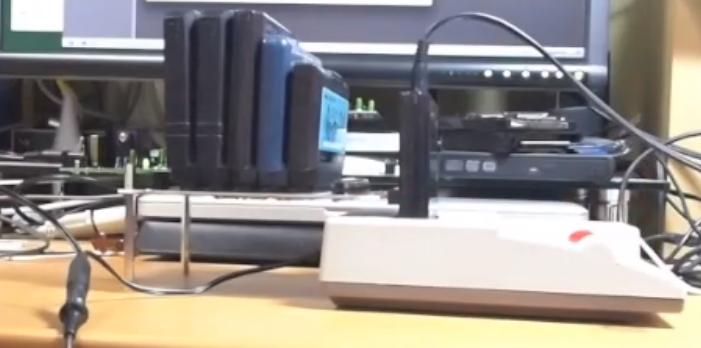
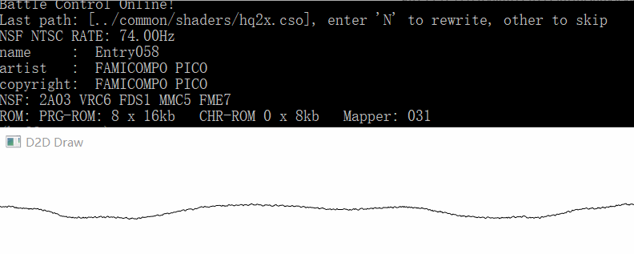

### NSF深入

蓦然回首, 已经可以几乎完全播放NSF了. 也快进入本步骤的尾声了, 这一步似乎过于长了.

[项目地址](https://github.com/dustpg/StepFC)

### 标准音源

'标准音源'在这里指的是最多有一个扩展音源的那种: ```exsound```为0(2A03音源), 或者说有一位为1(有一个扩展音源), 可以用这个判断:

```c
(exsound & (exsound - 1)) == 0;
```

当然这里只是指出这个位计算技巧而已, 实际上还是需要一个一个判断. 在这种情况下, 可以直接将写入操作'嫁接'到原来的写入就行(当然, 需要注意NSF的BANK切换寄存器).

### 多种混合

自然就是NSF支持的, 理论上, 在实机上也能播放(不然支持多音源就没有意义了!), 例如NicoNico~~Ni~~的[这一篇](https://www.nicovideo.jp/watch/sm19653477):



从右往左分插了:
 
 - 吉米克!
 - 女神転生Ⅱ
 - 大航海时代
 - 魍魎戦記MADARA
 - 拉格朗日点

就可以在实机上播放NSF(同一个作者的另一个视频就另有FDS). 一般地, 对于'标准'(最多一个), 可以使用对应的镜像地址. 不过多种混合就支持最低地址(镜像地址重合).


**VRC6**
 
- $9000-9003
- $A000-A002
- $B000-B002
- 以 *恶魔城3* 为标准, ab两个变种的两条地址线反了

**VRC7**

 - $9010
 - $9030
 
**FDS1**

 - $4040-$4092
 - FDS情况很特殊, RAM布局什么的都可以不管, 但是BANK切换就不同了:
 - $5FF6,$5FF7能够控制$6000-6FFF, $7000-7FFF这一区域
 - NSF 文件头 $076-$077也有能控制. 详细的还是看wiki吧

**MMC5**

 - $5000-5015, 音频支持
 - $5205,$5206, 8x8的乘法器
 - $5C00-5FF5, ExRAM区, 最上面的和NSF的BANK切换寄存器冲突了导致不可用

**N163**
 
 - $4800
 - $F800
 
**FME7**

 - $C000
 - $E000


作为软件播放器, 支持最低地址就行(当然支持所有镜像地址也是不错的), 在实机上由于地址互相重叠, 可能会使用一些技巧.


### 权重分配

之前使用的权重标准是基于```0.00752```, 来至wiki的线性逼近公式:

```
output = pulse_out + tnd_out
pulse_out = 0.00752 * (pulse1 + pulse2)
tnd_out = 0.00851 * triangle + 0.00494 * noise + 0.00335 * dmc
```

自己理所当然地以为这些加起来等于1, 但是实际上是```0.8XXX```, 索性直接用Mixer的``` 95.88/(8128/15+100)```, 这个值大约```0.1494```. 所以就用这个值作为基础值, 双通道是```0.2585```.

 - VRC6, 方波声道(复数)最大音量和2A03差不多
 - VRC6: [6bit]```0.2583 / 30 * vrc6```
 - VRC7, 无比较
 - FDS1, 最大音量似乎是方波的2.4倍
 - FDS1: [6bit]```0.1494 * 2.4 / 63 * fds1```
 - MMC5, 与2A03一致, 8bit PCM则看自己吧
 - N163, 把```0.00752/16```换成```0.1494/225```即可
 - FME7, 无比较

当然, 除了wiki直接给出的, 还有一个参考: NSFe. 这个是NSF的扩展版本. 里面有相关的比较(单位是百分之一dB):

 - VRC6 - Default: 0
 - 这就是提到的'差不多'
 - VRC7 - Comparison: Pseudo-square - Default: 1100
 - 11dB大致为3.5倍, 也就是达到0.523, 考虑到是有符号的所有应该除以2. 6声道暴力加起来就是1.57(双向).
 - 不过自己是认为的是共有8声道, 所以权重为2.092(近似看作2也行).
 - FDS - Default: 700
 - 7dB和'2.4'倍差不多
 - MMC5 - Default: 0
 - 这就是提到的'差不多'
 - N163 - Comparison: 1-Channel mode - Default: 1100 or 1900
 - wiki提到是11dB~19.5dB
 - Sunsoft 5B - Comparison: Volume 12 ($C) - Default: -130
 - 差距是-1.3dB, 不过比较的'12', 和15差了9dB. 加起来7.7dB. 和FDS差不多2.4倍吧
 - 权重```0.1494*2.4*3```, 几乎和```1.0```相差无几, 索性看着1.0.

VRC7 产生的伪方波:


NSFe虽然支持这个, 不过基本就是针对N163设计的, 其他的几乎就是用实体卡带简单测试一下, 不过作为参考足够了.


这样可以试试这个```2A03+VRC6+FDS1+MMC5+FME7```的NSF了!



### FDS 补遗

之前 *FDS篇* FDS实现有问题, 由于测试样本不足导致没有发现:

```
0 = %000 -->  0
1 = %001 --> +1
2 = %010 --> +2
3 = %011 --> +4
4 = %100 --> reset to 0
5 = %101 --> -4
6 = %110 --> -2
7 = %111 --> -1
```

'4'是'reset to 0', 自己还以为和0一样...导致调制出现问题. 

```c
const int8_t value = table[famicom->apu.fds.modtbl_index++];
fds->modtbl_index &= 0x3f;
//  0, 2, 4, 8, 1, -8, -4, -2
if (value & 1) fds->mod_counter_x2 = 0;
else  fds->mod_counter_x2 += value;
```

### N163声道模式

之前 *N163篇* 提到自己的实现是'声道模式', 输出最后处理的几个历史输出. 使用的是'3', 其实本身就是一个滤波器, 适当延长数字能够更好一点(8声道杂音太重, 比如可以是声道数量-1, 但是不能低于3). 

### 非标准速度支持

前面 *FDS篇* 提到了64Hz/60Hz, **如果将一个要求64Hz的用60Hz播放会发生什么事情**?

自己想了想, 之前将PLAY频率和FPS想在一起了. 其实没有必要, 比如60Hz就是每隔大约3万CPU周期调用一次PLAY, 120Hz就每隔1.5万CPU周期调用一次PLAY就行.

```c
// 播放速度提示
info->clock_per_play_n = (uint64_t)1789773 * (uint64_t)header.play_speed_ntsc_le / (uint64_t)1000000;
info->clock_per_play_p = (uint64_t)1662607 * (uint64_t)header.play_speed__pal_le / (uint64_t)1000000;
printf("NSF NTSC RATE: %.02fHz\n", 1000000.0 / header.play_speed_ntsc_le);
```

**提示INIT结束**, 之前INIT结束是没有通知的, 因为大致是到了垂直同步时, INIT*应该*完成了. 这显然是不准确的, 所以自己HACK了OpCode-02让其通知NSF初始化结束了:

```c
/// <summary>
/// HK2: Hack $02 - 用于提示NSF初始化
/// </summary>
/// <param name="address">The address.</param>
/// <param name="famicom">The famicom.</param>
static inline void sfc_operation_HK2(uint16_t address, sfc_famicom_t* famicom, uint32_t* const cycle) {
    famicom->nsf.play_clock = famicom->rom_info.clock_per_play;
}
```

INIT和PLAY调用的程序也就不一样了:

```c
    // PLAY时钟周期
    famicom->nsf.play_clock = 0xffffffff;
    // 调用INIT程序
    const uint16_t address = famicom->rom_info.init_addr;
    famicom->registers.program_counter = 0x4106;
    const uint32_t loop_point = 0x410A;
    // JSR
    famicom->bus_memory[0x106] = 0x20;
    famicom->bus_memory[0x107] = (uint8_t)(address & 0xff);
    famicom->bus_memory[0x108] = (uint8_t)(address >> 8);
    // (HACK) HK2
    famicom->bus_memory[0x109] = 0x02;
    // JMP $410A
    famicom->bus_memory[0x10A] = 0x4c;
    famicom->bus_memory[0x10B] = (uint8_t)(loop_point & 0xff);
    famicom->bus_memory[0x10C] = (uint8_t)(loop_point >> 8);
```


整个流程也简单起来了:


```c
while (famicom->cpu_cycle_count < cpu_cycle_per_frame) {
    const uint32_t cycle = sfc_cpu_execute_one(famicom);
    // PLAY
    if (famicom->nsf.play_clock < cycle) {
        famicom->nsf.play_clock += famicom->rom_info.clock_per_play;
        sfc_famicom_nsf_play(famicom);
    }
    // FRAME COUNTER
    if (famicom->nsf.framecounter_clock < cycle) {
        famicom->nsf.framecounter_clock += cpu_cycle_per_frame_4;
        sfc_trigger_frame_counter(famicom);
    }
    famicom->nsf.play_clock -= cycle;
    famicom->nsf.framecounter_clock -= cycle;
}
```

现在回答开头的提问, 答案是'**慢一点**', 不过不是音乐的频率慢一点, 而是节奏或者说BPM慢一点, 频率还是一致. 就像用不同速率敲键盘.

### 长度计算

原本的NSF是没有曲子的长度信息的, 我们可以进行估计:

 1. 放完了, 部分曲子放完了, 就播放完毕. 我们可以设定一个阈值, 比如说1分钟. 超过阈值还没有改变就认为放完了. 将当前长度减去阈值就行.
 2. 循环. 这个就是常见的游戏BGM的实现了, 要怎么检查曲子是无限循环的呢?
 - 这里提供一个思路, 在每次PLAY后监视哪些变量进行修改了, 最后进行评估.
 - 或者比如超过5分钟还没完就认为是3分钟的曲子

### 随机访问

比如很想支持Seek功能, 这里提供一个思路:

 - 类似于S/L, 将数据尽可能简化(比如不用储存VRAM), 数据量可能在30kb左右(没简化的数据量, 其实NSF用不了多少RAM, 甚至能够简化到几kb).
 - 用1mb为上限大致能存30个'快照'
 - 找到最近的前快照然后加速到目标时间

 
### 辣鸡ROM支持

```load_addr + length``` 没有对齐BANK. 之前弄到一个NSF文件, 15.3kb, 理所当然认为占用了4个BANK(4kb), 但是实际上用了5个BANK. 典型的辣鸡.

--------

上面就是一些核心支持, 下面就是一些具体实现, 可以略过.


### 配合MMC5

```
// 将BANK3-WRAM使用扩展RAM代替
famicom->prg_banks[6] = famicom->expansion_ram32 + 4 * 1024 * 0;
famicom->prg_banks[7] = famicom->expansion_ram32 + 4 * 1024 * 4;
```

原来8kb的WRAM分配给MMC5, NSF播放使用多余的32kb扩展区的前面8kb作为新的WRAM, 再接下来的128字节是N163的扩展RAM.


### 音频事件

之前实现的是```audio_changed```事件, 目的是为了"增量更新". 关键在于'ed', 本意是修改了再触发, 没有修改就没有必要. 其实专门用来处理'帧计数器/序列器'的(这个判断很复杂). 现在先无视状态直接触发事件, 以后优化.

所以将```audio_changed```事件改成```audio_change```事件. 

### 尘归尘, 浮点归定点

之前提到由于"每样本CPU周期数"由于除不尽(44.1kHz大致是40.58), 采用浮点避免误差. 但是这东西一会整型转浮点, 一会浮点转整型, 烦得很.

其实是为了方便描述而已, 这里就用定点小数模拟就行. 比如```uint32_t```高16位看着整数, 高16位看作小数, 由于每帧样本数大致在一千数量级, 所以误差数量级少于周期每帧.


```c
// 目前使用16.16定点小数, 可以换成6.10~8.8的16bit
typedef uint32_t sfc_fixed_t;
// 创建
static inline sfc_fixed_t sfc_fixed_make(uint32_t a, uint32_t b) {
    //------- 防溢出操作
    // 整数部分
    const uint32_t part0 = a / b;
    const uint32_t hi16 = part0 << 16;
    // 小数部分
    const uint32_t part1 = a % b;
    const uint32_t lo16 = (part1 << 16) / b;
    return hi16 | lo16;
}
// 增加
static inline uint16_t sfc_fixed_add(sfc_fixed_t* a, sfc_fixed_t b) {
    *a += b; const uint16_t rv = *a >> 16; *a &= 0xffff; return rv;
}
```


由于全部从浮点小数重写为定点小数, 很容易出现自己的'ctrl+c/v'的BUG, 只能祈祷岩田聪了.

不过这样一来, 代码终于变得清爽了:

```c
float output = 0.f;
// 2A03
{
    sfc_2a03_smi_ctx_t* const ctx = &g_states.ctx_2a03;
    const float* const weight_list = g_states.ch_weight + SFC_2A03_Square1;
    sfc_2a03_smi_sample(g_famicom, ctx, weight_list, cps_fixed);
    const float squ = sfc_mix_square(ctx->sq1_output, ctx->sq2_output);
    const float tnd = sfc_mix_tnd(ctx->tri_output, ctx->noi_output, ctx->dmc_output);
    output += squ + tnd;
}
// VRC6
if (extra_sound & SFC_NSF_EX_VCR6) {
    const float* const weight_list = g_states.ch_weight + SFC_VRC6_Square1;
    sfc_vrc6_smi_ctx_t* const ctx = &g_states.ctx_vrc6;
    sfc_vrc6_smi_sample(g_famicom, ctx, weight_list, cps_fixed);
    const float vrc6 = ctx->square1_output + ctx->square2_output + ctx->sawtooth_output;
    output += (0.2583f / 30.f) * vrc6;
}
// VRC7
if (extra_sound & SFC_NSF_EX_VCR7) {
    const float* const weight_list = g_states.ch_weight + SFC_VRC7_FM0;
    sfc_vrc7_smi_sample(g_famicom, &g_states.ctx_vrc7, weight_list, cps_fixed);
    const float weight = (float)(0.1494 * 3.5 * 8 * 0.5);
    output += g_states.ctx_vrc7.mixed * weight;
}
// FDS1
if (extra_sound & SFC_NSF_EX_FDS1) {
    const float* const weight_list = g_states.ch_weight + SFC_FDS1_Wavefrom;
    sfc_fds1_smi_sample(g_famicom, &g_states.ctx_fds1, weight_list, cps_fixed);
    float out = g_states.ctx_fds1.output * (2.4f * 0.1494f / 63.0f);
    out = sfc_filter_rclp(&g_states.fds_lp2k, out);
    output += out;
}
// MMC5
if (extra_sound & SFC_NSF_EX_MMC5) {
    sfc_mmc5_smi_ctx_t* const ctx = &g_states.ctx_mmc5;
    const float* const weight_list = g_states.ch_weight + SFC_MMC5_Square1;
    sfc_mmc5_smi_sample(g_famicom, ctx, weight_list, cps_fixed);
    const float squ = sfc_mix_square(ctx->sq1_output, ctx->sq2_output);
    const float pcm = 0.002f * ctx->pcm_output;
    output += squ + pcm;
}
// N163
if (extra_sound & SFC_NSF_EX_N163) {
    // N声道模式
    const uint8_t mode = 7;
    const float* const weight_list = g_states.ch_weight + SFC_N163_Wavefrom0;
    sfc_n163_smi_ctx_t* const ctx = &g_states.ctx_n163;
    sfc_n163_smi_sample(g_famicom, ctx, weight_list, cps_fixed, mode);
    output += ctx->output * ctx->subweight * (0.1494f / 225.f);
}
// FME7
if (extra_sound & SFC_NSF_EX_FME7) {
    sfc_fme7_smi_ctx_t* const ctx = &g_states.ctx_fme7;
    const float* const weight_list = g_states.ch_weight + SFC_FME7_ChannelA;
    sfc_fme7_smi_sample(g_famicom, ctx, weight_list, cps_fixed);
    // FME7 权重近似0.1494*2.4*3 近似 = 1
    output += ctx->output[0] + ctx->output[1] + ctx->output[2];
}
```

### VRC6 锯齿波

锯齿波的强化除了之前提到的利用浮点进行插值, 还有一个:

VRC6的锯齿波之前提到了, 由于寄存器宽度问题, 音量(其实叫做rate, $B000)超过42就会导致失真. 所以可以考虑为寄存器增加宽度防止失真.

### VRC7使用浮点模拟

双精度浮点可是可以将```uint32_t```也能完整地保存, 采用双精度浮点模拟VRC7的话音质应该是最高的了.

### VRC7变频模拟

之前提到VRC7内部几乎以50kHz运行, 我们需要进行重采样. 这里就回答之前提到的问题: 为什么其他的没有进行重采样.

答案很简单, 实现困难(1.79MHz->44.1kHz), 收益很低(不会故意放出超声波, 只有较弱的高次谐波).

而VRC7的50kHz, 一是固定的, 二是和使用的采样率比较接近, 于是就特意指出了. 而最好的重采样算法自然就是"**不用重采样**", 我们将VRC7的运行频率变得和当前使用的采样率一样的话, 自然就不需要了.

如果直接暴力变频自然是, 声音音调不对. 这一点就需要内部部件和VRC7同时变频即可. 这一点需要双精度浮点支持, 不然误差太大反而弄巧成拙.

比如采样率是44.1kHz, VRC7降低了约十分之一, 内部声道的频率增加十分之一, FM/AM速度也增加十分之一就行.


### N163变频模拟

这个和VRC7差不多, 由于声道多了, 1~2声道应该不错, 3声道和目前输出采样率差不多, 也行. 所以可在超过3声道时, 给N163'超频': 把声道频率降低, N163频率提高这样应该可以有效解决杂音问题.

同样'变频'这个概念可以推广在其他音源上.

### REF

 - [APU Mixer](https://wiki.nesdev.com/w/index.php/APU_Mixer)
 - [NSF](https://wiki.nesdev.com/w/index.php/NSF)
