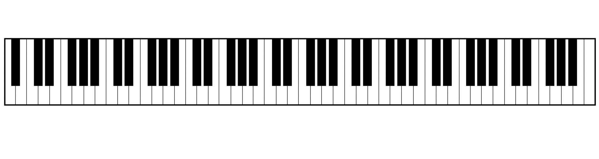
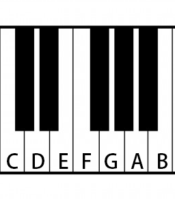
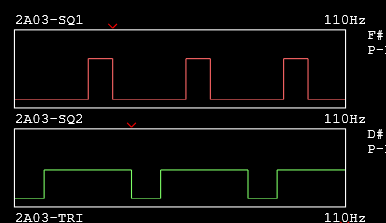
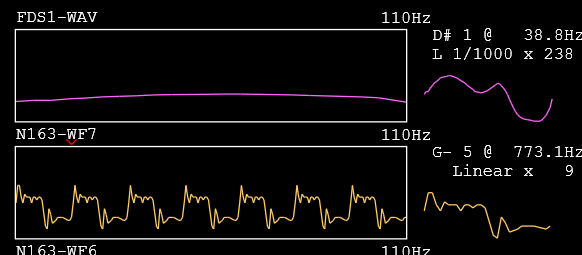
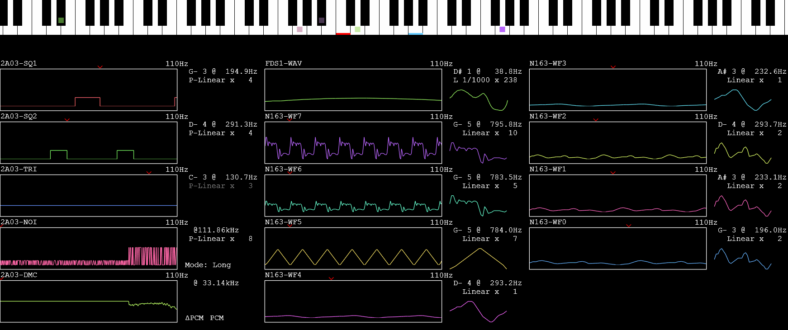
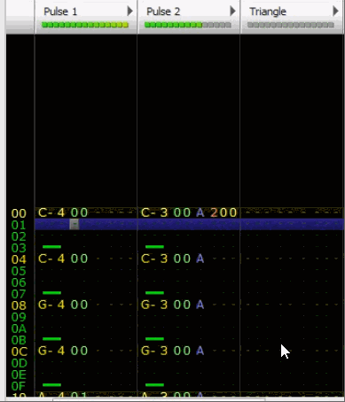
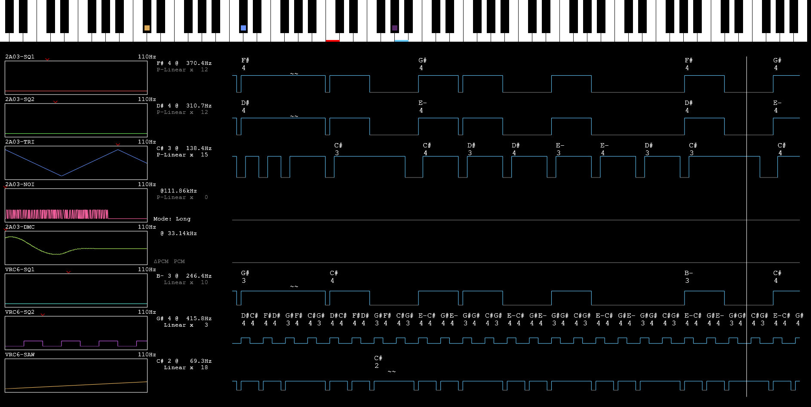
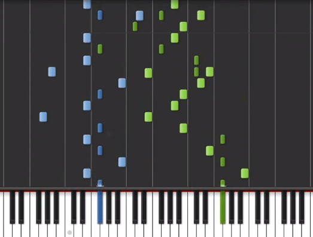

### StepE: 高级音频支持

本文github[备份地址](https://github.com/dustpg/BlogFM/issues/50)

数数这一步的内容:

 - Mapper031, NSF子集支持, 并在此基础上扩展用于播放NSF(NSF文件视为Mapper031的ROM)
 - NSF文件初步支持
 - 按顺序支持了VRC6, VRC7, FSD1, MMC5, N163以及FME7.
 - NSF文件进一步支持
 - 以及这一篇: 音频可视化

### 音频可视化

终于, 进入本步骤的最后一篇——音频可视化. 已经到E了, 16进制已经快装不下了, 预示着《Re: 从零开始的红白机模拟》也快结束了.

说到音频可视化, 可能就不得不提到傅里叶老人家. 不过在这里, 可能是见不到他老人家了——因为我们能拿到更基础的信息


### 数据可视化

可视化的目的就是为了直观的了解到相关'信息', 那么音频方面信息有哪些呢?

结合实际情况, 我们需要对音高、音色、音量等信息进行可视化.

### 音高

音高反映的是频率, 频率可视化自然就是映射到键盘上——



例如440Hz就是A4(A440标准), 中央C大致是262Hz. 键盘上是以'3白夹2黑 + 4白夹3黑'作为一节, 然后向两个方向扩展开来.




白键从左到右依次叫做CDEFGAB, 黑键则是对应的两个白键之间的半音, 记作升(♯, sharp, 就是C#的那个), 或者降(♭, flat). 即C# = D-flat. (♯#或许有区别, 不过'#'比较容易输入, 这里就用#作为半音符号表示).

其中EF, BC其实也是半音的关系. 应该是为了方便钢琴家定位才这么排列的.

标准钢琴则是选取的: 以A0开始的88键这个一区间. 挑战! 回头找一下'中央C'在哪!

### 键位计算

[Equations for the Frequency Table](http://pages.mtu.edu/~suits/NoteFreqCalcs.html)给出了计算公式:

```latex
f(n)=  (\sqrt[12]2{})^{n-49} \times A_{440}
```


 - 由于一个'8度'就会让频率翻倍, 即'2'
 - 由于一个'8度'也就是一节共12键, 即十二次根号
 - A4在第49个键(88键情况下), 即-49
 - 现行是A4为440Hz

现在自然要做出逆运算:

```c
/// <summary>
/// 以A4为基础计算键ID
/// </summary>
/// <param name="freq">The freq.</param>
/// <returns></returns>
float calc_key_id_a4(float freq) {
    /*
     换底公式
                    log(c, b)
        log(a, b) = ------------
                    log(c, a)
    */
    const float a4 = 440.f;
    return logf(freq / a4) * 17.3123404907f;
}
```

实际上, 因为一节是以C开始的所以实际实现中, 是以C4作为0. 再具体, 可能需要进行四舍五入转成整型方便查表, 注意:

 - 负数的膜运算(mod)
 - 负浮点的转整型(round, floor)

```cpp
// 浮点转整型实现A
return static_cast<int>(floorf(code + 0.5f));

// 浮点转整型实现B
const float adj = code < 0.f ? -0.5f : 0.5f;
return static_cast<int>(code + adj);


// 负数膜运算实现A
const auto b = ((a % 12) + 12) % 12;
return lut[b];

// 负数膜运算实现B:
// 直接膜, 但是LUT是双向的
const int lut[24] = {1,2,3, ... };
return (lut+12)[a%12];

```


也就是**负数需要特别注意**.


### 具体处理

 - **声道区分**: 每个声道独立用一个键盘不方便观看
   - 声道数量太多感觉也很乱, 不过还是用同一个键盘吧
   - 具体就是用颜色区分声道, 比如绿色表示2A03方波#1
   - 当然用户可调整
 - **Key-On/Off事件**: VRC7比较特殊的就是Key-On/Off事件, 我们可以采纳这个事件
   - VRC7, On就是按下, Off就是弹起.
   - 对于其他的声道, On就是出声, Off就是没有
   - 区别就是VRC7声道Off后还是可能会出声的(Release)


**颜色生成**

这里颜色生成是通过HSL色彩空间映射到RGB空间的方式, 生成的颜色. 需要一些随机颜色就可以随机'H'即可, 直接随机RGB生成的颜色不怎么好看, 这也算是一个小技巧.


目前需要的数据:

```c
struct visualizers_data {
    // 键盘
    color_t     color;
    float       freq;
    bool        key_on;
};
```

当然, 音量可以也用不透明度表示——不过交给用户控制, 不然可能看不清. 目前简单乘以2再钳制到1.

```c
static inline float vol2alpha(float vol) {
    vol *= 2.f; return vol > 1.f ? 1.f : vol;
}
```

自己(正式释出)打算用(类对数)曲线控制:

```
   ^
   |
   |                         XXXXXXXXXXX
   |                 XXXXXXXX
   |              XXX
   |            XX
   |          X
   |        X
   |      XX
   |     X
   |    X
   |   X
   |  X
   | X
   |X 
   |X
+---------------------------------------->
   |
   +

```


### 音色

我们知道, 音色是由其谐波决定的. 不过除开类似ΔPCM、FDS之类的基于波形信息的, 其余声部的音色其实已经预定好了, 我们需要的就是展现其内在信息.

例如方波就展示其'占空比'这一属性.

### 音量

不少声部都支持音量的调制.



例如看出橙色的方波#1占空比是25%, 音量大约是11. 绿色的方波#2占空比是75%, 音量约8.

### 各个声道计算


**2A03**

 - 方波: ```f = CPU / (16 * (t + 1))```
 - 三角波: ```f = CPU/(32*(t + 1))```
 - 噪声: 无
 - DMC: 无
 - 方波音量: 包络输出, 可以认为是线性值
 - 三角波音量: 不可调(或者DAC)

**VRC6**

 - 方波: ```f = CPU / (16 * (t + 1))```
 - 锯齿波: ```f = CPU / (14 * (t + 1))```
 - 方波音量: $9000, $A000相关4bit, 可能是线性值
 - 锯齿波音量: 其实叫做'rate', $B000, 6bit, 最大42(超过会失真). 但是最大输出是```(rate*6)>>3```, 5bit. 可能是线性值

**VRC7**

频率调制:

```
     49716 Hz * freq
F = -----------------
     2^(19 - octave)
```

注: 使用FM功能另算.

音量:

 - $30-$35, 低4位, 非线性值. 单位3.00dB.

**FDS1**

 - 波形表: ``` f = CPU * current_picth / 65536 / 64 ```
 - 音量: 
 - ```master_volume=2/2, 2/3, 2/4, 2/5```
 - ``` volenv_gain ``` 会被钳制到32

**MMC5**

 - 同2A03

**N163**

波形表频率: 

```
f = wave frequency
l = wave length
c = number of channels
p = 18-bit frequency value
n = CPU clock rate (≈1789773 Hz)

f = (n * p) / (15 * 65536 * l * c)
```

相关参数:

```
* w[$80] = the 163's internal memory
* sample(x) = (w[x/2] >> ((x&1)*4)) & $0F
* phase = (w[$7D] << 16) + (w[$7B] << 8) + w[$79]
* freq = ((w[$7C] & $03) << 16) + (w[$7A] << 8) + w[$78]
* length = 256 - (w[$7C] & $FC)
* offset = w[$7E]
* volume = w[$7F] & $0F
```


**FME7**

 - Tone频率: ```f = CPU / (2 * 16 * Period)```
 - Tone音量: $08-$0A 低4bit, 非线性值, 每个差距3dB.
 - 包络频率: ```f1 = CPU / (2 * 256 * Period)```
 - 适用于: $08/$0C
 - 包络频率: ```f2 = CPU / (2 * 256 * Period * 2)```
 - 适用于: $0A/$0E
 - 包络音量: 不可控

### 波形调制

多试了几个NSF, 在播放FDS时, 某些NSF音调上**还是有点问题**, 这个感觉找不到原因了, 这个BUG估计得留下来了.

N163, FDS1, 以及VRC7都可以算是通过给定波形进行指定频率输出. 当然还可以算上半个DMC. 对于这种我们可以显示原始波形在一旁作为参考.

N163和FDS1的波形是可以直接获取的. 但是VRC7的不能. DMC的这里暂时不考虑, 如果长度1kb的话就有8k个样本了.



**获取VRC7波形**

我们再来回顾一下VRC7声道的控制位:

 - $10-$15 ```LLLL LLLL``` Channel low 8 bits of frequency
  - $20-$25 ```--ST OOOH``` Channel sustain (S), trigger (T), octave (O), high bit of frequency (H)
 - $30-$35 ```IIII VVVV``` Channel instrument (I), volume (V)

影响音色的只有 *Sustain覆盖位*, 以及 *乐器索引*. 后者是理所当然的, 前者是无关紧要的, 是用来控制衰减. 

然后就是样本数量了, 参考FDS1的64个, N163的最大256个. 那就决定采样128个.  ```49716Hz / 128 = 388.4Hz```, 比G4的392Hz略低, 即octave = 4.

```
freq = F * 2^(19-octave) / VRC7
freq = VRC7 / n * 2^(19-octave) / VRC7
freq = 2^(19-7-4)
freq = 256
```

**ADSR包络**

直接生成的话几乎没有声音, 因为正在处于'A'阶段. 最暴力的办法当然就是修改核心代码让这个情况返回0衰减. 这里就采用'ADSR'增加一个阶段, 这这个阶段直接返回0.

```c
    case SFC_VRC7_Debug:
        rv = 0;
        break;
```

这样生成的波还是有点问题, 也就是**粗糙模拟**而已. 如果精确模拟的话可能太花时间了.

 - AM/FM 没有体现
 - ADSR包络中: 调制器会影响波形, 载波器会影响音量


### 减少DrawCall

减少DrawCall是提示图形显示效率的最直接的办法. 这里, 如果相邻的两条线段斜率一致则可以进行合并.

### 实时版

这样称为'实时版', 不存在时间的问题, 可以在游戏的时候也能打开, 最后大致结果就是:




[测试视频地址](https://www.bilibili.com/video/av38135954/)

### 框架优势

现在就要发挥目前框架优势了, 目前这个项目的优势为:

 - 提供接口
 - 事件驱动
 - 非单例

接口意味着允许'动态更换'.

事件驱动本来是自己对于音频的一种实现手段, 并且精度比不上基于周期的'次等手段', 不过本身就包含了音频事件信息, 并且没有真正处理音频.

非单例, 几乎每条函数都自带了一个```sfc_famicom_t*```参数, 这本来是'累赘'.

### 音频事件时间线

这是FT的界面



我们可以看出有一条'时间线', 下方的就是未来的事件, 上方的就是之前的事件. 是时候发挥框架优点了: 变废为宝.

前面提到的优势就是: 我们可以**同时运行两台**虚拟机, 使用不同的接口. 一个跑在前面, 仅仅处理音频事件并且记录下来, 后面的才是真正的播放.


### 内容


时间线实际上可以表示很多(几乎所有)东西, 但是出于简单化, 考虑仅仅处理音量和音高.

其中音高值得注意的是, 作曲家可能会手动模拟FM——也就是'抖音'. 频率在一个音符范围内来回摆动, 这样在时间线是看不出区别的——都是一个音. 所以可以打上FM的标记, 键盘上的波浪线'~'就比较合适.

音量用线段表示就行. 而对应的AM暂时不考虑, 背景可以从折线看出来.

目前没有做优化, 每次都是从现有数据生成的. 这种最末端的代码, 自然是放在**最后优化**, 不然一改就傻了


### 预载版

这样称为'预载版', 只能在播放NSF时才能启用. 并且, 再配合'即时读档'功能时需要特别注意:

 - 每次读取时, 为两个虚拟机载入状态
 - 然后当记录者预运行N帧
 - 正常播放
 - 当然, 也可以干脆禁用这种情况的状态读写



[测试视频地址](https://www.bilibili.com/video/av38135954/?p=2)


.

大致是这样的, 不过还是太简陋了, 不过反正仅仅是随便写的, 还没有正式释出.

还有一种比较典型的解决方案就是:



这种也是一种解决方案, 比如可以用颜色表示声道, 宽度表示音量, 位置就是音高了. 不过自己还是希望看一下'谱子', 而不是'键位'.

### StepE: 高级音频支持

这就本步的最后一节, 音频可视化. 这一步统称'高级音频支持'. 本步骤项目地址:

[Github-StepFC-StepE](https://github.com/dustpg/StepFC/tree/master/stepe)

### REF

 - [鋼琴鍵頻率](https://zh.wikipedia.org/wiki/鋼琴鍵頻率)


### 附录: 负数MOD运算

```((x % 12) + 12) % 12``` 微软编译器的实现:

```asm
mov         eax,2AAAAAABh  
imul        ecx  
push        esi  
sar         edx,1  
mov         eax,1  
mov         esi,edx  
shr         esi,1Fh  
add         esi,edx  
sub         eax,esi  
pop         esi  
lea         eax,[eax+eax*2]  
lea         eax,[ecx+eax*4]  
mov         ecx,0Ch  
cdq  
idiv        eax,ecx  
mov         eax,edx  
ret
```

将原本两次```idiv```优化成一次了. 所以, 膜还是很花时间的, 大家不要随便膜.