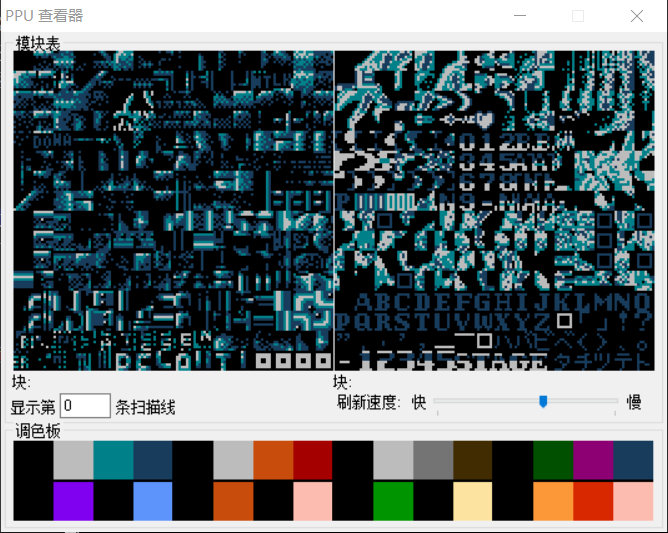
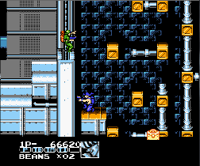

### StepF: 全部成为F

项目地址: [Github-StepFC-StepF](https://github.com/dustpg/StepFC/tree/master/stepf). 本文github[备份地址](https://github.com/dustpg/BlogFM/issues/51). 不光如此, 本系列博客还有Markdown文件位于[GitHub-StepFC-Blog](https://github.com/dustpg/StepFC/tree/master/blog)供离线查看.

StepF的目的是成为一个真正的模拟, 本文由于时间关系不能面面俱到. 但是很多功能可以参考其他的成熟的模拟器, 再进行实现. 


### C vs C++

这一个项目是自己第一次全部(核心部分)使用C来写, 原以为会异常繁琐, 没想到写得很顺畅(有些地方还很爽). 这就不难理解一些人用C++仅仅作为C with class了. 

不过类型安全还是感觉挺重要的(经常忘记打上&, 就被警告寻址类型不同, 只能打开编译器的'警告视为错误'了).

### 写保护

如果写入ROM自然会被硬件忽略, 同时不少硬件拥有针对RAM的写保护, 这部分自己是还没有实现的, 这一点需要特别注意.

### iNES vs NES 2.0

文件头的一般格式, 这两个文件头的魔法码(magic code)都是一样的, 这就比较麻烦了, wiki上有判断的方法.

同样适合NSF vs NSFe文件(不过就好多了), NSFe有时间信息, 可以知道曲子多长.

### FDS模拟

之前提到的会在这里简单讨论一下, 但是看了一下, 没有必要进行技术上的讨论, 这里就简单讨论一下法律风险.

除开像我们大陆这边, 以'学习为目的'几乎可以随便弄而不用承担法律风险, 在例如美国之类的国家针对模拟器还是有相当的限制的.

例如PS2的模拟器PCSX2, 要求使用该模拟器时, 使用自己dump自己PS2的BIOS文件. 这一点完全是规避法律风险.

FDS同理, FDS模拟中有一些'[BIOS call](http://wiki.nesdev.com/w/index.php/Family_Computer_Disk_System#BIOS_calls)', 需要模拟BIOS. 这一点还是建议像其他的模拟器一样, 要求用户自己dump自己FDS的BIOS. (用户的BIOS怎么来的我们不用管)

### 扩展输入

NES/FC还是有[很多的扩展输入](http://wiki.nesdev.com/w/index.php/Input_devices)的, 之前我们实现了基础的标准输出, 绝大部分游戏可以模拟了. 还有一些可以实现的输入方式, 这里简单列举一下:

 - 四人分插, [R.C. Pro-Am II](http://bootgod.dyndns.org:7777/profile.php?id=1151)
 - 麦克风, [北野武的挑战状](http://bootgod.dyndns.org:7777/profile.php?id=1760)
 - Zapper光枪, [打鸭子](http://bootgod.dyndns.org:7777/profile.php?id=1642)

### 更精确地模拟

精确模拟肯定是每个模拟器的目标, 这个被自己称为'中精度模拟器'的项目, 自己的打算是在此精度上尽可能地更为精确地模拟.

还有最高的基于'CPU周期'的精度, 这样精度是最高的, 可以完全按照周期进行硬件的可视化.

### 编辑工具

或者称为'汉化工具'就知道其具体用途了, 当然不一定是'语言本地化', 还可以进行简单的ROM-HACK.

比如所谓的'玛丽十代', 就是'成龙之龙'换了一个马里奥的'皮肤':


(在网上看解说, 一群人提到这个'玛丽十代'. 不过自己小时候玩的是'原版', 感谢良心的盗版商)

这里就是用fceux的类似工具截图:




### DMC IRQ

核心部分BUG先不谈, DMC的IRQ还没有实现. 其实即便是事件驱动也是可以实现了, 针对CPU周期进行计算即可:

```c
dmc_irq_cycle += cycle;
if ((dmc_irq_cycle & 0x7fffffff) >= dmc_irq_counter){
    dmc_irq_cycle -= dmc_irq_counter;
    // xxxxxxxxxx
}

```

```dmc_irq_counter```不用IRQ是就是```0xffffffff```. 但是因为这个样和其他音频事件格格不入就没有这么实现.

### 2POW BANK

之前切换BANK时, 为了防止溢出是这么操作的:

```c
load_bank(bank_id % bank_counter);
```

自己想了一下, 可以采用向上取整到最近的2次幂对齐数字, 然后减1作为掩码:

```c
load_bank(bank_id & bank_mask);
```

虽然看似把MOD换成了AND, 实际上bank_counter可能是0, 每次都要判断是不是0也烦.


### 作弊器/金手指

这就是作弊了, 简单地说就是修改某地址的数据. '锁定'数据可以实现为高频率(比如就利用帧序列器的240Hz)写入同一个数据.

### 游戏特化

不知道大家有没有玩过'魂斗罗力量'(背景是讲雇佣兵的, force也可以译作'军队')没有:



这游戏的一大特点就是卡顿明显, 我们可以针对不同的游戏进行'特化'. 比如发现用户在游玩这款游戏时, 可以以非强制性地提醒用户'是否修复魂斗罗力量的卡顿问题'.

如何判断可以利用CRC校验, 如何修复简单地说就是'超频'. 具体在哪里超频可以具体玩游戏时进行检查(避免等待垂直空白时超频), 超频会带来相当多的副作用, 不过目前的实现是'中精度模拟器', 反而超频没有多大的影响(基于CPU的IRQ的Mapper其实还是基于扫描线实现的).

### 平台优化

之前提到自己用SSE重写了渲染逻辑, 这就是'平台优化'. 虽然C是跨平台的, 但是优化还是根据具体平台具体实现.

### 图形用户接口/GUI

这是自然的, 用户是一般用户, 自然是需要实现一个图形接口. 之后, 自己会使用自己的[LongUI](https://github.com/dustpg/LongUI)实现图形化界面. 可能会将步骤记录下来作为博客, 不过重点将是GUI程序的编写.

### NES程序调试

现在依然有不少人会写一些简单的NES程序, 作为模拟器自然可以提供一个调试环境. 即便是没人用(╮（￣▽￣）╭ ), 这样能够全方位地提高自己的技术水平

### 网络

与人一起玩自然是很不错的, FC本身就支持本地的多人游戏. 但是现在能凑在一起玩是很困难的, 于是这部分可以使用网络联机实现.

不过自己几乎没有任何网络联机程序的经验(只有学校里面的简单测试), 只好作罢.

### 更多的Mapper

这也是后期主要维护的内容, 更多的Mapper能够游玩更多的游戏, 并且如果遇到类似MMC5这样'黑科技'的芯片也能感叹: 还能这样玩?!

### 重启-全部成为F

FC上面有一个'重启键', 所以FC的重启分为软重启(按下重启键)和硬重启(插上电源). 还有一些, 比如在'网球'里面玩一会之后, 接着玩'马里奥'可能会出现错误关卡的BUG. 因为网球的某数据和马里奥的关卡数据使用的是同一个地址. 

可以在[CPU power up state](https://wiki.nesdev.com/w/index.php/CPU_power_up_state), [PPU power up state](https://wiki.nesdev.com/w/index.php/PPU_power_up_state)分别查看 CPU/PPU 上电状态.


本节标题'全部成为F'自然也是有原因的. 程序中一开始会将系统自带的RAM清零, 但是不少模拟器会使用```$FF```清空, 也就是全部成为'F'.  FC里面按下'重启'键的目的往往是为了安全关闭游戏, 既是结束, 也是开始.  

**全文完**
